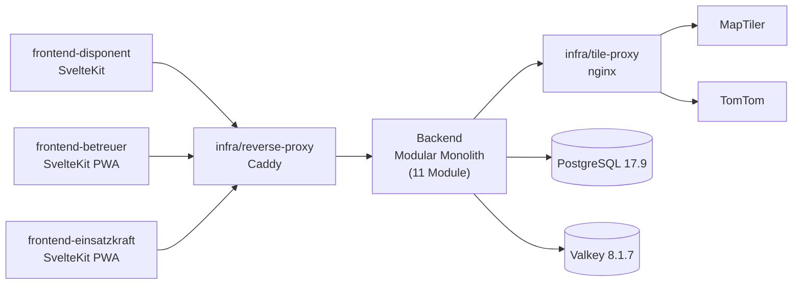

# EB Digital

<!-- Diese README spiegelt den aktuellen Umsetzungsstand des Projekts wider.
     Sie ist KEIN sporadisch gepflegtes Marketing-Dokument, sondern ein lebendes Statusbild.
     Aktualisierungs-Pflicht (CLAUDE.md Abschnitt 16):
       - bei jedem nutzerrelevanten Fahrplan-Schritt während der Bearbeitung
       - vor jedem Sessionende mit Synchronisations-Prüfung gegen Pflicht-Dokumente
     Inhalte stammen aus den Pflicht-Dokumenten und müssen mit ihnen konsistent sein.
     Drift zwischen README und Pflicht-Dokumenten ist ein Bug. -->


> Multi-Tenant-Plattform zur Echtzeit-Koordination ehrenamtlicher Einsatzbetreuung bei polizeilichen Großlagen.

## Über das Projekt

EB Digital ersetzt die heute übliche WhatsApp-Improvisation bei der ehrenamtlichen Einsatzbetreuung polizeilicher Großlagen durch ein strukturiertes, serviceorientiertes Auftragssystem. Disponenten, Betreuungsfahrzeuge und Einsatzkräfte arbeiten über rollenspezifische Oberflächen zusammen – mit Live-Karte, automatischer Fahrzeugzuweisung, anonymer Bestellfunktion für Einsatzkräfte und kollaborativer Multi-Disponenten-UX.

**Was es löst:** Fehlende Echtzeit-Koordination zwischen Disponenten, Betreuungsfahrzeugen und Einsatzkräften bei Großlagen – ohne Lagebild, ohne automatische Fahrzeugzuweisung, ohne Statusrückmeldung.

**Für wen:** Ehrenamtliche Strukturen polizeilicher Berufsverbände als Anbieter (initial DPolG, perspektivisch GdP und weitere). Polizeibedienstete im Außendienst als anonyme Bezieherseite. Cross-Berufsverbands-Versorgung ist gelebte solidarische Praxis und Teil des Selbstverständnisses des Systems.

**Was es bewusst nicht ist:**

- Kein Behörden-IT-Anschluss, kein operatives Lagebild im behördlichen Sinne, keine Einsatzversorgung im behördlichen Sinne.
- Keine Klarnamen-Verwaltung; Einsatzkräfte erhalten anonyme Temporär-Sessions.
- Keine Mitgliedschaftsprüfung der Einsatzkraft – verbandsoffener Zugriff über die Einsatz-URL.
- Keine Hilfe-Funktion für Einsatzkräfte (läuft über den polizeilichen Dienstweg).
- Keine native App in Phase 1 – ausschließlich PWA.
- Keine US-Cloud-Anbieter, kein Tracking, keine SaaS-Auth-Provider.

## Aktueller Status

<!-- Dieser Block wird vor jedem Sessionende synchronisiert mit:
     - project-context.md Abschnitt 1 (Status, Version)
     - fahrplan.md Abschnitt „Aktueller Stand"
     - architecture.md Abschnitt 9 (Reifegrad-Übersicht)
     - decisions.md Teil A (ADR-Übersicht, Reaktiv-Quote)
     - blockers.md (Aktive Blocker)
     Inkonsistenzen sind Bugs und werden vor Sessionende behoben. -->

- **Projektphase:** Phase 1 (Repo-Bootstrap & Tech-Foundations, UMSETZUNG); Schritte 1.1 (Repository- und Workspace-Setup) und 1.2 (CI-Pipeline aktivieren) am 2026-05-08 `[ERLEDIGT]`. Branch-Protection auf `main` aktiv mit 8 Required Status Checks. Schritt 1.3 (Backend-Skelett) als nächster Schritt.
- **Version:** v0.1.0
- **Status:** Konzeption
- **Letzte Änderung:** 2026-05-08
- **Architektur-Reife:** 9 Bestandteile `[BELASTBAR]` (Stack-/NFR-/Datenschutz-Constraints), ca. 35 `[VORLÄUFIG]` (Module, Schnittstellen, Datenmodell-Invarianten), 9 `[OFFEN]` (Spikes G–M, Bedrohungsmodell, Tracing). Architektur-Pattern Modular Monolith + drei SvelteKit-Frontends bleibt bis zum Last-/Funktionstest in Phase 7 `[VORLÄUFIG]`.
- **Aktive Blocker:** 0 ([`docs/blockers.md`](docs/blockers.md)).
- **ADRs:** 10 (9 `[STRATEGISCH]` aus INITIALISIERUNG + ADR-010 `[OPERATIV]` zu GitHub-Actions Major-Update + Verifikations-Regime); Reaktiv-Quote 0/10 (Schwellenwert 20 % nicht überschritten).
- **Klassifikation:** Klasse G (Groß) – ADR-001.

## Quick Start

> **Hinweis Konzeptionsphase:** Das Repository enthält die Pflicht-Dokumente und das Tooling-Skelett (uv-/pnpm-Workspace, Pre-Commit-Hooks, CI-Pipeline auf GitHub Actions). Anwendungscode (FastAPI-App, Frontend-Skelette, Compose-`dev`-Profil) folgt mit Phase-1-Schritten 1.3–1.8; siehe [`docs/fahrplan.md`](docs/fahrplan.md) Phase 1.

### Voraussetzungen

- Docker Engine 29.4+ und Docker Compose v5.1+ (für Phase 1.4 ff. – PostgreSQL/Valkey-Container)
- uv 0.11+ (Python-Package-Manager) und Python 3.13
- pnpm 11+ und Node.js 24 LTS
- Optional: GitHub-Account für CI-Auslösung; SSH-Zugriff auf Hetzner-VPS für Production-Deployment

### Heute lauffähig

```bash
# Repository klonen
git clone https://github.com/Paddel87/EB-Digital.git
cd EB-Digital

# Pflicht-Dokumente lesen (Pflichtlektüre nach CLAUDE.md Abschnitt 2)
cat docs/project-context.md
cat docs/architecture.md
cat docs/fahrplan.md

# Tooling installieren und Pre-Commit-Hooks aktivieren
uv sync                                              # Python-Dev-Tooling (ruff, mypy, pytest, bandit, …)
pnpm install                                         # Node-Dev-Tooling (commitlint, prettier, …)
uv run pre-commit install \
  --hook-type pre-commit --hook-type commit-msg      # Hooks lokal aktivieren
uv run pre-commit run --all-files                    # Alle Hooks einmalig durchlaufen
```

## Architektur (Überblick)



**Backend-Module (11):** `auth` (Login + Sessions + CLI-Bootstrap) · `auth_anonymous` (einsatz-URL + AccessCode) · `tenants` (Mandanten-Onboarding) · `catalog` (Artikelkatalog) · `operations` (Operations + Orders + Audit-Log) · `fleet` (Fahrzeuge + Beladung) · `geo` (Routing + Tile-Cache + Sperrungs-Override) · `realtime` (WebSocket-Hub) · `resilience` (Backup/Recovery) · `export` (DSGVO-Datenexport) · `retention` (30-Tage-Anonymisierung + Aggregat).

**Frontends (3):** `frontend-disponent` (Browser, Lagezentrum) · `frontend-betreuer` (PWA Mobile, Turn-by-Turn) · `frontend-einsatzkraft` (anonyme PWA).

**Infrastruktur (2):** `infra/reverse-proxy` (Caddy mit automatischem TLS) · `infra/tile-proxy` (nginx-Cache vor MapTiler/TomTom).

→ Vollständige Architektur: [`docs/architecture.md`](docs/architecture.md) · Architektur-Entscheidungen: [`docs/decisions.md`](docs/decisions.md)

## Verwendung

> Verwendungs-Beispiele werden ergänzt, sobald Phase 4 (Operations Core + Realtime + Einsatzkraft-PWA) abgeschlossen ist und ein End-to-End-Pfad lauffähig ist. Bis dahin spiegelt [`docs/architecture.md`](docs/architecture.md) Abschnitt 5 die geplanten Datenflüsse F1–F5.

## Nächste Schritte

1. **Phase 1 Schritt 1.3 – Backend-Skelett (FastAPI + Settings + Logging)**: `backend/eb_digital/{__main__.py, app.py, logging.py, settings.py}` plus erste Tests in `backend/tests/`. Healthcheck-Endpoint `/health`, strukturiertes JSON-Logging mit PII-Redaction. Detail in [`docs/fahrplan.md`](docs/fahrplan.md) Phase 1.
2. **Phase 1 Schritte 1.4–1.8** (UMSETZUNG): PostgreSQL+Alembic+ORM, Procrastinate-Worker, Admin-Bootstrap-CLI (ADR-004), Frontend-Workspaces, Compose-`dev`-Profil mit Caddy + Tile-Proxy.
3. **Phase 2 – Auth + Tenants + Verbund-Tauglichkeit (I1/I2)** (UMSETZUNG): Vollständige Auth-Schicht, Mandanten-Onboarding, `operation_tenant_participation` als alleinige Operation↔Mandant-Verknüpfung (ADR-009 Invariante I1), abstrakter Berechtigungs-Filter (Invariante I2).

→ Vollständiger Fahrplan mit 7 regulären Phasen plus späterer Verbund-Erweiterungs-Phase X: [`docs/fahrplan.md`](docs/fahrplan.md)

## Mitwirken

- **Branch-Konvention:** Hauptbranch `main`. Feature-Branches `feat/<kurztitel>`, Bugfixes `fix/<kurztitel>`, Refactor `refactor/<kurztitel>`. In der Initialisierungsphase ist direkter Push auf `main` zulässig (Status `Konzeption`); ab Statuswechsel nur über Pull Request mit grünen Pflicht-Gates.
- **Commit-Format:** Conventional Commits in deutscher Sprache, atomar pro Änderung, Imperativ-Präsens. Bei freigabepflichtigen Änderungen: ADR-Nummer im Commit-Body. Pre-Commit-Hooks und `commitlint` sind Pflicht-Gates.
- **Code-Standards:** Python via uv + ruff (Linter+Formatter) + mypy `--strict` + bandit + pip-audit. TypeScript via pnpm + eslint (`@typescript-eslint`, `eslint-plugin-svelte`, `eslint-plugin-security`) + prettier + svelte-check + `tsc --strict --noUncheckedIndexedAccess`. Tests: pytest+Coverage (Backend, kritische Pfade ≥ 95 %), vitest+Playwright (Frontends). CI: GitHub Actions, drei Workflows (`ci.yml`, `security.yml`, später `release.yml`).
- **Methodik:** semi-autonomer Modus mit Claude Code (siehe [`CLAUDE.md`](CLAUDE.md)). Architektur-Entscheidungen werden in [`docs/decisions.md`](docs/decisions.md) als ADRs festgehalten; Reaktiv-Quote ≤ 20 % über die letzten 10 ADRs.
- **Dokumentationssprache:** Deutsch. **Codesprache (Bezeichner, Kommentare):** Englisch (Domänen-Begriffe übersetzt – siehe [`docs/architecture.md`](docs/architecture.md) Abschnitt 0).

## Dokumentation

| Dokument                                             | Inhalt                                                                                           |
| ---------------------------------------------------- | ------------------------------------------------------------------------------------------------ |
| [`docs/vision.md`](docs/vision.md)                   | Ursprüngliche Projektvision (eingefroren nach Modus-2-Abschluss)                                 |
| [`docs/project-context.md`](docs/project-context.md) | Aktueller Stack, Constraints, Qualitätsziele, Code-Standards                                     |
| [`docs/architecture.md`](docs/architecture.md)       | Systemarchitektur, 14 Module, 10 Schnittstellen, 5 Datenflüsse, Reifegrad-Übersicht              |
| [`docs/fahrplan.md`](docs/fahrplan.md)               | Entwicklungsplan: 7 reguläre Phasen + Phase X (Verbund), Phase 1 voll detailliert                |
| [`docs/decisions.md`](docs/decisions.md)             | 10 ADRs (Klassifikation, Stack, Pattern, Fragen A–F, Actions-Update) plus 15 Entscheidungsregeln |
| [`docs/blockers.md`](docs/blockers.md)               | Aktive Blocker (aktuell keine) und Erkennungs-Heuristiken                                        |
| [`docs/logbuch.md`](docs/logbuch.md)                 | Chronologischer Flugschreiber: Sessions, Beobachtungen, Reifegrad-Wechsel, ADR-Anlagen           |
| [`CLAUDE.md`](CLAUDE.md)                             | Projektübergreifende Arbeitsmethodik (semi-autonomer Modus)                                      |

## Lizenz

Dieses Projekt steht unter der **GNU Affero General Public License v3.0** (AGPL-3.0); der vollständige Lizenztext liegt im [`LICENSE`](LICENSE)-File im Repo-Root.

**Erlaubte Abhängigkeitslizenzen:** MIT, BSD-2/BSD-3, Apache-2.0, MPL-2.0, ISC. **Ausgeschlossen:** GPL/LGPL als Backend-Dependency (außer per ADR), proprietär, RSALv2, SSPL, Confluent-Community-License, Elastic-License. Begründung in [`docs/project-context.md`](docs/project-context.md) Abschnitt 6.
