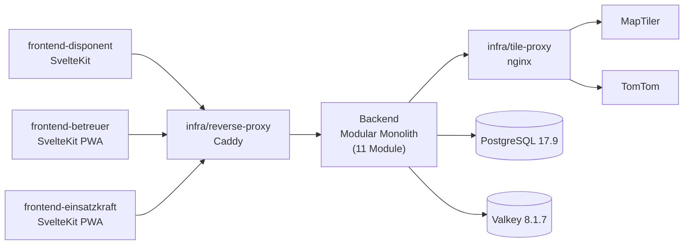

# EB Digital

<!-- Diese README spiegelt den aktuellen Umsetzungsstand des Projekts wider.
     Sie ist KEIN sporadisch gepflegtes Marketing-Dokument, sondern ein lebendes Statusbild.
     Aktualisierungs-Pflicht (CLAUDE.md Abschnitt 16):
       - bei jedem nutzerrelevanten Fahrplan-Schritt während der Bearbeitung
       - vor jedem Sessionende mit Synchronisations-Prüfung gegen Pflicht-Dokumente
     Inhalte stammen aus den Pflicht-Dokumenten und müssen mit ihnen konsistent sein.
     Drift zwischen README und Pflicht-Dokumenten ist ein Bug. -->


> Multi-Tenant-Plattform zur Echtzeit-Koordination ehrenamtlicher Einsatzbetreuung bei polizeilichen Großlagen.

## Über das Projekt

EB Digital ersetzt die heute übliche WhatsApp-Improvisation bei der ehrenamtlichen Einsatzbetreuung polizeilicher Großlagen durch ein strukturiertes, serviceorientiertes Auftragssystem. Disponenten, Betreuungsfahrzeuge und Einsatzkräfte arbeiten über rollenspezifische Oberflächen zusammen – mit Live-Karte, automatischer Fahrzeugzuweisung, anonymer Bestellfunktion für Einsatzkräfte und kollaborativer Multi-Disponenten-UX.

**Was es löst:** Fehlende Echtzeit-Koordination zwischen Disponenten, Betreuungsfahrzeugen und Einsatzkräften bei Großlagen – ohne Lagebild, ohne automatische Fahrzeugzuweisung, ohne Statusrückmeldung.

**Für wen:** Ehrenamtliche Strukturen polizeilicher Berufsverbände als Anbieter (initial DPolG, perspektivisch GdP und weitere). Polizeibedienstete im Außendienst als anonyme Bezieherseite. Cross-Berufsverbands-Versorgung ist gelebte solidarische Praxis und Teil des Selbstverständnisses des Systems.

**Was es bewusst nicht ist:**

- Kein Behörden-IT-Anschluss, kein operatives Lagebild im behördlichen Sinne, keine Einsatzversorgung im behördlichen Sinne.
- Keine Klarnamen-Verwaltung; Einsatzkräfte erhalten anonyme Temporär-Sessions.
- Keine Mitgliedschaftsprüfung der Einsatzkraft – verbandsoffener Zugriff über die Einsatz-URL.
- Keine Hilfe-Funktion für Einsatzkräfte (läuft über den polizeilichen Dienstweg).
- Keine native App in Phase 1 – ausschließlich PWA.
- Keine US-Cloud-Anbieter, kein Tracking, keine SaaS-Auth-Provider.

## Entwicklungsfortschritt

<!-- Sync-Quellen: fahrplan.md „Phasen-Übersicht" + „Aktueller Stand".
     Der Balken (docs/assets/entwicklungsfortschritt.svg) und die aufklappbaren
     Phasen-Details werden bei jedem Phasen-Statuswechsel mitgepflegt
     (CLAUDE.md §16, Trigger 1 + 2).
     Technik-Hinweis: GitHub entfernt JavaScript/CSS aus READMEs — Interaktivität
     ist bewusst auf <details>-Aufklappen beschränkt; der Balken ist ein
     animiertes SVG (SMIL), der Stand wird manuell synchronisiert. -->



<details>
<summary><strong>Phase 1 — Repository-Bootstrap &amp; Tech-Foundations</strong> · UMSETZUNG · ✅ ERLEDIGT 2026-05-10</summary>

Schritte 1.1–1.8: uv-/pnpm-Workspace, Pre-Commit-Hooks + CI-Pipeline, FastAPI-Skelett mit JSON-Logging (PII-Redaction), DB-Plumbing (SQLAlchemy 2.0 async + Alembic + PostgreSQL 17.9), Procrastinate-Job-Engine, Admin-Bootstrap-CLI, drei SvelteKit-Frontend-Skelette, Compose-Stack (Caddy + nginx-Tile-Proxy) inkl. `scripts/dev-smoke.sh`.

</details>
<details>
<summary><strong>Phase 2 — Auth + Tenants + Verbund-Tauglichkeit</strong> · UMSETZUNG · ✅ ERLEDIGT 2026-05-16</summary>

Schritte 2.1–2.7 (+ Hot-Stabilisierung 2.5b, ADR-015): Datenmodell-Skelett, Login + Cookie-Sessions + Rate-Limit (ADR-013), anonyme Bezieher-Schicht (`auth_anonymous`), Mandanten-Verwaltung mit Self-Service-Onboarding (S10, Invarianten I1/I2), `frontend-disponent`-Login-UI, `frontend-einsatzkraft`-AccessCode-UI, Coverage-Anker (Backend 95,84 %).

</details>
<details>
<summary><strong>Phase 3 — Spikes Wave 1 (Operations-Vorklärungen)</strong> · ERKUNDUNG · ✅ ERLEDIGT 2026-05-28</summary>

Spike I → ADR-017 (Geo-Plausibilität: Hülle-Distanz + dynamische GPS-Toleranz), Spike J → ADR-018 (Bündelung: manuell durch Disponent, `order_bundle`-Entity, min. 2 Orders).

</details>
<details>
<summary><strong>Phase 4 — Operations Core + Realtime + Einsatzkraft-PWA</strong> · UMSETZUNG · ✅ ERLEDIGT 2026-06-09</summary>

Schritte 4.1–4.6: `backend/catalog` (4.1), `backend/fleet` (4.2), `backend/operations` mit Plausibilität + Audit-Log + Assignment (4.3a) und Bündelung (4.3b), `backend/realtime` WebSocket-Hub + Valkey-Pub/Sub (4.4), `frontend-einsatzkraft`-Bestellpfad F2 mit WS-Live-Status (4.5), Coverage-Anker bei gestopptem Stack — Backend 89,78 % TOTAL, `backend/operations` 96,8 % Lines (4.6).

</details>
<details open>
<summary><strong>Phase 5 — Spikes Wave 2 (Geo, Frontends, Resilience, Roll-out)</strong> · ERKUNDUNG · 🔵 LÄUFT seit 2026-06-10</summary>

Fünf Spikes, 0 / 5 erledigt: **Spike G** (Sperrungs-Override-Technik — ⛔ blockiert durch fehlenden TomTom-API-Key, Blocker #002; Valhalla-Vergleichsteil bereits empirisch abgeschlossen), **Spike H** (Resilience-Granularität RTO/RPO), **Spike K** (Hilfe-Knopf-Semantik — 🕐 Konzept fertig, wartet auf Freigabe), **Spike L** (Tile-Caching-Strategie Frontend), **Spike M** (Fahrzeugbezeichnungs-Schema, DPolG-Rückfrage). Klärt die Phase-6-Eingangsbedingungen.

</details>
<details>
<summary><strong>Phase 6 — Geo + Disponent-/Betreuer-PWAs + Resilience + Retention + Export</strong> · UMSETZUNG · ⚪ OFFEN</summary>

Karten produktiv (MapLibre, Tile-Proxy nach ADR-016), Disponenten- und Betreuer-Operations-UIs, `backend/geo` mit Routing + Sperrungs-Override, `backend/resilience`, `backend/retention`, `backend/export`.

</details>
<details>
<summary><strong>Phase 7 — Stabilisierung, Roll-out-Vorbereitung, Validierung</strong> · STABILISIERUNG · ⚪ OFFEN</summary>

Lasttest (NFR-Validierung, API-Budget unter Cache-freier Annahme), externe Security-Review des Auth-Stacks ([#26](https://github.com/Paddel87/EB-Digital/issues/26)), Roadmap-Meilensteine N/O/P. Danach **Phase X** (Verbund-Modus für parallele Mandanten-Großlagen) als spätere Erweiterung.

</details>

→ Vollständiger Fahrplan: [`docs/fahrplan.md`](docs/fahrplan.md)

## Aktueller Status

<!-- Dieser Block wird vor jedem Sessionende synchronisiert mit:
     - project-context.md Abschnitt 1 (Status, Version)
     - fahrplan.md Abschnitt „Aktueller Stand"
     - architecture.md Abschnitt 9 (Reifegrad-Übersicht)
     - decisions.md Teil A (ADR-Übersicht, Reaktiv-Quote)
     - blockers.md (Aktive Blocker)
     Inkonsistenzen sind Bugs und werden vor Sessionende behoben. -->

- **Projektphase:** **Phase 5 (Spikes Wave 2 — Geo, Frontends, Resilience, Roll-out), Typ ERKUNDUNG — LAUFEND seit 2026-06-10.** Spike-Stand: 5.1/Spike G blockiert (Blocker #002, TomTom-API-Key; Valhalla-Vergleichsteil empirisch abgeschlossen, [`docs/spikes/spike-g-results.md`](docs/spikes/spike-g-results.md)), 5.3/Spike K Konzept fertig und wartet auf Freigabe ([`docs/spikes/spike-k-results.md`](docs/spikes/spike-k-results.md)), Spikes H/L/M offen. Davor: **Phase 4 (Operations Core + Realtime + Einsatzkraft-PWA, UMSETZUNG) ERLEDIGT** (2026-05-28 bis 2026-06-09). Verlauf: Schritte 4.1 + 4.2 **ERLEDIGT** und **4.3a ERLEDIGT** am 2026-06-06 (Schritt 4.3 wurde in 4.3a + 4.3b aufgeteilt — Detail-Plan-Freigabe 0C/1A/2A/3A/4A/5A/6A/7A/8A/9A/10A). **Schritt 4.3a** brachte `backend/operations` auf Belastbarkeits-Reifegrad (ohne Bündelung): 7 neue Tabellen (`operation_area` mit JSONB-GeoJSON-Polygon, `operation_dispatcher_participation`, `customer_order` mit Plausibility-Spalten und Status-Maschine, `customer_order_item` mit `exactly_one_ref`-CHECK, `order_assignment` mit Partial-UNIQUE auf aktivem Order), additive Spalten `tenant.plausibility_default_threshold_m` und `operation.plausibility_threshold_m` (ADR-017), 9 Use-Cases mit explizitem Audit-Log-Aufruf, PlausibilityChecker (`backend/geo`) mit Shapely 2.x (ADR-017 + ADR-020 für Sub-Dep-GEOS-LGPL), Realtime-Stub-Adapter (S3-Verkabelung in 4.4), 13 API-Endpunkte unter `/api/operations/*` (S8e) plus Anon-Order-Endpunkt unter `/api/anon/{url}/order` (S2c) mit Rate-Limit. **Verifikation:** Migration `c5e8d2f4a173` Round-Trip gegen Postgres 17.9 (`alembic check` deckungsgleich); 676 Tests grün, Modul-Coverage `backend/operations` ≥ 90 %, `backend/geo/plausibility` 100 %; ruff + mypy --strict + bandit grün; dev-smoke.sh-Operations-Stufe mit 13 Sub-Checks (voller F2-Hard-Path Open→Order→Moderation→Assign→Complete→Audit→Close) E2E grün. **Schritt 4.3b** (Bündelung, ADR-018) **ERLEDIGT** am 2026-06-07: neue Entity `order_bundle` + nullable `customer_order.bundle_id`/`order_assignment.bundle_id` (Migration `d4f1a9b8c2e6` Round-Trip-verifiziert), `BundleOrders` (manuell, Versorgungs-Transporter `large_order`, min. 2 `pending`-Orders) / `DissolveBundle` / impliziter `CompleteBundle`, Einzel-Order-Storno-Sperre in aktivem Bündel, 4 Bündel-Endpunkte, Audit-Action-Types `orders_bundled`/`bundle_dissolved`/`bundle_completed`; 726 Tests grün, dev-smoke-Bündel-Stufe (9 Sub-Checks) E2E grün. Damit ist `backend/operations` vollständig `[BELASTBAR]` (verbleibend `[OFFEN]` nur Spike K/Hilfe-Knopf). **Schritt 4.4** (`backend/realtime`) **ERLEDIGT** am 2026-06-08: neues Modul mit WebSocket-Hub (3 rollengebundene Endpunkte `/ws/dispatcher`, `/ws/carer`, `/ws/anon/{token}`), Valkey-Pub/Sub-Brücke (`RealtimePublisher` ersetzt den No-Op-Stub, Hub-Listener `PSUBSCRIBE operation.*`), S10-Subscription-Autorisierung, Anon-`session_id`-Filter (nur eigene Bestellung), Heartbeat (30 s/10 s) und Tile-Hash-Redaction; `order_status`-Payload additiv um `anonymous_session_id`; Session-Helper rückwärtskompatibel auf `HTTPConnection` generalisiert. **Verifikation:** 781 Tests grün (+55), Modul-Coverage 93–100 % Lines, dev-smoke-Realtime-Stufe (6 Sub-Checks: WS-Auth + Subscribe + Valkey-E2E + Anon-Filter) grün; S3/S9 + „Pub/Sub via Valkey" damit `[BELASTBAR]`. **Schritt 4.5** (`frontend-einsatzkraft`, Bestellpfad F2) **ERLEDIGT** am 2026-06-09: anonyme Bestell-PWA produktiv — effektiver Katalog (S2b) nach Kategorie + Mengen-Stepper, Standorterfassung (Geolocation auf Nutzeraktion + Text-Fallback), Bestellung via S2c (genau-eine-Referenz-Mapping), Live-Status der eigenen Bestellung über einen gekapselten WS-Client (S9, `/api/ws/anon/{token}`, Pong + Auto-Reconnect — erster WS-Konsument im Frontend). 80 Vitest-Tests grün (+33), Coverage `src/lib/` 95.21 % Lines / 82.53 % Branches, Build (adapter-static) grün; Karten-Anzeige + 150-m-Annäherung bleiben Phase 6. **Schritt 4.6** (Coverage-Anker, Phase-4-Abschluss) **ERLEDIGT** am 2026-06-09: Coverage-Frischlauf aller Phase-4-Module bei **gestopptem Compose-Stack** (CI-treu) — Backend 781 passed + 1 skipped, TOTAL 89,78 % ≥ 80 %-Gate, `backend/operations` 96,8 % Lines / 90,1 % Branches ≥ 90 %-Anker; Frontend-Disponent 27/27 (96,61 % Lines), Frontend-Einsatzkraft 80/80 (96,77 % Lines); voller `dev-smoke.sh` (alle Stufen + Frontend-Builds) E2E grün; keine Code-Änderung, kein neuer ADR. Schritt **4.2** `backend/fleet` und **4.1** `backend/catalog` ERLEDIGT am 2026-05-28 (ADR-019 Phase-4-Sonderregel). Phase 3 (Spikes Wave 1, ERKUNDUNG) abgeschlossen mit ADR-017 + ADR-018. Phase 2 abgeschlossen am 2026-05-16. Phase 1 vollständig abgeschlossen.
- **Version:** v0.1.0
- **Status:** Konzeption
- **Letzte Änderung:** 2026-06-10
- **Architektur-Reife:** ca. 53 Bestandteile `[BELASTBAR]` (Stack-/NFR-/Datenschutz-Constraints + Schnittstelle S1 Admin-Bootstrap-CLI + `backend/auth`-Modul + Schnittstelle S8a `/api/auth/{login,logout,me}` + Valkey-Connection-Pool + NFR Anbieter-Austauschbarkeit für externe Geo-Services via ADR-014/Regel-017 + `backend/auth_anonymous`-Modul, Schnittstelle S2a `/api/anon/{url}/info`+`/session`, Datenmodell `anonymous_session` und Spalten-Widening `operation.url_token` 64→255 + seit Schritt 2.4 `backend/tenants`-Modul, Schnittstelle S8b `/api/auth/{register-tenant,reset-password}`+`/api/tenants/*`, Schnittstelle S10 Participation-Lookup, Invariante I1 `operation_tenant_participation` und Invariante I2 abstrakter Berechtigungs-Filter + seit Schritt 2.5b Request-Scoped DB-Session-Dependency `get_db_session` via ADR-015/Regel-018 + seit Schritt 4.1 `backend/catalog`-Modul + S8c + drei Catalog-Datenmodelle + seit Schritt 4.2 `backend/fleet`-Modul + S8d + vier Fleet-Datenmodelle + **seit Schritt 4.3a `backend/operations`-Modul (Lebenszyklus + Orders + Assignment) + `backend/geo.PlausibilityChecker` + Schnittstellen S8e/S2c + S4 + Invariante I3 + fünf Operations-Datenmodelle + seit Schritt 4.3b Bündelungs-Bereich (Spike-J) + Datenmodell `order_bundle` + Bündel-Endpunkte — `backend/operations` damit vollständig belastbar + seit Schritt 4.4 `backend/realtime`-Modul (WS-Hub + Valkey-Pub/Sub) + Schnittstellen S3/S9 + „Pub/Sub via Valkey"**; die granulare Vollaufzählung bleibt Phase-7-Sync-Kandidat), ca. 15 `[VORLÄUFIG]` (Module inkl. drei Frontend-Skelette + zwei Infra-Module mit Phase-1-Smoke, restliche Schnittstellen, Invarianten I3–I5; seit 2026-05-18 zusätzlich Spike-I-Bereich „Geo-Plausibilitäts-Algorithmus" in `backend/operations` + `backend/geo` durch ADR-017 — Phase-2-Sonderregel: Beförderung erfolgt mit dem jeweiligen funktionalen Schritt; `frontend-disponent` ist mit 2.5 und `frontend-einsatzkraft` mit 2.6 (Anmeldung) sowie 4.5 (Bestellpfad F2: Katalog + Bestellung + WS-Live-Status) funktional validiert, beide bleiben `[VORLÄUFIG]` bis zum Last-Test in Phase 6 — Detail-Frage 5-A aus 2.5), 7 `[OFFEN]` (Spikes G, H, K, L, M, Bedrohungsmodell, Tracing). Architektur-Pattern Modular Monolith + drei SvelteKit-Frontends bleibt bis zum Last-/Funktionstest in Phase 6 `[VORLÄUFIG]`.
- **Aktive Blocker:** 1 — **Blocker #002** (2026-06-10): TomTom-API-Key fehlt in `.env` (Platzhalter-Wert), blockiert die TomTom-Empirie von Spike G; MapTiler-Key ebenfalls Platzhalter (betrifft perspektivisch Spike L). Klärungsfrage an den Plattform-Betreiber in [`docs/blockers.md`](docs/blockers.md). (Blocker #001 am 2026-05-10 ursächlich aufgeklärt, siehe [`scripts/fix-venv-flags.sh`](scripts/fix-venv-flags.sh).)
- **ADRs:** 20 (9 `[STRATEGISCH]` aus INITIALISIERUNG + 5 `[OPERATIV]` + 4 weitere `[STRATEGISCH]` + 1 `[REAKTIV]` aus Phase 2 + 2 `[ERKENNTNIS]` aus Phase 3: ADR-010 GitHub-Actions Major-Update, ADR-011 psycopg-LGPL-Akzeptanz, ADR-012 actions/upload-artifact v7, ADR-013 Rate-Limit als Valkey-Counter, ADR-014 Anbieter-Austauschbarkeit für Geo-Services, ADR-015 `[REAKTIV]` `get_db_session()`-Rollback, ADR-016 Verzicht auf serverseitiges Caching, ADR-017 Geo-Plausibilitäts-Algorithmus, ADR-018 Bündelungs-Trigger, ADR-019 Phase-4-Sonderregel + Regel-019, **ADR-020 Shapely 2.1.2 + GEOS-LGPL-Sub-Dep-Akzeptanz (Plausibility-/Geo-Pfad, Schritt 4.3a)**); Reaktiv-Quote 1/10 = 10 % (Schwellenwert 20 % nicht überschritten; Fenster wandert auf ADR-011 bis ADR-020).
- **Klassifikation:** Klasse G (Groß) – ADR-001.

## Quick Start

> **Hinweis Konzeptionsphase:** Das Repository enthält die Pflicht-Dokumente, das Tooling-Skelett (uv-/pnpm-Workspace, Pre-Commit-Hooks, CI-Pipeline auf GitHub Actions), das Backend-Skelett (FastAPI + Settings + JSON-Logging mit PII-Redaction + `/health` und `/api/health`), die Datenbank-Plumbing-Schicht (SQLAlchemy 2.0 Async-Engine + asyncpg, Alembic mit Async-Template, PostgreSQL-17.9-Service mit Digest-Pin), die Procrastinate-Job-Engine (ping-Test-Job, Worker-Subcommand, Worker-Container), die `backend/auth`-Bootstrap-Schiene (`PlatformAdmin`-Tabelle, Argon2id-Hashing, CLI `python -m eb_digital admin create`), die drei SvelteKit-Frontend-Skelette (Disponent ohne PWA, Betreuer + Einsatzkraft mit `vite-plugin-pwa`-Service-Worker und `/api`-NetworkFirst-Cache), die komplette Compose-Infrastruktur (Caddy reverse-proxy mit `tls internal` für `eb.local`/`localhost`, nginx tile-proxy als Phase-1-Stub — Cache-Verzicht ab Phase 6 nach ADR-016, `db-init`-Migration vor backend/worker, `scripts/dev-smoke.sh` als End-to-End-Smoke-Test inkl. Auth-Smoke), das Phase-2-Datenmodell-Skelett aus 2.1 (`Tenant`, `Dispatcher`, `Carer`, `Operation` ohne Tenant-FK [Invariante I1, ADR-009], `OperationTenantParticipation` mit Partial-Unique-Index auf `role='owner'`, `OperationAuditLog` mit JSONB-Payload nach ADR-008) und seit Schritt 2.2 die produktive Auth-Schicht (Login-Endpoint `POST /api/auth/login` mit Argon2id-Verify und Timing-Attack-Schutz, signierte Cookie-Sessions via Starlette `SessionMiddleware` mit Role-spezifischen Timeouts, `POST /api/auth/logout` und `GET /api/auth/me`, eigener Valkey-basierter Rate-Limit-Counter nach ADR-013 mit IP+User-AND-Logik). Seit Schritt 2.3 zusätzlich die produktive Anonymous-Bezieher-Schicht (`backend/auth_anonymous` mit `itsdangerous`-signiertem URL-Token, Crockford-Base32-AccessCode-Generator, Argon2id-Konstantzeit-Verify gemäß Regel-006, IP+URL-Rate-Limit, 24-h-Hard-Cap-Cookie-Session) und Schnittstelle S2a (`GET /api/anon/{url}/info`, `POST /api/anon/{url}/session`). Seit Schritt 2.4 die produktive Mandanten-Verwaltung (`backend/tenants` mit Self-Service-Antrag `POST /api/auth/register-tenant` mit 3/24 h/IP-Rate-Limit, Plattform-Admin-Approve/Deactivate, Tenant-CRUD mit Rollen-Filter, Dispatcher-/Carer-Invite mit signiertem `URLSafeTimedSerializer`-Reset-Token (24-h-TTL, Salt-Separation gegen URL-Token aus 2.3), Reset-Password-Flow `POST /api/auth/reset-password` mit Replay-Schutz, Tenant-Status-Check im Login-Pfad), Schnittstelle S10 (Tenant Participation Lookup mit drei Funktions-Exporten gemäß Regel-013/014) und Invarianten I1+I2 (`operation_tenant_participation` als alleinige Mandanten-Verknüpfung, abstrakter Teilnahme-Filter). Seit Schritt 2.5 das produktive `frontend-disponent` (Login + Dashboard + Reset-Password-UI gegen S8a/S8b) und seit Schritt 2.6 das produktive `frontend-einsatzkraft` (AccessCode-Eingabe-UI gegen S2a: Landing-Erklärungsseite, dynamische Route `/[token]` mit `/info`-Load und Code-Form, separate Erfolgs-Route `/[token]/dashboard` mit In-Memory-Session-Guard, SPA-Mode mit `prerender=false; ssr=false` für die dynamische Token-Route, strikte Crockford-Base32-Pattern-Validation mit Auto-Uppercase, 47 Vitest-Tests grün mit 98.59 %/95.55 % Coverage). Phase 1 und Phase 2 (Auth + Tenants + Verbund-Tauglichkeit) **vollständig abgeschlossen** mit Schritt 2.7 am 2026-05-16; **Phase 3 (Spikes Wave 1 – Operations-Vorklärungen, ERKUNDUNG) laufend** seit 2026-05-18 — Schritt 3.1 Spike I (Geo-Plausibilitäts-Algorithmus) am 2026-05-18 durch ADR-017 ERLEDIGT, nächster Schritt 3.2 Spike J (Bündelungs-Trigger). Detail in [`docs/fahrplan.md`](docs/fahrplan.md).

### Voraussetzungen

- Docker Engine 29.4+ und Docker Compose v5.1+ (für Phase 1.4 ff. – PostgreSQL/Valkey-Container)
- uv 0.11+ (Python-Package-Manager) und Python 3.13
- pnpm 11+ und Node.js 24 LTS
- **bash 4+** (für `scripts/`-Hilfsskripts) — auf Linux/macOS Standard; auf Windows: **Git Bash** (Teil von Git for Windows) oder **WSL2**
- **jq 1.6+** (für `scripts/dev-smoke.sh`, JSON-Parsing der HTTP-Antworten) — Linux: `apt install jq` / `dnf install jq`; macOS: `brew install jq`; Windows: `winget install jqlang.jq` oder `choco install jq` (in Git Bash danach ggf. neue Shell-Session öffnen, damit der PATH die Installation sieht)
- **curl 7+** (echter curl, nicht der PowerShell-`Invoke-WebRequest`-Alias) — in Git Bash und WSL2 vorhanden; in cmd/PowerShell `curl.exe` explizit aufrufen
- Optional: GitHub-Account für CI-Auslösung; SSH-Zugriff auf Hetzner-VPS für Production-Deployment

> **Plattform-Hinweis:** Phase 1+2 sind auf Linux, macOS und Windows (mit Git Bash oder WSL2) lauffähig. Eine ausführliche Plattform-Matrix steht in [`docs/project-context.md`](docs/project-context.md) Abschnitt 8.1; die strukturelle Hintergrund-Analyse zur Plattform-Pflege-Lücke in [`docs/methodik-feedback/`](docs/methodik-feedback/) (Issue + Regelwerks-Patches als Vorlage für künftige Projekte).

### Heute lauffähig

```bash
# Repository klonen
git clone https://github.com/Paddel87/EB-Digital.git
cd EB-Digital

# Pflicht-Dokumente lesen (Pflichtlektüre nach CLAUDE.md Abschnitt 2)
cat docs/project-context.md
cat docs/architecture.md
cat docs/fahrplan.md

# Tooling installieren und Pre-Commit-Hooks aktivieren
uv sync                                              # Python-Dev-Tooling (ruff, mypy, pytest, bandit, …)
# macOS-Hinweis: Wenn der Checkout unter einem versteckten Parent-Verzeichnis liegt
# (z. B. ein Claude-Code-Worktree unter .claude/worktrees/), nach dem ersten `uv sync`
# einmalig ausführen — entfernt UF_HIDDEN von der frischen .venv, sonst skippt
# Python 3.13 die Editable-.pth (siehe docs/blockers.md → Blocker #001):
bash scripts/fix-venv-flags.sh
pnpm install                                         # Node-Dev-Tooling (commitlint, prettier, …)
uv run pre-commit install \
  --hook-type pre-commit --hook-type commit-msg      # Hooks lokal aktivieren
uv run pre-commit run --all-files                    # Alle Hooks einmalig durchlaufen
# Hinweis: erster Lauf lädt 18 Hook-Repositories (mypy, ruff, prettier, bandit,
# actionlint, eslint, svelte-check, …) — kann mehrere Minuten dauern und braucht
# Internet. Folgeläufe nutzen lokale Caches und sind in Sekunden durch.

# Backend-Skelett lokal starten (ab Schritt 1.3)
cp .env.example .env
# WICHTIG vor dem ersten Start: zwei Platzhalter in .env ersetzen, sonst schlägt der Boot fehl.
#  1. SECRET_KEY=GENERATE_ME_64_CHAR_RANDOM_TOKEN  →  Token generieren mit:
#       python -c "import secrets; print(secrets.token_urlsafe(64))"
#  2. CHANGE_ME (Postgres-Passwort) durch ein echtes Passwort ersetzen — an den
#     drei Stellen synchron: DATABASE_URL, POSTGRES_PASSWORD.
# Wenn das Backend NICHT im Compose-Netz, sondern lokal als Uvicorn-Prozess gestartet
# wird, zusätzlich DATABASE_URL von "...@db:5432/..." auf "...@localhost:5432/..."
# umstellen — der Compose-Service-Name "db" ist nur innerhalb des Compose-Netzwerks
# auflösbar. Für den vollständigen Compose-Stack-Lauf (siehe unten) bleibt "db".
uv run python -m eb_digital serve                    # Uvicorn auf 0.0.0.0:8000
curl http://localhost:8000/health                    # → {"status":"ok","version":"0.1.0"}
# Hinweis: /health antwortet ohne DB-Zugriff. Sobald /api/*-Pfade aufgerufen werden,
# muss eine Datenbank erreichbar sein — siehe nächsten Block oder den vollständigen
# Compose-Stack-Lauf weiter unten.

# Datenbank lokal hochziehen (ab Schritt 1.4)
docker compose --profile dev up -d db                # PostgreSQL 17.9 mit Digest-Pin und Healthcheck
uv run alembic upgrade head                          # Schema auf den aktuellen Stand bringen

# Worker im Container starten (ab Schritt 1.5; baut docker/Dockerfile.backend beim ersten up)
docker compose --profile dev up -d worker            # eb-digital-backend:dev → python -m eb_digital worker
docker compose --profile dev logs -f worker          # JSON-Logs der Job-Engine

# Plattform-Administrator anlegen (ab Schritt 1.6)
uv run python -m eb_digital admin create --username patrick   # interaktive Passwort-Eingabe via getpass
# → "created admin user: patrick" plus JSON-Audit-Log {message: "platform_admin_created", …}

# Frontend-Workspaces (ab Schritt 1.7)
pnpm -r build                                        # baut alle drei SvelteKit-Frontends
pnpm --filter frontend-disponent dev                 # Disponent-Dev-Server auf Port 5173
pnpm --filter frontend-betreuer dev                  # Betreuer-Dev-Server auf Port 5174 (PWA)
pnpm --filter frontend-einsatzkraft dev              # Einsatzkraft-Dev-Server auf Port 5175 (PWA)

# Komplettes dev-Profil (Backend + Worker + DB + Cache + Tile-Proxy + Reverse-Proxy, ab Schritt 1.8)
docker compose --profile dev up -d                   # 6 Services + db-init alle healthy
curl -k https://localhost/api/health                 # → {"status":"ok","version":"0.1.0"} via Caddy
bash scripts/dev-smoke.sh                            # 28-Checks-Smoke (Caddy + Tile-Proxy + Auth + Anon + Tenants + DB-Lifecycle + Frontend-Builds)
# Re-Run innerhalb 15 min: vorher Volumes löschen, sonst greift der Valkey-Rate-
# Limit-Counter aus dem vorherigen Lauf (Login → 429). Vollständiger Reset:
#   docker volume rm $(docker volume ls -q --filter "name=eb-digital")
# Alternativ nur den Login-Counter wegwerfen (Daten bleiben):
#   docker compose --profile dev exec cache valkey-cli FLUSHALL

# Optional: Frontends als zusätzliches Profil
docker compose --profile dev --profile frontends up -d   # erster Start: pnpm install im Volume-Cache (mehrere Minuten)

uv run pytest                                        # 440 Backend-Tests + 1 skipped, Coverage 95.84 % (Phase-2-Schwellen alle übererfüllt)
pnpm -r test                                         # Frontend-Disponent 27/27, Frontend-Einsatzkraft 47/47 (Coverage ≥ 96 % auf getesteten Modulen)
```

## Architektur (Überblick)



**Backend-Module (11):** `auth` (Login + Sessions + CLI-Bootstrap) · `auth_anonymous` (einsatz-URL + AccessCode) · `tenants` (Mandanten-Onboarding) · `catalog` (Artikelkatalog) · `operations` (Operations + Orders + Audit-Log) · `fleet` (Fahrzeuge + Beladung) · `geo` (Routing + Sperrungs-Override + Verbrauchszähler) · `realtime` (WebSocket-Hub) · `resilience` (Backup/Recovery) · `export` (DSGVO-Datenexport) · `retention` (30-Tage-Anonymisierung + Aggregat).

**Frontends (3):** `frontend-disponent` (Browser, Lagezentrum) · `frontend-betreuer` (PWA Mobile, Turn-by-Turn) · `frontend-einsatzkraft` (anonyme PWA).

**Infrastruktur (2):** `infra/reverse-proxy` (Caddy mit automatischem TLS) · `infra/tile-proxy` (nginx-Reverse-Proxy für API-Key-Inject vor MapTiler/TomTom, ohne serverseitiges Cache nach ADR-016).

→ Vollständige Architektur: [`docs/architecture.md`](docs/architecture.md) · Architektur-Entscheidungen: [`docs/decisions.md`](docs/decisions.md)

## Verwendung

> Phase 4 (Operations Core + Realtime + Einsatzkraft-PWA) ist abgeschlossen; der anonyme Bestellpfad F2 (Einsatzkraft-PWA → Backend → Realtime) ist End-to-End lauffähig und in `scripts/dev-smoke.sh` E2E abgesichert. Vollständige Verwendungs-Beispiele (Disponenten-/Betreuer-Operations-UIs, Karten) folgen mit Phase 6. Bis dahin spiegelt [`docs/architecture.md`](docs/architecture.md) Abschnitt 5 die Datenflüsse F1–F5.

## Nächste Schritte

1. **Blocker #002 auflösen:** echten TomTom-API-Key (und MapTiler-Key für Spike L) in `.env` eintragen — schaltet die TomTom-Empirie T1/T2/T3 von Spike G frei (siehe [`docs/blockers.md`](docs/blockers.md)).
2. **Spike-K-Konzept freigeben** ([`docs/spikes/spike-k-results.md`](docs/spikes/spike-k-results.md)) → ADR-Anlage Hilfe-Knopf-Semantik.
3. **Spike H (Resilience-Granularität RTO/RPO)** — key-unabhängig lokal durchführbar; danach Spike L, Spike M (DPolG-Rückfrage).
4. **Phase 4 – Operations Core + Realtime + Einsatzkraft-PWA (UMSETZUNG) — ERLEDIGT (2026-06-09)**: produktive Operations-Logik, WebSocket-Realtime-Hub, Einsatzkraft-Bestellpfad (Hard-Path F2). **Schritt 4.1** `backend/catalog` (vier Rollen-API, Resolver-Drei-Query-Pattern) und **Schritt 4.2** `backend/fleet` (Vehicle-CRUD + Versorgungs-Transporter-Modus + relationale Beladung mit Append-Only-History + HeadOffice, Rollen-Matrix Disp/PA/Carer/Anon) beide **ERLEDIGT** am 2026-05-28. **Schritt 4.3a** `backend/operations` (Operations + Orders + Plausibilität + Assignment + Audit-Log; ADR-017/ADR-020; löst ADR-008/Regel-011-Audit-Pflicht für Mode-Wechsel via Fleet-Umhüllung) **ERLEDIGT** am 2026-06-06. **Schritt 4.3b** `backend/operations` (Bündelung, ADR-018 — `order_bundle`-Entity, manuelle Bündelung auf Versorgungs-Transporter, Auflösen, implizite Vervollständigung) **ERLEDIGT** am 2026-06-07. **Schritt 4.4** `backend/realtime` (WebSocket-Hub + Valkey-Pub/Sub-Fan-out; ersetzt den No-Op-Realtime-Stub) **ERLEDIGT** am 2026-06-08. **Schritt 4.5** `frontend-einsatzkraft` (Bestellpfad F2: Katalog + Bestellung + Standorterfassung + Live-Status via WS-Client, konsumiert `/api/ws/anon/{token}`) **ERLEDIGT** am 2026-06-09. **Schritt 4.6** (Coverage-Anker, Phase-4-Abschluss) **ERLEDIGT** am 2026-06-09 — Coverage-Frischlauf bei gestopptem Stack (CI-treu) + voller dev-smoke.sh E2E grün; Phase 4 damit vollständig abgeschlossen. Karten-Anzeige der Einsatzkraft-PWA bleibt Phase 6. Phase 3 (Spikes Wave 1) **abgeschlossen** mit 3.1 ADR-017 (2026-05-18) und 3.2 ADR-018 (2026-05-28).
5. **Phase 7.2 – Externe Security-Review Auth-Stack**: vorbereitet als Briefing-Anker im Issue [`Paddel87/EB-Digital#26`](https://github.com/Paddel87/EB-Digital/issues/26); aktiv ab Phase 7 vor Status-Wechsel `Konzeption → Aufbau`.

→ Vollständiger Fahrplan mit 7 regulären Phasen plus späterer Verbund-Erweiterungs-Phase X: [`docs/fahrplan.md`](docs/fahrplan.md)

## Mitwirken

- **Branch-Konvention:** Hauptbranch `main`. Feature-Branches `feat/<kurztitel>`, Bugfixes `fix/<kurztitel>`, Refactor `refactor/<kurztitel>`. In der Initialisierungsphase ist direkter Push auf `main` zulässig (Status `Konzeption`); ab Statuswechsel nur über Pull Request mit grünen Pflicht-Gates.
- **Commit-Format:** Conventional Commits in deutscher Sprache, atomar pro Änderung, Imperativ-Präsens. Bei freigabepflichtigen Änderungen: ADR-Nummer im Commit-Body. Pre-Commit-Hooks und `commitlint` sind Pflicht-Gates.
- **Code-Standards:** Python via uv + ruff (Linter+Formatter) + mypy `--strict` + bandit + pip-audit. TypeScript via pnpm + eslint (`@typescript-eslint`, `eslint-plugin-svelte`, `eslint-plugin-security`) + prettier + svelte-check + `tsc --strict --noUncheckedIndexedAccess`. Tests: pytest+Coverage (Backend, kritische Pfade ≥ 95 %), vitest+Playwright (Frontends). CI: GitHub Actions, drei Workflows (`ci.yml`, `security.yml`, später `release.yml`).
- **Methodik:** semi-autonomer Modus mit Claude Code (siehe [`CLAUDE.md`](CLAUDE.md)). Architektur-Entscheidungen werden in [`docs/decisions.md`](docs/decisions.md) als ADRs festgehalten; Reaktiv-Quote ≤ 20 % über die letzten 10 ADRs.
- **Dokumentationssprache:** Deutsch. **Codesprache (Bezeichner, Kommentare):** Englisch (Domänen-Begriffe übersetzt – siehe [`docs/architecture.md`](docs/architecture.md) Abschnitt 0).

## Dokumentation

| Dokument                                             | Inhalt                                                                                                                                                                                                                                                                                          |
| ---------------------------------------------------- | ----------------------------------------------------------------------------------------------------------------------------------------------------------------------------------------------------------------------------------------------------------------------------------------------- |
| [`docs/vision.md`](docs/vision.md)                   | Ursprüngliche Projektvision (eingefroren nach Modus-2-Abschluss)                                                                                                                                                                                                                                |
| [`docs/project-context.md`](docs/project-context.md) | Aktueller Stack, Constraints, Qualitätsziele, Code-Standards                                                                                                                                                                                                                                    |
| [`docs/architecture.md`](docs/architecture.md)       | Systemarchitektur, 14 Module, 10 Schnittstellen, 5 Datenflüsse, Reifegrad-Übersicht                                                                                                                                                                                                             |
| [`docs/fahrplan.md`](docs/fahrplan.md)               | Entwicklungsplan: 7 reguläre Phasen + Phase X (Verbund), Phase 1 voll detailliert                                                                                                                                                                                                               |
| [`docs/decisions.md`](docs/decisions.md)             | 17 ADRs (Klassifikation, Stack, Pattern, Fragen A–F, Actions-Updates, psycopg-LGPL-Akzeptanz, Rate-Limit als eigener Valkey-Counter, Anbieter-Austauschbarkeit, yield-Dependency mit Rollback, Cache-Verzicht externe Geo-Services, Geo-Plausibilitäts-Algorithmus) plus 18 Entscheidungsregeln |
| [`docs/blockers.md`](docs/blockers.md)               | Aktive Blocker (aktuell 1: #002 TomTom-API-Key; #001 am 2026-05-10 gelöst) und Erkennungs-Heuristiken                                                                                                                                                                                           |
| [`docs/logbuch.md`](docs/logbuch.md)                 | Chronologischer Flugschreiber: Sessions, Beobachtungen, Reifegrad-Wechsel, ADR-Anlagen                                                                                                                                                                                                          |
| [`CLAUDE.md`](CLAUDE.md)                             | Projektübergreifende Arbeitsmethodik (semi-autonomer Modus)                                                                                                                                                                                                                                     |

## Lizenz

Dieses Projekt steht unter der **GNU Affero General Public License v3.0** (AGPL-3.0); der vollständige Lizenztext liegt im [`LICENSE`](LICENSE)-File im Repo-Root.

**Erlaubte Abhängigkeitslizenzen:** MIT, BSD-2/BSD-3, Apache-2.0, MPL-2.0, ISC. **Ausgeschlossen:** GPL/LGPL als Backend-Dependency (außer per ADR), proprietär, RSALv2, SSPL, Confluent-Community-License, Elastic-License. Begründung in [`docs/project-context.md`](docs/project-context.md) Abschnitt 6.
