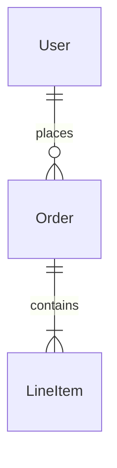

# Architecture

<!-- Systemarchitektur, Modulgrenzen, Schnittstellenverträge.
     Architektur ist ein lebendes Dokument: sie reift während der Umsetzung.
     Jeder Architektur-Bestandteil trägt einen Reifegrad-Marker, der seinen Status anzeigt.
     Änderungen an belastbaren Bestandteilen sind freigabepflichtig (CLAUDE.md Abschnitt 4).
     Änderungen an vorläufigen oder offenen Bestandteilen sind Teil der normalen Erkenntnisarbeit. -->

## 0. Reifegrad-System

Jedes Modul, jede Schnittstelle und jede Architektur-Aussage trägt einen der folgenden Marker:

- `[BELASTBAR]` – Entscheidung getroffen, durch Umsetzung validiert oder durch ADR fixiert. Änderung ist freigabepflichtig (CLAUDE.md Abschnitt 4) und erzeugt einen ADR.
- `[VORLÄUFIG]` – Entwurfshypothese, plausibel aber nicht durch Umsetzung validiert. Darf in der Implementierung verfeinert werden, ohne separate Freigabe – jede Verfeinerung wird aber im Dokument nachgezogen und mit Datum vermerkt. Wird nach Validierung auf `[BELASTBAR]` befördert.
- `[OFFEN]` – bewusst nicht entschieden. Wartet auf Erkenntnis aus einer Erkundungsphase, einen Spike oder eine externe Klärung. Kein Code in Bereichen, die von einer `[OFFEN]`-Architektur abhängen, ohne dass die Lücke vorher geschlossen wurde.

**Beförderungsregel:** Ein Bestandteil wird von `[VORLÄUFIG]` auf `[BELASTBAR]` befördert, wenn:
1. Die Annahme durch funktionierende Implementierung bestätigt wurde, **oder**
2. Ein ADR die Entscheidung explizit fixiert.

Beide Wege sind dokumentationspflichtig: Beförderung mit Datum und kurzer Begründung am betroffenen Eintrag.

**Rückstufungsregel:** Ein `[BELASTBAR]`-Bestandteil kann nur durch ADR auf `[VORLÄUFIG]` oder `[OFFEN]` zurückgestuft werden. Stille Rückstufung ist verboten.

## 1. Überblick

[2–4 Sätze: was wird gebaut, grobe Aufteilung, prägende Kernentscheidung.]

**Architektur-Pattern:** [z. B. „Modular Monolith" `[BELASTBAR]`]

**Kommunikations-Grundmodus:** [z. B. „Synchron REST intern, asynchron via Queue zwischen Services" `[BELASTBAR]`]

## 2. Modul-Karte

[Diagramm als ASCII oder Mermaid, das die Module und ihre Kommunikationsbeziehungen zeigt.
Nur diese Beziehungen sind erlaubt – alles andere ist Architekturbruch.
Vorläufige oder offene Beziehungen werden im Diagramm gekennzeichnet (z. B. gestrichelte Linie für `[VORLÄUFIG]`).]

```mermaid
graph LR
  A[Modul A] -->|REST [BELASTBAR]| B[Modul B]
  B -.->|Event [VORLÄUFIG]| C[Modul C]
```

## 3. Module (detailliert)

### Modul: [Name] [REIFEGRAD]

- **Reifegrad:** `[BELASTBAR | VORLÄUFIG | OFFEN]`, seit [YYYY-MM-DD], Begründung: [kurz]
- **Verantwortung:** [was macht dieses Modul – in 1–2 Sätzen]
- **Nicht-Verantwortung:** [was explizit **nicht** in diesem Modul erledigt wird, obwohl es thematisch naheliegen könnte]
- **Öffentliche Schnittstellen:** [siehe Abschnitt 4, mit eigenen Reifegraden]
- **Interne Struktur:** [Kurzbeschreibung; Details sind Implementierungsfreiheit]
- **Abhängigkeiten (andere Module):** [welche Module werden aufgerufen, auf welche Art]
- **Abhängigkeiten (extern):** [Services, Bibliotheken mit besonderer Relevanz]
- **Technologie:** [nur wenn abweichend vom Haupt-Stack]
- **NFRs (modulspezifisch):** [siehe Abschnitt 6]
- **Offene Fragen:** [falls Reifegrad `[VORLÄUFIG]` oder `[OFFEN]`: was muss noch geklärt werden, durch welchen Schritt im Fahrplan]

### Modul: [Name] [REIFEGRAD]

[...]

## 4. Schnittstellenverträge

Alle modulübergreifenden Aufrufe sind hier dokumentiert. Änderungen an `[BELASTBAR]`-Schnittstellen sind freigabepflichtig (CLAUDE.md 4.5). `[VORLÄUFIG]`-Schnittstellen dürfen während der Umsetzung verfeinert werden, mit Update hier.

### Schnittstelle: [ID oder sprechender Name] [REIFEGRAD]

- **Reifegrad:** `[BELASTBAR | VORLÄUFIG | OFFEN]`, seit [YYYY-MM-DD]
- **Typ:** [HTTP-REST | gRPC | Event | CLI | Funktions-Export | Bibliotheks-API]
- **Anbieter:** [Modul, das bereitstellt]
- **Konsument:** [Module, die aufrufen]
- **Spezifikation:**
  - **Eingabe:** [Schema, Pflichtfelder, Typen, Validierung]
  - **Ausgabe (Erfolg):** [Schema, Statuscode/Envelope]
  - **Ausgabe (Fehler):** [Fehlerklassen, Statuscodes, Fehlerschema]
  - **Idempotenz:** [ja/nein, wie sichergestellt]
  - **Timeouts und Retries:** [wer wartet wie lange, wann wird retried]
- **Versionierung:** [wie werden Breaking Changes gehandhabt]
- **Sicherheit:** [Auth, Rate Limits]
- **Beispiel:** [Minimalbeispiel für Request und Response]
- **Offene Fragen:** [bei nicht-`[BELASTBAR]`: was muss noch validiert werden]

### Schnittstelle: [...] [REIFEGRAD]

[...]

## 5. Datenfluss

[Wie bewegen sich Daten durch das System. Für jeden nicht-trivialen Flow:]

### Flow: [Name, z. B. „Neuregistrierung eines Nutzers"] [REIFEGRAD]

1. [Schritt 1: wer macht was, mit welchem Input/Output]
2. [Schritt 2: ...]
3. [...]

**Fehlerpfade:** [was passiert, wenn ein Schritt fehlschlägt – Rollback, Retry, Compensating Action]

## 6. Nicht-funktionale Anforderungen

[NFRs tragen ebenfalls Reifegrade, weil Performance- oder Skalierungsannahmen oft erst durch Messung validiert werden.]

### Performance

- **Modul [X]:** [Latenz-Ziel, Durchsatz-Ziel, konkrete Werte] `[REIFEGRAD]`
- **Modul [Y]:** [...] `[REIFEGRAD]`

### Skalierung

- **Horizontal skalierbare Module:** [welche, mit Begründung] `[REIFEGRAD]`
- **Stateful Module (Skalierung beschränkt):** [welche, wie wird State gehalten] `[REIFEGRAD]`

### Security

- **Bedrohungsmodell:** [welche Angriffe werden bedacht, welche nicht] `[REIFEGRAD]`
- **Schutzmaßnahmen:** [pro Schicht/Modul]
- **Sensitive Datenflüsse:** [wo bewegen sich PII, Secrets, kryptographische Schlüssel]

### Observability

- **Logging:** [Format, Level, Aggregation]
- **Metriken:** [welche werden erfasst, wo]
- **Tracing:** [falls implementiert: wie]

### Datenschutz

[Falls personenbezogene Daten verarbeitet werden:]

- **Datenkategorien:** [welche Arten von PII]
- **Speicherort:** [wo liegen die Daten]
- **Retention:** [wie lange]
- **Löschung:** [wie wird DSGVO-Art. 17 technisch umgesetzt]

## 7. Datenmodell

[Grobübersicht der wichtigsten Entitäten und ihrer Beziehungen.
Details (Spalten, Typen, Indizes) gehören in Migration-Dateien oder ein separates Schema-Dokument,
nicht hier. Änderungen an `[BELASTBAR]`-Datenmodellen sind freigabepflichtig (CLAUDE.md 4.4).]



Reifegrad-Hinweise: pro Entität in Klammern, falls relevant.

## 8. Verworfene Alternativen

[Architekturoptionen, die bewusst nicht gewählt wurden, mit Begründung.
Verhindert, dass die KI später diese Optionen neu vorschlägt, ohne den Kontext zu kennen.
Jeder Eintrag verweist auf den entsprechenden ADR in `decisions.md`.]

- **[Verworfene Option]:** [Grund in 1 Satz] – siehe ADR-[Nr.]

## 9. Reifegrad-Übersicht (Stand vom YYYY-MM-DD)

[Tabelle, die den Gesamtstatus der Architektur auf einen Blick zeigt.
Wird zu Sessionende aktualisiert, wenn sich Reifegrade geändert haben.]

| Bestandteil | Reifegrad | Seit | Validiert durch / wartet auf |
|---|---|---|---|
| Modul A | BELASTBAR | YYYY-MM-DD | Implementierung Phase 1 |
| Schnittstelle X→Y | VORLÄUFIG | YYYY-MM-DD | wartet auf Spike S-3 |
| NFR Performance Modul Z | OFFEN | YYYY-MM-DD | wartet auf Lasttest in Phase 4 |

---

**Initialisierungshinweis (erste Session nach Projektanlage):**

- **Initiale Reifegrade in Modus 2:** Architektur-Bestandteile, die direkt aus der Vision und der Konzeptphase ableitbar sind, starten als `[VORLÄUFIG]` – nicht als `[BELASTBAR]`. `[BELASTBAR]` setzt Validierung voraus, die in Modus 2 noch nicht stattgefunden hat. Ausnahme: Bestandteile, die durch harte Randbedingungen aus der Vision fixiert sind (z. B. „muss Self-Hosting sein" → Hosting-Pattern `[BELASTBAR]`).
- **Bestandteile, die in der Konzeptphase bewusst nicht entschieden wurden:** als `[OFFEN]` mit Verweis auf den Erkundungs-Schritt im Fahrplan, der sie klären soll.
- **Strukturwahl** (ein Dokument vs. Index mit Unterdokumenten) richtet sich nach der Projektgrößen-Klassifikation in `CLAUDE.md` Abschnitt 1B. Default pro Klasse:
  - **Klasse K (Klein):** Reduzierte Form – Modul-Karte und Datenfluss können entfallen, Schnittstellenverträge nur wenn nicht-trivial.
  - **Klasse M (Mittel):** Ein Dokument, alle Abschnitte ausgefüllt.
  - **Klasse G (Groß):** Ein Hauptdokument, ergänzt um `architecture-<modul>.md` für besonders komplexe Module.
  - **Klasse V (Verteilt-Groß):** Pflicht-Index, Service-spezifische Dokumente, separates `architecture-integration.md` für übergreifende Verträge.
- Abschnitt 8 (Verworfene Alternativen) wird im Projektverlauf gefüllt, startet leer.
- Abschnitt 9 (Reifegrad-Übersicht) startet befüllt mit den initialen Reifegraden aus Modus 2.
- Klassifikations- und Anpassungsentscheidung in `decisions.md` als ADR-001 festhalten.
