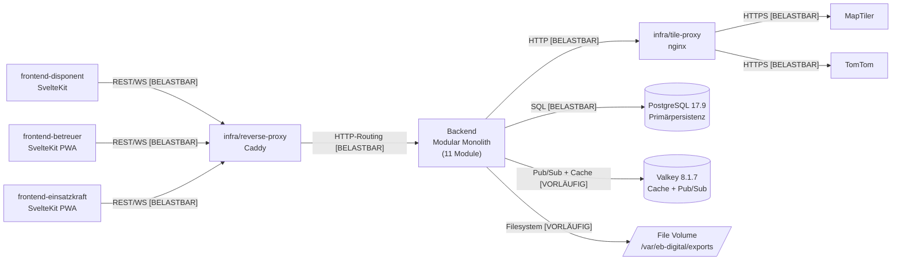
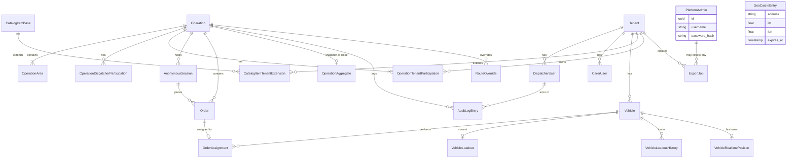

# Architecture

<!-- Systemarchitektur, Modulgrenzen, Schnittstellenverträge.
     Architektur ist ein lebendes Dokument: sie reift während der Umsetzung.
     Jeder Architektur-Bestandteil trägt einen Reifegrad-Marker, der seinen Status anzeigt.
     Änderungen an belastbaren Bestandteilen sind freigabepflichtig (CLAUDE.md Abschnitt 4).
     Änderungen an vorläufigen oder offenen Bestandteilen sind Teil der normalen Erkenntnisarbeit. -->

## 0. Reifegrad-System

Jedes Modul, jede Schnittstelle und jede Architektur-Aussage trägt einen der folgenden Marker:

- `[BELASTBAR]` – Entscheidung getroffen, durch Umsetzung validiert oder durch ADR fixiert. Änderung ist freigabepflichtig (CLAUDE.md Abschnitt 4) und erzeugt einen ADR.
- `[VORLÄUFIG]` – Entwurfshypothese, plausibel aber nicht durch Umsetzung validiert. Darf in der Implementierung verfeinert werden, ohne separate Freigabe – jede Verfeinerung wird aber im Dokument nachgezogen und mit Datum vermerkt. Wird nach Validierung auf `[BELASTBAR]` befördert.
- `[OFFEN]` – bewusst nicht entschieden. Wartet auf Erkenntnis aus einer Erkundungsphase, einen Spike oder eine externe Klärung. Kein Code in Bereichen, die von einer `[OFFEN]`-Architektur abhängen, ohne dass die Lücke vorher geschlossen wurde.

**Beförderungsregel:** Ein Bestandteil wird von `[VORLÄUFIG]` auf `[BELASTBAR]` befördert, wenn:

1. Die Annahme durch funktionierende Implementierung bestätigt wurde, **oder**
2. Ein ADR die Entscheidung explizit fixiert.

Beide Wege sind dokumentationspflichtig: Beförderung mit Datum und kurzer Begründung am betroffenen Eintrag.

**Rückstufungsregel:** Ein `[BELASTBAR]`-Bestandteil kann nur durch ADR auf `[VORLÄUFIG]` oder `[OFFEN]` zurückgestuft werden. Stille Rückstufung ist verboten.

**Code-Bezeichner-Konvention:** Codesprache ist Englisch (`project-context.md` Abschnitt 1). Domänenbegriffe werden 1:1 ins Englische übersetzt:

| Deutsch (Glossar)       | Englisch (Code)                                                                            |
| ----------------------- | ------------------------------------------------------------------------------------------ |
| Einsatz                 | Operation                                                                                  |
| Einsatzraum             | OperationArea                                                                              |
| Mandant                 | Tenant                                                                                     |
| Plattform-Administrator | PlatformAdmin                                                                              |
| Disponent               | Dispatcher                                                                                 |
| Betreuer                | Carer                                                                                      |
| Einsatzkraft            | ResponseUnitMember (Arbeitsname; finale Wahl im Auth-Modul-ADR vor erster UMSETZUNG-Phase) |
| Versorgungs-Transporter | SupplyTransporter                                                                          |
| Geschäftsstelle         | HeadOffice                                                                                 |
| Zugangscode             | AccessCode                                                                                 |
| Bestellung              | Order                                                                                      |
| Fahrauftrag             | OrderAssignment                                                                            |
| Sperrungs-Override      | RouteOverride                                                                              |
| Audit-Log-Eintrag       | AuditLogEntry                                                                              |

Tabellennamen folgen `snake_case`, Klassennamen `PascalCase`, Modulpfade `kebab-case`/`snake_case` gemäß PEP 8 / Svelte-Konvention. Tabellen, die in der Klärungs-Session in `project-context.md` Abschnitt 11 deutsch referenziert wurden (`einsatz_mandant_teilnahme`, `einsatz_audit_log`), werden im Code als `operation_tenant_participation` und `operation_audit_log` umgesetzt. Diese Übersetzung ist Code-Konvention, kein Vision-Pivot.

## 1. Überblick

EB Digital ist ein **Modular Monolith im Backend** mit **drei separaten SvelteKit-Frontends** (Disponent, Betreuer, Einsatzkraft), einem **nginx-Tile-Proxy** vor MapTiler und TomTom sowie einem **Caddy-Reverse-Proxy** mit automatischem TLS. Das Gesamtsystem läuft als einzelne Compose-Deployment-Einheit auf einem Hetzner-VPS in Deutschland.

Prägende Kernentscheidung: ein Backend-Monolith mit klar geschnittenen Modulen statt eines verteilten Service-Schnitts. Begründung: kein verteilter Lebenszyklus erkennbar, Mandanten-Trennung erfolgt domänenintern, Last-Annahme (50 Disponenten + 500 Einsatzkräfte) trägt einen Monolithen problemlos. Drei separate Frontends sind dagegen nötig, weil sich die Service-Worker-Profile, Last-Annahmen und Berechtigungs-Modelle der Rollen klar unterscheiden.

**Architektur-Pattern:** Modular Monolith Backend + drei SvelteKit-Frontends + Tile-/Reverse-Proxy. `[VORLÄUFIG]`, seit 2026-05-07. Validierung steht aus; Beförderung auf `[BELASTBAR]` mit Erreichen erster UMSETZUNG-Phase und bestandenem Last-/Funktionstest.

**Kommunikations-Grundmodus:**

- REST/JSON synchron Frontend ↔ Backend, Pfad-Präfix `/api`. `[BELASTBAR]`, Vision-Stack-fix.
- WebSocket Frontend ↔ Backend für Live-Standorte, Auftragsstatus-Updates, Disponent↔Betreuer-Chat, Hilfe-Knopf, Audit-Log-Stream. `[BELASTBAR]`, Vision-Stack-fix.
- HTTP synchron Backend → externe Karten-/Routing-Services ausschließlich über `infra/tile-proxy`. `[BELASTBAR]`, Vision-Constraint API-Budget + Privacy.
- Pub/Sub über Valkey für WebSocket-Fan-out (mehrere Backend-Worker können denselben Topic-Stream bedienen). `[VORLÄUFIG]`, plausible Stack-Nutzung, Validierung steht aus.
- Asynchrone Hintergrund-Jobs über Procrastinate (PostgreSQL-basiert): Datenexport, 30-Tage-Anonymisierung, Aggregat-Berechnung. `[BELASTBAR]`, Stack-fix.

## 2. Modul-Karte



**Erlaubte Beziehungen sind ausschließlich die im Diagramm gezeigten.** Insbesondere:

- Frontends greifen niemals direkt auf externe Services (MapTiler, TomTom) zu – Tiles und Routing werden Backend-seitig über `infra/tile-proxy` gepuffert. Begründung: API-Keys bleiben Backend-seitig (`project-context.md` Abschnitt 6 Sicherheit), API-Budget-Disziplin zentral kontrollierbar.
- Frontends greifen niemals direkt auf PostgreSQL oder Valkey zu.
- Backend-Module greifen niemals direkt auf MapTiler oder TomTom zu – ausschließlich über `infra/tile-proxy`.
- Backend-Module sprechen Frontends nur über REST oder WebSocket an, nicht über andere Kanäle.

Die backend-internen Modul-zu-Modul-Beziehungen sind in Abschnitt 3 pro Modul unter „Abhängigkeiten (andere Module)" dokumentiert. Reifegrade dort.

## 3. Module (detailliert)

### Modul: backend/auth `[VORLÄUFIG]`

- **Reifegrad:** `[VORLÄUFIG]`, seit 2026-05-07. Begründung: Modul-Schnitt aus Vision und Klärungs-Session ableitbar, aber nicht durch Implementierung validiert.
- **Verantwortung:** Account-Verwaltung und Session-Handling für angemeldete Rollen (Plattform-Administrator, Disponent, Betreuer); Passwort-Hashing per Argon2id; Login mit Rate-Limit; Cookie-basierte Sessions; CLI-Bootstrap zum Anlegen von Plattform-Administrator-Accounts.
- **Nicht-Verantwortung:** Anonyme Einsatzkraft-Sessions (das ist `backend/auth_anonymous`); Mandanten-Antrag und -Freischaltung (das ist `backend/tenants`); Account-Anlage Disponent durch Plattform-Admin und Betreuer durch Disponent (Use-Case-Logik liegt hier, aber Mandanten-Scope-Validierung in `backend/tenants`).
- **Öffentliche Schnittstellen:** S1 (CLI-Entry-Point Admin-Bootstrap), Anteile von S8 (REST `/api/auth/*`, REST `/api/users/*`); siehe Abschnitt 4.
- **Interne Struktur:** ein Use-Case-Layer (Login, Logout, ChangePassword, CreateUser, ListUsers); Repository-Layer auf SQLAlchemy 2.0; Hashing-Helper mit `argon2-cffi`; Session-Handling über Starlette `SessionMiddleware`; CLI-Befehl als eigenständiger Click/Typer-Subcommand unter `eb_digital.cli.admin`.
- **Abhängigkeiten (andere Module):** wird verwendet von `backend/tenants` (Disponent-Anlage), Frontends (Login-Pfad). Verwendet selbst keine anderen Backend-Module.
- **Abhängigkeiten (extern):** PostgreSQL für `users`-Tabelle (mit Rolle, Mandanten-Referenz), `argon2-cffi`, `itsdangerous`, Starlette-Session-Middleware.
- **Technologie:** wie Haupt-Stack.
- **NFRs (modulspezifisch):** Coverage ≥ 95 % Lines, ≥ 90 % Branches (`project-context.md` Abschnitt 7). Externe Security-Review vor Produktivstart Pflicht (`project-context.md` Abschnitt 3 „Auth-Bausteine"). Bedrohungsmodell siehe Abschnitt 6, Reifegrad `[OFFEN]`.
- **Offene Fragen:** Email-Reset-Flow (Detail-Schema steht aus); MFA für Plattform-Admin (Phase ≥ 2 erwogen, kein Phase-1-Constraint).

### Modul: backend/auth_anonymous `[VORLÄUFIG]`

- **Reifegrad:** `[VORLÄUFIG]`, seit 2026-05-07. Begründung: Schnitt durch Frage B konkretisiert; Implementierungs-Validierung steht aus.
- **Verantwortung:** Erzeugung und Validierung der einsatzspezifischen URL mit kryptographisch zufälligem Token; AccessCode-Generierung (6 Zeichen Crockford-Base32) und Validierung; Verwaltung anonymer Temporär-Sessions; Bindung der Session an `operation_id`.
- **Nicht-Verantwortung:** Das Anlegen oder Beenden eines Einsatzes (`backend/operations`); persistente Standortdaten der Einsatzkraft (`backend/operations` über das Order-Datenmodell mit Lebensdauer-Limit aus `project-context.md` Abschnitt 6 Datenschutz); jegliche User-Identität (per Definition kein PII).
- **Öffentliche Schnittstellen:** S2 (REST `/api/anon/{operation_url}/*`); siehe Abschnitt 4.
- **Interne Struktur:** URL-Token-Generator (`itsdangerous`); AccessCode-Generator (Crockford-Base32-Encoding mit Verwechslungsfreiheit O/0/I/1/L); AnonymousSessionRepository; Toggle-Logik für AccessCode-Aktivierung mit Zeitstempel; QR-Code-Renderer im Disponenten-Frontend (Backend liefert die kombinierte URL-mit-Code als String, QR-Render erfolgt clientseitig).
- **Abhängigkeiten (andere Module):** verwendet `backend/operations` (Operation-Lookup zur Validierung, Status `aktiv`). Wird verwendet von `frontend-einsatzkraft` und intern vom Bestellpfad in `backend/operations`.
- **Abhängigkeiten (extern):** PostgreSQL (`anonymous_session`, `operation` mit `access_code`, `access_code_active`).
- **NFRs (modulspezifisch):** Coverage ≥ 95 % Lines, ≥ 90 % Branches. Rate-Limit auf Code-Validierungs-Endpunkt (analog zu Login: 5 Fehlversuche pro 15 min pro IP).
- **Offene Fragen:** keine offenen Bereiche im Phase-1-Scope; spätere Erweiterung „Code rotieren während Einsatz" ist Stabilisierungs-Erweiterungspfad (`project-context.md` Abschnitt 11 Frage B).

### Modul: backend/tenants `[VORLÄUFIG]`

- **Reifegrad:** `[VORLÄUFIG]`, seit 2026-05-07.
- **Verantwortung:** Mandanten-Stammdatenpflege; Self-Service-Antrag (`POST /api/auth/register-tenant`); Plattform-Admin-Freischaltung; mandantenseitige Verwaltung von Disponenten-, Betreuer- und Fahrzeug-Accounts (Anlage, Sperrung, Reset durch Disponent für seine Mandanten-Mitglieder); Mandanten-Deaktivierung mit Lösch-Pfad für Stammdaten (DSGVO-Art. 17).
- **Nicht-Verantwortung:** Verbund-Vertragsabwicklung in Phase 1 (siehe Frage F – kein eigenes Modul, spätere Erweiterung dieses Moduls); Aggregations-Tabelle (`backend/retention`); Datenexport (`backend/export`).
- **Öffentliche Schnittstellen:** Anteile von S8 (REST `/api/tenants/*`, `/api/users/*` mit Mandanten-Scope); S10 (Funktions-Export `tenant_participates_in_operation(tenant_id, operation_id) -> bool` für I2-Berechtigungs-Filter).
- **Interne Struktur:** Use-Cases CreateTenant, ApproveTenant, DeactivateTenant, AddDispatcher/Carer/Vehicle (delegiert an `backend/auth` für Account-Anlage und an `backend/fleet` für Fahrzeug-Anlage); Repository auf `tenant`, `operation_tenant_participation`-Tabelle.
- **Abhängigkeiten (andere Module):** verwendet `backend/auth` (User-Anlage), `backend/fleet` (Fahrzeug-Anlage). Wird verwendet von `backend/operations` (Mandanten-Scope-Prüfung über S10).
- **Abhängigkeiten (extern):** PostgreSQL (`tenant`, `operation_tenant_participation`).
- **NFRs (modulspezifisch):** Coverage ≥ 80 % Lines (Standard).
- **Offene Fragen:** Verbund-Vertrag-Schema (Phase ≥ 2, in spätere UMSETZUNG-Phase „Verbund-Modus" verschoben, siehe `project-context.md` Abschnitt 11 Frage F).

### Modul: backend/catalog `[VORLÄUFIG]`

- **Reifegrad:** `[VORLÄUFIG]`, seit 2026-05-07.
- **Verantwortung:** Zentraler Basis-Artikelkatalog (gepflegt durch Plattform-Admin); mandantenspezifische Erweiterungen (gepflegt durch Disponent); Bereitstellung des effektiven Katalogs für eine gegebene Operation (`base_catalog ∪ tenant_catalog`).
- **Nicht-Verantwortung:** Bestand und Beladung – das ist `backend/fleet`. Bestellungs-Logik – das ist `backend/operations`.
- **Öffentliche Schnittstellen:** Anteile von S8 (REST `/api/catalog/*` mit Mandanten-Scope; öffentlicher Read-Only-Pfad `/api/anon/{operation_url}/catalog` für Einsatzkraft-Sicht).
- **Interne Struktur:** zwei Tabellen-Layer (`catalog_item_base`, `catalog_item_tenant_extension`); Use-Cases CreateBaseItem, CreateTenantExtension, ResolveCatalogForOperation.
- **Abhängigkeiten (andere Module):** wird verwendet von `backend/operations` (Bestellungs-Validierung).
- **Abhängigkeiten (extern):** PostgreSQL.
- **NFRs (modulspezifisch):** Standard-Coverage.

### Modul: backend/operations `[VORLÄUFIG]` (mit teil-`[OFFEN]`-Bestandteilen)

- **Reifegrad:** `[VORLÄUFIG]`, seit 2026-05-07. **Eingebettete `[OFFEN]`-Bereiche:** Bündelungs-Trigger (Spike J), Hilfe-Knopf-Semantik (Spike K), Geo-Plausibilitäts-Algorithmus (Spike I).
- **Verantwortung:** Lebenszyklus von Operations (Eröffnen, Aktiv, Beenden); OperationArea-Verwaltung; Bestellungs-Aufnahme; Auftrags-Erzeugung; Fahrzeug-Zuweisung (automatisch + Disponent-Override); Stornierung; Bündelung (Großbestellungs-Modus); Versorgungs-Transporter-Modus-Steuerung; AuditLogEntry-Schreibung für alle kritischen Aktionen; Audit-Log-Stream-Bereitstellung. Zugangscode-Toggle ist Aktion auf Operation, technische Umsetzung in `backend/auth_anonymous`.
- **Nicht-Verantwortung:** Routing-Berechnung (`backend/geo`); WebSocket-Topic-Verteilung (`backend/realtime` – `backend/operations` publisht Events, `backend/realtime` fan-outet); Aggregat-Schreibung beim Einsatz-Ende (`backend/retention` – wird über S5-Event getriggert).
- **Öffentliche Schnittstellen:** Anteile von S8 (REST `/api/operations/*`, `/api/operations/{id}/orders/*`, `/api/operations/{id}/audit-log`); S3 (Event-Publishing an `backend/realtime`); S4 (Funktions-Export für Fahrzeug-Zuweisung); S5 (Event an `backend/retention` „operation ended"); S10 (Konsument von `tenant_participates_in_operation`).
- **Interne Struktur:** Domain-Layer mit Operation/Order/OrderAssignment-Aggregaten; Use-Case-Layer mit Aktionen (OpenOperation, CloseOperation, ChangeOperationArea, ToggleAccessCode, SwitchSupplyTransporterMode, PlaceOrder, AssignVehicle, CancelOrder, BundleOrders, RaiseHelpAlert, ApproveLowPlausibilityOrder); EventBus-Adapter zu `backend/realtime`; AuditLogger als Cross-Cutting-Concern auf jedem Use-Case.
- **Abhängigkeiten (andere Module):** verwendet `backend/catalog` (Item-Validation), `backend/fleet` (Fahrzeug-Lookup, Beladungs-Prüfung), `backend/geo` (Routing-Anfrage, Plausibilitäts-Check), `backend/realtime` (Event-Publishing), `backend/retention` (Aggregat-Trigger), `backend/auth_anonymous` (für anonyme Bestell-Pfade), `backend/tenants` (S10).
- **Abhängigkeiten (extern):** PostgreSQL (zentrale Operation/Order/Audit-Tabellen).
- **NFRs (modulspezifisch):** Coverage ≥ 90 % Lines (`project-context.md` Abschnitt 7); Audit-Log-Vollständigkeit ist Pflicht-Test.
- **Offene Fragen:** Bündelungs-Trigger (Spike J), Hilfe-Knopf-Semantik (Spike K), Geo-Plausibilitäts-Algorithmus (Spike I). Bis zur Klärung gilt: keine produktive UMSETZUNG der jeweiligen Bereiche.

### Modul: backend/fleet `[VORLÄUFIG]`

- **Reifegrad:** `[VORLÄUFIG]`, seit 2026-05-07.
- **Verantwortung:** Fahrzeug-Stammdaten (mit Mandanten-Bindung); Beladungs-Erfassung (manuell + automatische Verbrauchsbuchung pro Mandant aktivierbar); Versorgungs-Transporter-Klassifikation; HeadOffice-Definition pro Mandant.
- **Nicht-Verantwortung:** Fahrzeug-Position in Echtzeit (das ist `backend/realtime` – Push aus Betreuer-PWA an WebSocket-Topic, ohne dauerhafte Persistenz roher GPS-Spuren); Fahrzeug-Zuweisung zu Aufträgen (`backend/operations`).
- **Öffentliche Schnittstellen:** Anteile von S8 (REST `/api/fleet/*`, mandantengescoped); Funktions-Exporte für `backend/operations` (Fahrzeug-Lookup, Beladungs-Check, Verbrauchs-Buchung).
- **Interne Struktur:** Tabellen `vehicle`, `vehicle_loadout` (Snapshot der aktuellen Beladung), `vehicle_loadout_history`; Use-Cases CreateVehicle, UpdateLoadout, RecordConsumption.
- **Abhängigkeiten (andere Module):** wird verwendet von `backend/tenants` (Anlage), `backend/operations` (Lookup, Verbrauchs-Buchung).
- **NFRs (modulspezifisch):** Standard-Coverage.
- **Offene Fragen:** Fahrzeugbezeichnungs-Schema (Spike M, kein Architektur-Blocker, vor Roll-out zu klären).

### Modul: backend/geo `[VORLÄUFIG]` (mit teil-`[OFFEN]`-Bestandteilen)

- **Reifegrad:** `[VORLÄUFIG]`, seit 2026-05-07. **Eingebettete `[OFFEN]`-Bereiche:** Sperrungs-Override-Technik (Spike G), Geo-Plausibilitäts-Algorithmus (Spike I, gemeinsam mit `backend/operations`).
- **Verantwortung:** Routing-Adapter zu TomTom (mit aktiver Routing-API-Version explizit gepinnt – kein implizites `latest`, siehe `project-context.md` Abschnitt 5); Geocoding-Adapter zu MapTiler mit Adress→Koordinate-Cache; Tile-Caching-Steuerung an `infra/tile-proxy`; Geofencing 150 m für Annäherungs-Notification an Einsatzkraft (Vision); Sperrungs-Override-Verwaltung (Datenmodell `route_override` mit Polylinien-Repräsentation, siehe Spike G); Verbrauchszähler externer Dienste mit Disponenten-Warnung bei Budget-Überschreitung.
- **Nicht-Verantwortung:** Tile-Bereitstellung selbst (das ist `infra/tile-proxy`); Karten-Rendering (Frontend mit MapLibre GL JS).
- **Öffentliche Schnittstellen:** Anteile von S8 (REST `/api/geo/*` für Routing-Anfragen, Plausibilitäts-Check, Override-Pflege); S7 (HTTP-Konsument von `infra/tile-proxy`); Funktions-Export für `backend/operations` (`route_for_assignment(start, target, vehicle_id)`).
- **Interne Struktur:** TomTomRoutingAdapter (`httpx`-Client, Connection-Pool, expliziter API-Version-Pin); MapTilerGeocodingAdapter (mit Cache `geo_cache` in PostgreSQL); RouteOverrideRepository; PlausibilityChecker (Implementierung `[OFFEN]` bis Spike I); GeoUsageCounter mit Persistenz im Tabellen-Format `geo_usage_daily(tenant_id, date, tomtom_calls, maptiler_geocoding_calls, maptiler_tile_proxy_hits)`.
- **Abhängigkeiten (andere Module):** verwendet `infra/tile-proxy` (HTTP-Aufrufe). Wird verwendet von `backend/operations` (Routing, Plausibilität).
- **Abhängigkeiten (extern):** TomTom (Routing), MapTiler (Geocoding/Tiles über Tile-Proxy), PostgreSQL (Cache + Override-Tabelle).
- **NFRs (modulspezifisch):** Standard-Coverage. Routing-Aufrufe-Disziplin Pflicht (`project-context.md` Abschnitt 6 Performance: max 1 Aufruf pro Auftrag, ≥ 30 s Pause für dasselbe Fahrzeug, 60-s-Cache identischer Routen).
- **Offene Fragen:** Sperrungs-Override-Technik (Spike G – Custom-Areas vs. Route-Bias vs. Penalty-Map; budgetschonend); Geo-Plausibilitäts-Algorithmus (Spike I – Distanz-Metrik, Schwellenwert).

### Modul: backend/realtime `[VORLÄUFIG]`

- **Reifegrad:** `[VORLÄUFIG]`, seit 2026-05-07.
- **Verantwortung:** WebSocket-Endpoint pro Rolle (`/ws/dispatcher`, `/ws/carer`, `/ws/anon/{operation_url}`); Topic-Schema mit Tenant-Scoping (siehe S9); Pub/Sub über Valkey für Multi-Worker-Fan-out; Standort-Push der Betreuer mit Tile-Identifier-Hashing für Logging (PII-Redaction); Auftragsstatus-Stream; Disponent↔Betreuer-Chat-Routing; Hilfe-Knopf-Notification-Routing; Audit-Log-Stream zu Disponenten-UI.
- **Nicht-Verantwortung:** Persistenz der Standort-Spur (nur letzter Standort pro Session in `anonymous_session`/`vehicle_realtime_position` mit Lebensdauer-Limit); Notification an externe Push-Stacks – Web-Push ist nicht im Phase-1-Stack.
- **Öffentliche Schnittstellen:** S9 (WebSocket-Topologie und Topic-Schema); S3 (Event-Konsument von `backend/operations`).
- **Interne Struktur:** WebSocket-Hub mit Topic-Routing; Valkey-Pub/Sub-Brücke; Authentifizierungs-Decorator (Cookie für Disponent/Betreuer, anonyme Session-Cookie für Einsatzkraft); Logger-Wrapper mit Standort-Redaction (Tile-Hash statt Roh-Koordinate).
- **Abhängigkeiten (andere Module):** verwendet `backend/auth` (Cookie-Validierung) und `backend/auth_anonymous` (anonyme Session-Validierung). Wird verwendet von `backend/operations` (Event-Publishing) und Frontends.
- **Abhängigkeiten (extern):** Valkey (Pub/Sub), PostgreSQL (Realtime-Position-Snapshot mit Lebensdauer).
- **NFRs (modulspezifisch):** Standard-Coverage. PII-in-Logs-Verbot strikt eingehalten.

### Modul: backend/resilience `[VORLÄUFIG]` (mit teil-`[OFFEN]`-Bestandteilen)

- **Reifegrad:** `[VORLÄUFIG]`, seit 2026-05-07. **Eingebetteter `[OFFEN]`-Bereich:** Backup-Granularität, Recovery-Reihenfolge, RTO/RPO-Annahme (Spike H).
- **Verantwortung:** Backup und Wiederherstellung des persistenten Einsatzzustands aus PostgreSQL (inklusive offener Aufträge und in-flight Procrastinate-Jobs); Recovery-Skript für Bare-Metal-Restore. WebSocket-Verbindungen brechen bei Server-Neustart bewusst ab; Clients reconnecten automatisch und bekommen den persistenten State neu geladen. „Nahtlos" im Vision-Sinn meint State-Erhaltung, nicht Connection-Erhaltung.
- **Nicht-Verantwortung:** WebSocket-Reconnect-Logik im Frontend (das ist Frontend-Aufgabe); Hot-Failover oder Multi-Master-Replikation (Phase ≥ 2).
- **Öffentliche Schnittstellen:** keine modul-übergreifenden Funktions-Exporte; Operative-Schnittstellen in Form von Skripten unter `eb_digital.cli.resilience` (Backup-Trigger, Restore-Dry-Run, Restore).
- **Interne Struktur:** Backup-Strategie als TBD nach Spike H; Restore-Runbook in `docs/runbooks/restore.md` (Phase ≥ UMSETZUNG `backend/resilience`); Health-Check-Endpoint für Backup-Status.
- **Abhängigkeiten (andere Module):** keine direkten – das Modul liest direkt PostgreSQL und schreibt Backup-Artefakte.
- **Abhängigkeiten (extern):** PostgreSQL (`pg_basebackup` oder `pg_dump`-Pfad – TBD nach Spike H), Filesystem auf VPS (Backup-Volume).
- **NFRs (modulspezifisch):** Coverage ≥ 90 % Lines (`project-context.md` Abschnitt 7); RTO/RPO-Werte werden in Spike H festgelegt und in `architecture.md` Abschnitt 6 als `[VORLÄUFIG]` mit Wert eingetragen, nach Test-Validierung in STABILISIERUNG-Phase auf `[BELASTBAR]` befördert.
- **Offene Fragen:** Backup-Strategie (Spike H), Recovery-Reihenfolge (Spike H), getestete RTO-Annahme (Spike H + Lasttest in STABILISIERUNG).

### Modul: backend/export `[VORLÄUFIG]`

- **Reifegrad:** `[VORLÄUFIG]`, seit 2026-05-07. Konkretisiert durch Frage D.
- **Verantwortung:** DSGVO-Datenexport pro Mandant; Job-Tripel POST/GET-Status/GET-Download; ZIP-Bundle mit JSON pro Tabelle plus `manifest.json`; Cleanup-Job für 7-Tage-Aufbewahrung.
- **Nicht-Verantwortung:** PDF/CSV-Konvertierung (nicht in Phase 1); Karten-Snapshot-Anhänge (nicht in Phase 1).
- **Öffentliche Schnittstellen:** S6 (REST `/api/tenants/{id}/export*` Tripel + Procrastinate-Job + Filesystem-Volume).
- **Interne Struktur:** ExportJobUseCase erstellt Procrastinate-Job; Worker liest sämtliche Mandanten-Daten read-only aus allen relevanten Backend-Modulen über deren Repositories; ZipBuilder serialisiert pro Tabelle eine JSON-Datei und schreibt `manifest.json`; FileVolumeStore legt unter `/var/eb-digital/exports/{tenant_id}/{job_id}.zip` ab; CleanupJob löscht Files älter als 7 Tage.
- **Abhängigkeiten (andere Module):** liest read-only aus allen Backend-Modulen mit mandantengebundenen Daten (`backend/tenants`, `backend/auth` ohne Passwort-Hashes, `backend/fleet`, `backend/catalog`, `backend/operations`, `backend/retention`-Aggregate). Phase 1 nutzt Filterregel I5: nur Daten mit `operation_tenant_participation.role='owner'`.
- **Abhängigkeiten (extern):** PostgreSQL, Filesystem-Volume.
- **NFRs (modulspezifisch):** Standard-Coverage.

### Modul: backend/retention `[VORLÄUFIG]`

- **Reifegrad:** `[VORLÄUFIG]`, seit 2026-05-07. Konkretisiert durch Frage C.
- **Verantwortung:** Aggregat-Snapshot beim Operation-Ende (Trigger via S5-Event); 30-Tage-Anonymisierungs-Job für individuelle Bestell- und Standortdaten; Mandanten-Deaktivierungs-Lösch-Pfad für Stammdaten (DSGVO-Art. 17).
- **Nicht-Verantwortung:** Datenexport (das ist `backend/export`); Backup-Recovery (das ist `backend/resilience`).
- **Öffentliche Schnittstellen:** S5 (Event-Konsument); kein REST-Pfad.
- **Interne Struktur:** zwei Procrastinate-Jobs (`write_operation_aggregate(operation_id)` synchron beim Operation-End-Event; `anonymize_operation_details(operation_id)` zeitgesteuert mit Verzögerung 30 Tage); Aggregations-Schreiber baut den `operation_aggregate`-Eintrag aus Operation-Daten + Audit-Log; Anonymisierer löscht Detail-Daten der Tabellen `order`, `order_assignment`, `anonymous_session`, `vehicle_realtime_position` für `operation_id`.
- **Abhängigkeiten (andere Module):** liest read-only aus `backend/operations` (Operations, Orders, Assignments) und `backend/auth_anonymous` (anonyme Session-Snapshots, falls für Aggregat relevant). Schreibt in eigene Tabelle `operation_aggregate`.
- **Abhängigkeiten (extern):** PostgreSQL, Procrastinate.
- **NFRs (modulspezifisch):** Coverage ≥ 95 % Lines (`project-context.md` Abschnitt 7); Idempotenz beider Jobs Pflicht-Test.
- **Offene Fragen:** Schema-Migration auf „verarbeitende Mandanten" bei Verbund-Phase (I4-Vermerk, kein Phase-1-Aufwand).

### Modul: frontend-disponent `[VORLÄUFIG]`

- **Reifegrad:** `[VORLÄUFIG]`, seit 2026-05-07.
- **Verantwortung:** Disponenten-Web-UI für Desktop/Tablet; Login-Pfad; Operation-Übersicht; Auftrags-Disposition; Karte mit MapLibre GL JS; Audit-Log-Sicht; AccessCode-Verwaltung mit Anzeige + Copy + QR-Render; Bestätigungs-Dialog vor destruktiven Aktionen (`project-context.md` Abschnitt 11 Frage E).
- **Nicht-Verantwortung:** Service-Worker-Offline-Caching im Sinne der Betreuer-PWA – Disponent arbeitet stationär mit stabiler Verbindung.
- **Öffentliche Schnittstellen:** REST/WS-Konsument der Backend-API.
- **Interne Struktur:** SvelteKit-App mit Routing; Stores für Auth-Session, aktive Operation, Auftrags-Liste; WebSocket-Client für Live-Updates; QR-Code-Rendering clientseitig.
- **Abhängigkeiten (andere Module):** REST/WS zu Backend.
- **Abhängigkeiten (extern):** MapLibre GL JS, ein QR-Code-Renderer (z. B. `qrcode-svelte` mit MIT-Lizenz – Auswahl per OPERATIVER ADR vor erster UMSETZUNG-Phase Frontend).
- **NFRs (modulspezifisch):** Standard-Coverage.

### Modul: frontend-betreuer `[VORLÄUFIG]` (mit teil-`[OFFEN]`-Bestandteil)

- **Reifegrad:** `[VORLÄUFIG]`, seit 2026-05-07. **Eingebetteter `[OFFEN]`-Bereich:** Tile-Caching-Strategie / Service-Worker (Spike L).
- **Verantwortung:** Mobile-PWA für Betreuer; Login-Pfad; Auftrags-Anzeige; Turn-by-Turn-Navigation auf Straßenwegen; Karten-Anzeige mit MapLibre GL JS; Service-Worker mit Tile-Caching und Auftrags-Pufferung; GPS-Push an WebSocket; Hilfe-Knopf (UI-Teil; Semantik-Detail aus Spike K).
- **Nicht-Verantwortung:** Disposition (das ist Disponenten-Sache); Stornierung und Umverteilung.
- **Öffentliche Schnittstellen:** REST/WS-Konsument der Backend-API; Service-Worker als interner Browser-Layer.
- **Interne Struktur:** SvelteKit-App; vite-plugin-pwa + Workbox; Tile-Cache-Strategy TBD nach Spike L; Routenführungs-Renderer; Geolocation-API-Wrapper.
- **Abhängigkeiten (andere Module):** REST/WS zu Backend.
- **Abhängigkeiten (extern):** MapLibre GL JS, Workbox 7.4.x, vite-plugin-pwa 1.3.x.
- **NFRs (modulspezifisch):** Offline-Pufferung Pflicht (Vision); PWA-Coverage durch Playwright-Smoke-Test pro Service-Worker-Strategie.
- **Offene Fragen:** Tile-Caching-Strategie Phase 1 (Spike L: StaleWhileRevalidate vs. CacheFirst mit Expiration; Pre-Cache des Einsatzraums beim Schichtbeginn).

### Modul: frontend-einsatzkraft `[VORLÄUFIG]`

- **Reifegrad:** `[VORLÄUFIG]`, seit 2026-05-07.
- **Verantwortung:** Schlanke anonyme Bestell-PWA; URL-Validation; optionale AccessCode-Eingabe; Standortfreigabe (GPS oder Text-Beschreibung); Katalog-Anzeige; Bestellungs-Erfassung; Auftragsstatus-Anzeige; 150-m-Annäherungs-Anzeige.
- **Nicht-Verantwortung:** Anzeige fremder Bestellungen (Vision-Constraint); Chat-Funktion; Hilfe-Funktion (Vision-Constraint); Stornierung/Umverteilung.
- **Öffentliche Schnittstellen:** REST/WS unter `/api/anon/{operation_url}/*`; Service-Worker für minimale Tile-Cache-Pufferung (umfänglich kleiner als Betreuer-PWA, weil seltene Aufrufe).
- **Interne Struktur:** SvelteKit-App, klein gehalten; minimaler Service-Worker (Tiles im Sichtbereich); kein Login, kein Profil.
- **Abhängigkeiten (andere Module):** REST/WS zu Backend.
- **Abhängigkeiten (extern):** MapLibre GL JS, Workbox 7.4.x.
- **NFRs (modulspezifisch):** niederschwellige Bedienbarkeit (Vision); Erstaufruf-Größe minimal (mobile, oft schlechtes Netz).

### Modul: infra/tile-proxy `[VORLÄUFIG]`

- **Reifegrad:** `[VORLÄUFIG]`, seit 2026-05-07.
- **Verantwortung:** nginx-Cache vor MapTiler-Tile-Endpunkten und MapTiler-Geocoding; HTTP-Pass-Through zu TomTom-Routing mit gemeinsamen Limit-Headers; ausgehender API-Key-Inject; statische Tiles mit ≥ 7 Tage TTL gecacht.
- **Nicht-Verantwortung:** Routing-Logik (`backend/geo`); Geocoding-Cache als Backend-Repository (`backend/geo` plus `geo_cache`-Tabelle für strukturiertes Caching).
- **Öffentliche Schnittstellen:** S7 (HTTP-Konsument für `backend/geo`).
- **Interne Struktur:** nginx-Konfiguration mit `proxy_cache`-Zone, Cache-Key inkl. Tile-Pfad, Header-basierte Cache-Steuerung, expliziter `Cache-Control: max-age=604800` für Tiles.
- **Abhängigkeiten (andere Module):** keine; wird verwendet von `backend/geo`.
- **Abhängigkeiten (extern):** MapTiler, TomTom.
- **NFRs (modulspezifisch):** nicht durch Coverage messbar; Smoke-Test über curl + Snapshot-Diff (`project-context.md` Abschnitt 7 Ausnahmen).

### Modul: infra/reverse-proxy `[VORLÄUFIG]`

- **Reifegrad:** `[VORLÄUFIG]`, seit 2026-05-07.
- **Verantwortung:** Caddy mit automatischem TLS (Let's Encrypt); Routing zum Backend-Container und zu den drei Frontend-Buckets; Access-Logging; einheitliche Security-Header (HSTS, CSP-Skelett, X-Content-Type-Options).
- **Nicht-Verantwortung:** Tile-Caching (`infra/tile-proxy`); jegliche App-Logik.
- **Öffentliche Schnittstellen:** öffentlicher HTTPS-Endpoint; intern HTTP zu Backend und Frontend-Buckets.
- **Interne Struktur:** Caddyfile mit Site-Blöcken pro Frontend (Disponent unter `app.eb-digital.example`, Betreuer unter `betreuer.eb-digital.example`, Einsatzkraft unter `einsatz.eb-digital.example` – konkrete Domains in `project-context.md` Abschnitt 8 zu finalisieren).
- **Abhängigkeiten (andere Module):** keine; vor allen anderen.
- **NFRs (modulspezifisch):** nicht durch Coverage messbar; Smoke-Test über curl + Snapshot-Diff.

## 4. Schnittstellenverträge

Alle modulübergreifenden Aufrufe sind hier dokumentiert. Änderungen an `[BELASTBAR]`-Schnittstellen sind freigabepflichtig (CLAUDE.md 4.5). `[VORLÄUFIG]`-Schnittstellen dürfen während der Umsetzung verfeinert werden, mit Update hier.

### Schnittstelle: S1 – Admin-Bootstrap-CLI `[VORLÄUFIG]`

- **Reifegrad:** `[VORLÄUFIG]`, seit 2026-05-07.
- **Typ:** CLI.
- **Anbieter:** `backend/auth`.
- **Konsument:** Operator (Patrick) per `docker compose exec backend python -m eb_digital admin create`.
- **Spezifikation:**
  - **Eingabe:** `--username <string>` (Pflicht, mindestens 3 Zeichen, kein Whitespace), interaktive Passwort-Eingabe via `getpass` (Mindestlänge 12, Library-Default-Argon2id-Parameter, kein Maximum).
  - **Ausgabe (Erfolg):** stdout `created admin user: <username>`, Exit-Code 0.
  - **Ausgabe (Fehler):** Exit-Code 1; Fehlerklassen: `UsernameAlreadyExists`, `PasswordTooShort`, `DatabaseUnavailable`. Keine Passwort-Echos in Logs oder Fehlermeldungen.
  - **Idempotenz:** nicht idempotent. Wiederholtes Anlegen mit demselben Username scheitert mit `UsernameAlreadyExists`.
  - **Timeouts:** keiner (interaktive Eingabe).
- **Versionierung:** keine semantische Versionierung; CLI-Subcommand-Schema wird mit Major-Version-Bump des Backend-Pakets versioniert.
- **Sicherheit:** kein Klartext-Passwort in argv; kein Klartext-Passwort in Logs; CLI nur erreichbar mit SSH-Zugang zum Host.
- **Beispiel:**
  ```
  $ docker compose exec backend python -m eb_digital admin create --username patrick
  Password:
  Confirm password:
  created admin user: patrick
  ```
- **Offene Fragen:** keine.

### Schnittstelle: S2 – Anonymous Session API `[VORLÄUFIG]`

- **Reifegrad:** `[VORLÄUFIG]`, seit 2026-05-07.
- **Typ:** HTTP-REST.
- **Anbieter:** `backend/auth_anonymous`.
- **Konsument:** `frontend-einsatzkraft`.
- **Spezifikation:**
  - **Endpoints:**
    - `GET /api/anon/{operation_url}/info` – Metadaten zur Operation (Stadt-Label, AccessCode-Pflicht ja/nein, Status). Antwort 200 oder 404. Keine Authentifizierung nötig.
    - `POST /api/anon/{operation_url}/session` – Body: `{ "access_code": "X7K3PQ" | null }`. Validiert Token + ggf. Code; legt anonyme Session an; setzt Session-Cookie. Antwort 201 mit `{ "session_id": "..." }` oder 401 (Code falsch) oder 410 (Operation beendet). Rate-Limit: 5 Fehlversuche/15 min/IP plus separat pro Operation-URL.
    - `POST /api/anon/{operation_url}/order` – Body: `{ "items": [...], "location": { "lat": ..., "lon": ... } | { "text": "..." } }`. Antwort 201 mit `order_id` oder 422 (Plausibilitäts-Moderation, Order in Disponenten-Queue) oder 401 (Session abgelaufen).
    - `GET /api/anon/{operation_url}/order/{order_id}` – Statusabfrage. Antwort 200 oder 404.
    - `GET /api/anon/{operation_url}/catalog` – effektiver Mandanten-Katalog. Antwort 200.
  - **Eingabe-Validierung:** Pydantic v2 Schemas; AccessCode-Format `^[0-9A-HJ-KM-NP-TV-Z]{6}$` (Crockford-Base32 ohne O/I/L/U).
  - **Ausgabe (Erfolg):** JSON-Schema in OpenAPI-Spec.
  - **Ausgabe (Fehler):** einheitliches Fehler-Schema `{ "error_code": "...", "message": "..." }`. Keine PII in Fehlermeldungen.
  - **Idempotenz:** `POST /session` nicht idempotent (jeder Aufruf eine neue Session); `POST /order` nicht idempotent. Wenn Idempotenz später nötig wird, optional `Idempotency-Key`-Header (`[OFFEN]`, Phase ≥ 2).
  - **Timeouts/Retries:** Frontend-seitig 10 s Timeout, ein Retry; Backend kein automatischer Retry.
- **Versionierung:** API-Pfad-Präfix `/api`; Schema-Breaking-Changes bekommen einen neuen Pfad-Block (z. B. `/api/v2/anon/...`). Phase 1: keine Versionierung im Pfad.
- **Sicherheit:** Cookie-Sessions `Secure` + `HttpOnly` + `SameSite=Strict`, signiert; Lifetime einsatzgebunden (verfällt mit Operation-Status `closed`).
- **Beispiel:**
  ```
  POST /api/anon/abc123def456/session
  Content-Type: application/json
  { "access_code": "X7K3PQ" }
  ```
- **Offene Fragen:** keine.

### Schnittstelle: S3 – Operations Event Bus → Realtime `[VORLÄUFIG]`

- **Reifegrad:** `[VORLÄUFIG]`, seit 2026-05-07.
- **Typ:** Intern Event (Funktions-Aufruf mit asynchronem Fan-out).
- **Anbieter:** `backend/realtime` (Konsument-Hub).
- **Konsument-API:** `backend/operations` published via `realtime.publish(topic: str, payload: dict, tenant_scope: TenantId | None)`.
- **Spezifikation:**
  - **Topic-Schema:**
    - `operation.{operation_id}.order_status` – jeder Auftragsstatus-Wechsel.
    - `operation.{operation_id}.assignment` – Fahrzeug-Zuweisungen.
    - `operation.{operation_id}.audit_log` – jede AuditLogEntry-Schreibung (für Disponenten-Audit-Stream).
    - `operation.{operation_id}.help_alert` – Hilfe-Knopf-Notification.
    - `operation.{operation_id}.chat` – Chat-Nachrichten.
  - **Payload:** strukturiertes JSON mit `event_type`, `timestamp`, `actor` (DispatcherId | CarerId | AnonymousSessionId | "system"), `data`. Kein PII-Roh-GPS, sondern gehashter Tile-Identifier in Payload-`location`-Feldern.
  - **Idempotenz:** Konsument muss Doppel-Empfang tolerieren (Valkey-Pub/Sub liefert mindestens-einmal).
- **Versionierung:** Topic-Schema-Versionierung über `event_type`-Sub-Suffixe (z. B. `order_status_v2`).
- **Sicherheit:** Tenant-Scoping über Topic-Namen: WebSocket-Subscriptions werden pro Verbindung gegen `tenant_participates_in_operation` geprüft; Cross-Mandanten-Subscription scheitert mit 403.
- **Offene Fragen:** Hilfe-Knopf-Payload-Schema (Spike K).

### Schnittstelle: S4 – Operations → Fleet Vehicle Assignment `[VORLÄUFIG]`

- **Reifegrad:** `[VORLÄUFIG]`, seit 2026-05-07. Implementiert Invariante I3 aus Frage F.
- **Typ:** Funktions-Export.
- **Anbieter:** `backend/fleet`.
- **Konsument:** `backend/operations`.
- **Spezifikation:**
  - **Funktion:** `fleet.assign_vehicle(order_id: OrderId, vehicle_id: VehicleId, dispatcher_id: DispatcherId) -> OrderAssignment`.
  - **Vor-Bedingung:** Berechtigungs-Prüfung über `tenant_participates_in_operation(vehicle.tenant_id, order.operation_id)` – nicht über Mandanten-ID-Match.
  - **Eingabe:** `OrderId`, `VehicleId`, `DispatcherId` (Akteur, für Audit-Log).
  - **Ausgabe (Erfolg):** `OrderAssignment` mit `assigned_at`, `vehicle_state_snapshot`.
  - **Ausgabe (Fehler):** `VehicleNotEligible` (Tenant nicht teilnehmend), `VehicleNotLoaded` (fehlende Items), `OrderAlreadyAssigned`, `VehicleUnavailable`.
  - **Idempotenz:** nicht idempotent; mehrfache Zuweisung erzeugt zusätzliche Assignments oder Fehler je nach Order-Status.
- **Sicherheit:** Funktions-Aufruf intern, Berechtigungs-Prüfung Pflicht.
- **Offene Fragen:** Verhalten bei Bündelung – ob ein Bündelungs-Auftrag eine Assignment-Aggregation braucht, hängt von Spike J ab.

### Schnittstelle: S5 – Operations → Retention Aggregat-Trigger `[VORLÄUFIG]`

- **Reifegrad:** `[VORLÄUFIG]`, seit 2026-05-07. Implementiert Frage C, Reihenfolge 5.A.
- **Typ:** Event (Procrastinate-Job-Enqueue).
- **Anbieter:** `backend/retention`.
- **Konsument-API:** `backend/operations` ruft `retention.schedule_operation_aggregate(operation_id)` synchron beim Aktion `CloseOperation`. Dieser Aufruf reiht den Procrastinate-Job ein.
- **Spezifikation:**
  - **Eingabe:** `OperationId`.
  - **Ausgabe (Erfolg):** Job ID; Aggregat-Snapshot wird zeitnah (Sekunden) geschrieben.
  - **Ausgabe (Fehler):** Job-Enqueue-Fehler propagiert (DB nicht erreichbar).
  - **Idempotenz:** Pflicht – Doppel-Enqueue darf nur einen Aggregat-Eintrag erzeugen (UNIQUE auf `operation_aggregate.operation_id`). Konsument-Test.
  - **Reihenfolge:** Aggregat-Schreibung ist getrennter Job vor 30-Tage-Anonymisierung. 30-Tage-Job wird beim Operation-End ebenfalls eingereiht, mit `schedule_at = ended_at + 30 days`.
- **Sicherheit:** intern.

### Schnittstelle: S6 – Tenant Data Export `[VORLÄUFIG]`

- **Reifegrad:** `[VORLÄUFIG]`, seit 2026-05-07. Implementiert Frage D.
- **Typ:** HTTP-REST + Procrastinate-Job + Filesystem-Volume.
- **Anbieter:** `backend/export`.
- **Konsument:** `frontend-disponent` (Self-Service); CLI für Plattform-Admin-Override (`python -m eb_digital export start --tenant <id>`).
- **Spezifikation:**
  - **Endpoints:**
    - `POST /api/tenants/{tenant_id}/export` – startet Job, Antwort 202 mit `{ "job_id": "..." }`. Auth: Cookie als Disponent dieses Tenants oder Plattform-Admin.
    - `GET /api/tenants/{tenant_id}/export/{job_id}` – Status. Antwort 200 mit `{ "state": "queued|running|done|failed", "started_at": "...", "completed_at": "..." | null, "size_bytes": ... | null }`.
    - `GET /api/tenants/{tenant_id}/export/{job_id}/download` – ZIP-Download. Antwort 200 mit `Content-Type: application/zip`, `Content-Disposition: attachment; filename="eb-digital-export-{tenant_id}-{job_id}.zip"`. 410 wenn älter als 7 Tage oder bereits gelöscht.
  - **Eingabe:** keine.
  - **Ausgabe-Bundle:** ZIP mit `manifest.json` + JSON-Datei pro Tabelle. `manifest.json` Schema:
    ```json
    {
      "schema_version": "1.0.0",
      "exported_at": "2026-05-07T10:00:00Z",
      "tenant_id": "uuid...",
      "tables": [
        { "name": "tenant", "rows": 1, "filename": "tenant.json" },
        { "name": "dispatcher_user", "rows": 12, "filename": "dispatcher_user.json" },
        ...
      ]
    }
    ```
  - **Inhalt:** Mandanten-Stammdaten, Disponenten- und Betreuer-Accounts ohne `password_hash`, Fahrzeug-Stammdaten und Beladungs-Historie, mandantenspezifischer Catalog, Operations + Orders + Assignments der letzten 30 Tage detailliert (anonymisiert danach), `operation_aggregate`-Einträge. Phase 1 nutzt Filterregel I5: nur Operations mit `operation_tenant_participation.role='owner'`.
  - **Idempotenz:** mehrfacher Aufruf von POST erzeugt mehrere Jobs (kein Lock); GET-Download mehrfach abrufbar bis Cleanup.
  - **Lebensdauer:** ZIP unter `/var/eb-digital/exports/{tenant_id}/{job_id}.zip`, 7 Tage. Cleanup-Job (zweiter Procrastinate-Job, scheduled 1×/Tag) löscht ältere Files.
- **Versionierung:** `manifest.schema_version` als SemVer; Migration zwischen Versionen wird im Migrations-Hinweis dokumentiert.
- **Sicherheit:** Auth-Cookie Pflicht; Tenant-Scope über DispatcherUser-Mandant geprüft; Plattform-Admin kann jeden Mandanten exportieren.
- **Offene Fragen:** keine in Phase 1.

### Schnittstelle: S7 – Geo → Tile-Proxy `[VORLÄUFIG]` (mit `[OFFEN]`-Anteil)

- **Reifegrad:** `[VORLÄUFIG]`, seit 2026-05-07. **`[OFFEN]`-Anteil:** konkrete Routing-Anfrage-Struktur mit Sperrungs-Override (Spike G).
- **Typ:** HTTP.
- **Anbieter:** `infra/tile-proxy`.
- **Konsument:** `backend/geo`.
- **Spezifikation:**
  - **Tile-Endpunkte:** `GET /tiles/{provider}/{z}/{x}/{y}.{ext}` – nginx proxied an MapTiler mit gecachtem Response (≥ 7 Tage TTL).
  - **Geocoding-Endpunkt:** `GET /geocoding/{provider}/forward?q=...` – proxied an MapTiler. `backend/geo` cached zusätzlich strukturiert in `geo_cache`.
  - **Routing-Endpunkt:** `GET /routing/tomtom/{path}` – proxied an TomTom mit aktiver Routing-API-Version explizit gepinnt (kein implizites `latest`). Detail-Format der Sperrungs-Override-Übergabe TBD nach Spike G.
  - **API-Key-Inject:** nginx fügt API-Key serverseitig hinzu; Client-Side-Pfad enthält keinen Key.
- **Versionierung:** Routing-API-Version explizit im Pfad (z. B. `/routing/tomtom/calculateRoute/v1`).
- **Sicherheit:** Tile-Proxy ist intern erreichbar (Compose-Netzwerk); Caddy reicht keine Tile-Proxy-Pfade nach außen.
- **Offene Fragen:** Sperrungs-Override-Aufrufschema (Spike G).

### Schnittstelle: S8 – Authentifizierte REST-API `[VORLÄUFIG]`

- **Reifegrad:** `[VORLÄUFIG]`, seit 2026-05-07.
- **Typ:** HTTP-REST.
- **Anbieter:** Backend (verteilt auf `backend/auth`, `backend/tenants`, `backend/operations`, `backend/fleet`, `backend/catalog`, `backend/geo`, `backend/export`).
- **Konsument:** `frontend-disponent`, `frontend-betreuer` (Untermenge der Endpunkte je Rolle).
- **Spezifikation:**
  - **Pfad-Präfix:** `/api`.
  - **Auth:** Cookie-Session (Disponent/Betreuer/PlatformAdmin); Pflicht für alle Endpoints außer `/api/health`, `/api/auth/login`, `/api/auth/register-tenant`, `/api/anon/...`.
  - **Endpunkt-Bereiche:**
    - `/api/auth/*` – Login, Logout, ChangePassword, Registriere-Tenant-Antrag.
    - `/api/users/*` – User-Verwaltung im eigenen Mandanten.
    - `/api/tenants/*` – Mandanten-Sicht (Plattform-Admin: alle; Disponent: eigener Mandant).
    - `/api/fleet/*` – Fahrzeug-Verwaltung im eigenen Mandanten.
    - `/api/catalog/*` – Basis-Katalog (Plattform-Admin schreibend) + Mandanten-Erweiterungen (Disponent schreibend).
    - `/api/operations/*` – Operations-Sicht und -Aktionen (Disponent schreibend, Betreuer lesend mit Auftragsbezug).
    - `/api/operations/{id}/orders/*` – Auftragsverwaltung.
    - `/api/operations/{id}/audit-log` – Audit-Log-Stream pro Operation.
    - `/api/geo/*` – Routing-Anfragen, Override-Pflege.
    - `/api/health` – Liveness-Check, ohne Auth.
  - **Schema:** OpenAPI-3.1-Dokument generiert aus FastAPI; verfügbar unter `/api/openapi.json`. Pydantic v2 als Schema-Quelle.
  - **Idempotenz-Header:** `Idempotency-Key` für `POST`-Endpunkte mit Nebenwirkungen (Auftragserzeugung, Statuswechsel) – `[VORLÄUFIG]`, Implementierung erst bei Bedarf in der UMSETZUNG-Phase.
  - **Pagination:** Cursor-basierte Pagination (`?cursor=...&limit=50`) für Listen-Endpunkte mit potentiell vielen Einträgen.
  - **Fehler-Format:** `{ "error_code": "...", "message": "...", "details": {...} | null }`.
- **Versionierung:** Pfad-Präfix-Versionierung bei Breaking Changes (`/api/v2/...`); Phase 1 keine `v1`-Suffix.
- **Sicherheit:** CSRF-Schutz über `SameSite=Strict`-Cookie; Login-Rate-Limit 5/15 min/IP plus pro User; API-Keys (MapTiler/TomTom) niemals im Client-Bundle (Backend-injection in Tile-Proxy).
- **Offene Fragen:** Idempotency-Key-Implementierung Phase 2; OpenAPI-Server-Side-Validation-Strenge (zusätzlich zu Pydantic).

### Schnittstelle: S9 – WebSocket-Topologie `[VORLÄUFIG]`

- **Reifegrad:** `[VORLÄUFIG]`, seit 2026-05-07.
- **Typ:** WebSocket.
- **Anbieter:** `backend/realtime`.
- **Konsument:** `frontend-disponent`, `frontend-betreuer`, `frontend-einsatzkraft`.
- **Spezifikation:**
  - **Endpoints:**
    - `/ws/dispatcher` – Auth via Cookie. Beim Connect sendet Client eine `subscribe`-Nachricht mit `{ "operations": ["op_id_1", "op_id_2"] }`. Server prüft `tenant_participates_in_operation` für jedes Topic.
    - `/ws/carer` – Auth via Cookie. Subscribt automatisch auf `operation.{op_id}.assignment` (eigene Aufträge), `operation.{op_id}.chat` (Mandanten-Chat-Channel).
    - `/ws/anon/{operation_url}` – Auth via anonyme Session-Cookie. Subscribt auf `operation.{op_id}.order_status` für eigene Bestellung – Filtern nach `session_id` serverseitig (Client darf keine fremden Bestellungen sehen, Vision-Constraint).
  - **Message-Schema:** alle Server→Client-Messages: `{ "topic": "...", "event_type": "...", "payload": {...}, "ts": "..." }`. Client→Server: `{ "action": "subscribe|unsubscribe|chat|gps_push|...", "data": {...} }`.
  - **Reconnect-Verhalten:** Frontend reconnected automatisch bei Verbindungsabbruch; Server liefert beim Reconnect den aktuellen State neu (kein WS-internes Replay; State-Reload erfolgt über REST-Refetch nach Verbindungs-Restore).
  - **Heartbeat:** alle 30 s Server-Ping; Client-Pong erwartet binnen 10 s, sonst Connection-Drop.
- **Versionierung:** Topic-Schema-Versionierung über `event_type`-Sub-Suffixe.
- **Sicherheit:** Tenant-Scoping pro Subscription geprüft; PII-Redaction in Logging-Pfad (kein Roh-GPS in Logs).
- **Offene Fragen:** GPS-Push-Frequenz vom Carer (Vorschlag: alle 10 s im aktiven Auftrag, alle 60 s sonst – TBD in UMSETZUNG-Phase `frontend-betreuer`).

### Schnittstelle: S10 – Tenant Participation Lookup `[VORLÄUFIG]`

- **Reifegrad:** `[VORLÄUFIG]`, seit 2026-05-07. Implementiert Invarianten I1 und I2 aus Frage F.
- **Typ:** Funktions-Export.
- **Anbieter:** `backend/tenants`.
- **Konsument:** `backend/operations`, `backend/realtime`, `backend/export`.
- **Spezifikation:**
  - **Funktionen:**
    - `tenants.list_operations_for_tenant(tenant_id: TenantId) -> list[OperationId]` – liefert alle Operations, an denen der Mandant teilnimmt (Phase 1: alle als `role='owner'`).
    - `tenants.tenant_participates_in_operation(tenant_id: TenantId, operation_id: OperationId) -> bool`.
    - `tenants.owners_of_operation(operation_id: OperationId) -> list[TenantId]` – Phase 1 immer Liste mit einem Eintrag.
  - **Implementierung:** SQL-Join über `operation_tenant_participation`.
  - **Performance:** Index auf `(tenant_id, operation_id)` und `(operation_id, role)`.
- **Versionierung:** intern, keine SemVer.
- **Sicherheit:** intern; Funktions-Aufruf nur innerhalb Backend.
- **Offene Fragen:** keine in Phase 1; Verbund-Phase erweitert um `role='participant'`-Pfade.

## 5. Datenfluss

### Flow: F1 – Mandanten-Self-Service-Onboarding `[VORLÄUFIG]`

1. Mandanten-Antragsteller (Berufsverband-Vertretung) ruft `POST /api/auth/register-tenant` (öffentlich) mit Stammdaten und schriftlichem Vertrags-Verweis (extern hochgeladen, in Phase 1 als Hinweis-Text). `backend/tenants` legt Tenant mit `status='pending'` an.
2. Plattform-Admin sieht Antrag in `frontend-disponent` (Plattform-Admin-Sicht) und ruft `POST /api/tenants/{id}/approve` nach Vorliegen der schriftlichen Unterlagen. `backend/tenants` setzt `status='active'`.
3. Plattform-Admin legt initialen Disponenten-Account an (`POST /api/users` mit Mandanten-Scope und Rolle `dispatcher`). Zugangsdaten werden out-of-band an Mandanten übergeben.
4. Disponent meldet sich erstmals an, ändert Passwort.

**Fehlerpfade:**

- Antragsdaten unvollständig → 422 mit Feld-Validation.
- Plattform-Admin nicht erreichbar → Antrag bleibt im `pending`-Status (kein automatisches Aging).
- Disponenten-Anlage scheitert (Username schon belegt) → Plattform-Admin korrigiert.

### Flow: F2 – Einsatzkraft-Bestellung Hard-Path `[VORLÄUFIG]` (mit `[OFFEN]`-Bestandteilen)

1. Disponent eröffnet Operation (`POST /api/operations`) mit Stadt-Label, OperationArea-Geometrie, optionalem AccessCode-Aktivierungs-Flag. `backend/operations` erzeugt Operation, `backend/auth_anonymous` generiert URL-Token und (falls aktiviert) AccessCode.
2. Disponent verteilt URL (und Code) per Disponenten-UI (Anzeige, Copy, QR-Code).
3. Einsatzkraft öffnet `https://einsatz.eb-digital.example/{operation_url}` in Browser. `frontend-einsatzkraft` lädt App-Shell (PWA); ruft `GET /api/anon/{operation_url}/info`. Bei `access_code_active=true` zeigt UI Code-Eingabe.
4. Einsatzkraft gibt Code ein, Frontend ruft `POST /api/anon/{operation_url}/session` mit Code. `backend/auth_anonymous` validiert; bei Erfolg Session-Cookie; bei Misserfolg Rate-Limit-Counter +1.
5. Einsatzkraft sieht Catalog (`GET /api/anon/{operation_url}/catalog`), erfasst Bestellung, gibt Standort frei (GPS oder Text). `POST /api/anon/{operation_url}/order` mit Items + Location.
6. `backend/operations` ruft `backend/geo.check_plausibility(location, operation_id)` (Algorithmus `[OFFEN]`, Spike I). Ergebnis: `plausible` oder `needs_moderation`.
7. Bei `plausible`: `backend/operations` erzeugt Order, ruft `backend/geo.route_for_assignment(...)` für jedes Kandidaten-Fahrzeug, ruft `backend/fleet.assign_vehicle(...)` mit dem nach Nähe + Beladung passenden Fahrzeug. Disponent kann automatische Wahl überschreiben.
8. `backend/operations` published `operation.{op}.assignment`-Event; `backend/realtime` fan-outet an Disponenten-WS, betreffenden Carer-WS und Einsatzkraft-WS (eigene Order).
9. Carer empfängt Auftrag in PWA, navigiert zur Position. Bei < 150 m Annäherung published `backend/realtime` ein `proximity`-Event an Einsatzkraft-WS.
10. Carer drückt „Übergabe abgeschlossen". `POST /api/operations/{id}/orders/{order_id}/complete`. Order-Status wechselt auf `completed`, AuditLog-Eintrag.

**Fehlerpfade:**

- AccessCode falsch → 401, Rate-Limit-Counter +1; nach 5 Versuchen Block.
- Plausibilitäts-Check schlägt fehl → Order in Status `needs_moderation`, Disponent entscheidet.
- TomTom-Routing nicht erreichbar → Fallback ohne Verkehrslage (Static-Routing aus letzter Antwort); bei vollständigem Ausfall Disponent koordiniert per Chat (Vision/`project-context.md` Abschnitt 5).
- Kein passendes Fahrzeug → Auftrag bleibt in Disponenten-Queue, Disponent disponiert manuell.
- Carer offline (Funkloch) → Auftrag wird gepuffert, sobald Verbindung wiederhergestellt, lädt PWA Status nach (REST-Refetch).

### Flow: F3 – Disponenten-Aktion mit Audit-Log `[VORLÄUFIG]`

1. Disponent (Akteur D) löst Aktion aus (z. B. „Auftrag stornieren"). UI zeigt Bestätigungs-Dialog für destruktive Aktionen.
2. Frontend ruft REST-Endpoint (z. B. `POST /api/operations/{id}/orders/{order_id}/cancel`).
3. `backend/operations` führt Use-Case aus, schreibt im selben Transaktions-Scope einen `operation_audit_log`-Eintrag mit `{ actor_id: D, action_type: 'order_cancelled', target_object: order_id, ts, payload: {...} }`.
4. `backend/operations` published `operation.{op}.audit_log`-Event; alle anderen Disponenten am Einsatz sehen den Eintrag im UI in Echtzeit.
5. AuditLog-Daten werden beim Operation-Ende in das Aggregat (Frage C) eingerechnet (`anzahl_stornierungen` etc.).

**Fehlerpfade:**

- Use-Case scheitert (z. B. Auftrag bereits abgeschlossen) → 422, kein AuditLog-Eintrag.
- Audit-Log-Schreibung scheitert → gesamte Transaktion zurückgerollt; UI zeigt Fehler.

### Flow: F4 – Operation-Ende → Aggregat → 30-Tage-Anonymisierung `[VORLÄUFIG]`

1. Disponent löst `POST /api/operations/{id}/close` aus (mit Bestätigungs-Dialog wegen Destruktivität – Frage E).
2. `backend/operations` setzt Operation-Status auf `closed`, schreibt AuditLog-Eintrag, ruft `retention.schedule_operation_aggregate(operation_id)` (S5).
3. `backend/retention`-Procrastinate-Job „write_operation_aggregate" liest Operation-Daten + AuditLog + Detail-Tabellen, baut den `operation_aggregate`-Eintrag (Felder aus Frage C 2.A), schreibt mit UNIQUE-Schutz auf `operation_id`.
4. `backend/retention` reiht parallel den 30-Tage-Anonymisierungs-Job ein mit `schedule_at = ended_at + 30 days`.
5. Nach 30 Tagen läuft „anonymize_operation_details": löscht Detail-Daten in `order`, `order_assignment`, `anonymous_session`, `vehicle_realtime_position` für `operation_id`. Aggregat bleibt.

**Fehlerpfade:**

- Aggregat-Schreibung scheitert → Procrastinate-Retry mit Backoff (Standard-Konfiguration); bei dauerhaftem Scheitern Plattform-Admin-Alert.
- 30-Tage-Job läuft nicht (Scheduler offline) → Job bleibt in Queue, läuft beim nächsten Start; Aggregat unbeeinflusst, weil bereits geschrieben.

### Flow: F5 – Mandanten-Datenexport asynchron `[VORLÄUFIG]`

1. Disponent klickt „Export" in `frontend-disponent`. Frontend ruft `POST /api/tenants/{tenant_id}/export`. `backend/export` erstellt Procrastinate-Job, antwortet 202 mit `job_id`.
2. Frontend pollt alle 3 s `GET /api/tenants/{tenant_id}/export/{job_id}` für Status (oder per WS-Topic `tenant.{id}.export_status`, Phase 2).
3. Worker führt Export-Job aus: liest read-only aus allen relevanten Modul-Repositories (Filter I5: nur `operation_tenant_participation.role='owner'`); serialisiert pro Tabelle eine JSON-Datei; schreibt `manifest.json`; verpackt zu ZIP unter `/var/eb-digital/exports/{tenant_id}/{job_id}.zip`.
4. Status auf `done`. Frontend zeigt Download-Link, der `GET /api/tenants/{tenant_id}/export/{job_id}/download` aufruft.
5. Download streamt das ZIP. Datei bleibt 7 Tage abrufbar.
6. Cleanup-Job (täglich) löscht Files älter als 7 Tage.

**Fehlerpfade:**

- Export-Job scheitert (DB-Lese-Fehler) → Status `failed`; Frontend zeigt Fehler; Disponent kann erneut starten.
- Download-Abbruch → mehrfacher Download im Fenster möglich, kein Job-Restart nötig.
- Volume voll → Job scheitert mit `disk_full`-Error; Plattform-Admin-Alert.

## 6. Nicht-funktionale Anforderungen

### Performance

- **Backend-API p95 < 300 ms** bei 50 concurrent Disponenten + 500 concurrent Einsatzkräfte (`project-context.md` Abschnitt 2 Annahme). `[VORLÄUFIG]`, in STABILISIERUNG-Phase mit Lasttest zu validieren.
- **WebSocket-Latenz Server→Client p95 < 200 ms** (Annahme, `[VORLÄUFIG]`).
- **Tile-Cache-Trefferquote ≥ 95 %** für statische Tiles innerhalb eines aktiven Einsatzes (Folge der ≥ 7-Tage-TTL). `[VORLÄUFIG]`, in Lasttest zu validieren.
- **TomTom-Routing-Aufruf-Disziplin:** max 1 pro Auftrag, ≥ 30 s Pause für dasselbe Fahrzeug, 60-s-Cache identischer Routen. `[BELASTBAR]` (`project-context.md` Abschnitt 6).
- **Datenbank-Abfragen:** keine N+1-Muster, kein `SELECT *`. `[BELASTBAR]` (Linter/Review-Regel).

### Skalierung

- **Backend horizontal skalierbar:** mehrere FastAPI-Worker hinter Caddy, gemeinsamer Valkey-Pub/Sub für WebSocket-Fan-out, gemeinsamer PostgreSQL. `[VORLÄUFIG]` – Phase 1 läuft mit einem Backend-Worker; horizontale Skalierung Phase ≥ STABILISIERUNG.
- **Stateful-Komponenten:**
  - PostgreSQL 17.9 – `[BELASTBAR]`.
  - Valkey 8.1.7 – `[BELASTBAR]` (Cache + Pub/Sub).
  - File-Volume `/var/eb-digital/exports` – `[BELASTBAR]`.
- **Procrastinate-Worker:** kann separat skaliert werden (mehrere Worker auf demselben PostgreSQL-Job-State). `[VORLÄUFIG]`.

### Security

- **Bedrohungsmodell:** `[OFFEN]` – wird in einem späteren Auth-Threat-Model-ADR (vor erster UMSETZUNG-Phase `backend/auth`) erstellt; vor Produktivstart per externer Security-Review validiert (`project-context.md` Abschnitt 3 „Auth-Bausteine" Pflicht).
- **Schutzmaßnahmen:**
  - Argon2id-Hashing per `argon2-cffi`. `[BELASTBAR]`.
  - Cookie-Sessions `Secure` + `HttpOnly` + `SameSite=Strict`, signiert. `[BELASTBAR]`.
  - Login-Rate-Limit 5/15 min/IP+User, Code-Rate-Limit analog. `[BELASTBAR]`.
  - API-Keys (MapTiler/TomTom) ausschließlich Backend; Tile-Proxy injectet. `[BELASTBAR]`.
  - CSRF-Schutz über `SameSite=Strict`. `[VORLÄUFIG]` (Validierung mit Penetrations-Test).
  - HSTS + Security-Header in Caddy. `[VORLÄUFIG]`.
- **Sensitive Datenflüsse:**
  - Passwort-Hashes ausschließlich in `users.password_hash`, niemals in Logs/Exports.
  - GPS-Standorte: nur als gehashter Tile-Identifier in Logs (`backend/realtime`-Logger-Wrapper). Roh-Koordinaten ausschließlich in Live-Tabellen mit Lebensdauer-Limit.
  - AccessCodes: in DB als `access_code` (kein Hash, weil 6-Zeichen-Hashing keine echte Schutzwirkung; Alternative wäre HMAC auf Suchfeld, aber Phase-1-Komplexität nicht gerechtfertigt). `[VORLÄUFIG]` – Re-Evaluation in Auth-Threat-Model-ADR.

### Observability

- **Logging:** strukturiertes JSON via stdlib `logging` + JSON-Formatter; zentraler Logger-Wrapper mit Redaction-Liste (`project-context.md` Abschnitt 3 „Backend Logging"). Caddy-Access-Logs separat, kein PII. Prod-Default `INFO`, lokal `DEBUG`. `[BELASTBAR]`.
- **Metriken:** Phase 1 keine Prometheus-Integration; einfacher Healthcheck-Endpoint `/api/health` plus `geo_usage_daily`-Tabelle für API-Budget-Monitoring. `[VORLÄUFIG]` – Erweiterung um Healthcheck-Dashboard und Verbrauchszähler in STABILISIERUNG-Phase (`project-context.md` Abschnitt 8).
- **Tracing:** `[OFFEN]`, kein Phase-1-Constraint; Re-Evaluation, sobald Performance-Validierung (Lasttest) sichtbare Latenz-Hotspots zeigt.

### Datenschutz

- **Datenkategorien:**
  - Identitäts-PII (Disponent/Betreuer): Username, optional Email für Reset.
  - Anonyme Einsatzkraft-Sessions: Session-ID, Operation-ID, optional letzter Standort mit Lebensdauer-Limit. **Keine Identitäts-PII**.
  - Aggregations-Daten: dauerhaft, ohne Personen-Buckets.
- **Speicherort:** PostgreSQL auf Hetzner-VPS in Deutschland.
- **Retention:**
  - Detail-Daten Operations 30 Tage nach Operation-Ende.
  - Aggregations-Daten dauerhaft.
  - Stammdaten Mandant solange aktiv; bei Mandanten-Deaktivierung Lösch-Pfad.
- **Löschung:** Procrastinate-Jobs in `backend/retention`; Mandanten-Deaktivierung in `backend/tenants`. DSGVO-Art. 17 implizit über 30-Tage-Auto-Anonymisierung; Mandanten-Deaktivierung als zusätzlicher Pfad.
- `[BELASTBAR]` (Vision-Constraint und `project-context.md` Abschnitt 6).

## 7. Datenmodell

Grobübersicht der wichtigsten Entitäten und ihrer Beziehungen. Spalten/Indizes/Migrations-Details gehören in Alembic-Migrations-Dateien (`backend/migrations/versions/`), nicht hier. Reifegrad pro Entität: alle `[VORLÄUFIG]` außer wo markiert.

**Plumbing-Schicht (Stand 2026-05-09 nach Schritt 1.4):** SQLAlchemy 2.0 Async-Engine + asyncpg-Driver, gemeinsamer `DeclarativeBase` mit deterministischer `MetaData`-Naming-Convention für PK/FK/UQ/CK/IX (Voraussetzung für stabile Alembic-Autogenerate-Diffs). `TimestampMixin` liefert `created_at`/`updated_at` als timezone-aware UTC. ID-Schema: UUID v4 als Default für PKs (außer wenn ein Aggregat fachlich Integer-Auto-Increment verlangt — dann ADR). Migrations-Verzeichnis `backend/migrations/`; `alembic.ini` im Repo-Root liest die DB-URL zur Laufzeit aus `Settings`, kein Hard-Coding.



**Zentrale Invariante I1 (Frage F):** `OperationTenantParticipation(operation_id, tenant_id, role)` ist die einzige Verknüpfung zwischen Operation und Tenant. Phase 1: genau ein Eintrag mit `role='owner'` pro Operation. Späterer Verbund-Modus fügt `role='participant'` additiv hinzu.

**Lebensdauer-Felder:**

- `AnonymousSession.last_location` mit `last_seen_at` – wird durch Heartbeat aktualisiert; nach Operation-Ende über `backend/retention` gelöscht.
- `VehicleRealtimePosition` – aktualisiert per WebSocket-GPS-Push; nach 30 Tagen gelöscht.

**Schema-Migrations-Hinweis (I4 aus Frage F):** `OperationAggregate.tenant_id` ist Phase 1 ein einzelner Foreign-Key. Bei späterer Verbund-Phase Schema-Migration auf „verarbeitende Mandanten" – z. B. Aufspaltung in `originating_tenant_id` und `executing_tenant_id` oder zusätzliche Tabelle `operation_aggregate_tenant_share`. Migration ist eine bekannte spätere Aufgabe, keine versteckte technische Schuld.

## 8. Verworfene Alternativen

Architekturoptionen, die bewusst nicht gewählt wurden, mit Begründung. ADR-Referenzen vergeben in Modus-2-Schritt 5 (2026-05-07).

- **Lead-Disponent-Modell mit exklusiven kritischen Aktionen** – verworfen zugunsten des flachen Modells „alle Disponenten gleichberechtigt" mit Audit-Log und UX-Bestätigungs-Dialog. Begründung: Plattform-Admin als Eskalations-Pfad nicht zuverlässig erreichbar; Disponenten haben den operativen Überblick. Siehe `project-context.md` Abschnitt 11 Frage E. **Siehe ADR-008.**
- **Synchron-Einzelendpunkt für Datenexport** (`GET /api/tenants/{id}/export` als Single-Request) – verworfen wegen Worker-Block-Risiko bei großen Mandanten und Kollision mit p95 < 300 ms-Ziel. Stattdessen asynchron via Procrastinate-Job-Tripel. Siehe `project-context.md` Abschnitt 11 Frage D. **Siehe ADR-007.**
- **ENV-Variable-Bootstrap für Plattform-Admin** – verworfen wegen Klartext-Passwort-Risiko in `.env`/Compose-File/Logs/Backups. Siehe `project-context.md` Abschnitt 11 Frage A. **Siehe ADR-004.**
- **Web-Setup-Wizard für Plattform-Admin** – verworfen wegen Race-Condition-Risiko und früher Web-Code-Last. Siehe `project-context.md` Abschnitt 11 Frage A. **Siehe ADR-004.**
- **Hybrid-Setup-Link via Server-Log** – verworfen wegen Konflikt mit Datenschutz-Constraint „keine sensiblen Daten in Logs". Siehe `project-context.md` Abschnitt 11 Frage A. **Siehe ADR-004.**
- **Verbund-Modus in Phase 1** – verworfen wegen Phase-1-Komplexität; stattdessen architektonische Verbund-Tauglichkeit über fünf Invarianten I1–I5 vorbereitet, eigentliche Implementierung in späterer UMSETZUNG-Phase. Siehe `project-context.md` Abschnitt 11 Frage F. **Siehe ADR-009.**
- **Cross-Anzeige bei Geo-Überschneidung paralleler Mandanten in Phase 1** – verworfen, weil DPolG-Bremen Solo-Mandant und Geo-Überschneidungs-Logik in Phase 1 ohne Validierungsmöglichkeit. Erweiterungspfad in spätere Phase verschoben. **Siehe ADR-009** (im Kontext der Verbund-Vorbereitung).
- **Pseudonyme Personen-Hashes im Aggregat** – verworfen wegen Re-Identifikations-Risiko bei kleinen Mandanten. Aggregat hat keine Personen-Buckets. Siehe `project-context.md` Abschnitt 11 Frage C. **Siehe ADR-006.**
- **Karten-Snapshots im Datenexport** – verworfen wegen MapTiler-Lizenz-Klärungsbedarf und Phase-1-Komplexität. Siehe `project-context.md` Abschnitt 11 Frage D. **Siehe ADR-007.**
- **Single-Use-Codes pro Einsatzkraft** – verworfen, weil Verteilung „außerhalb des Systems" ohne zentrale Verteilliste pro Einsatzkraft nicht realisierbar. Stattdessen ein Code pro Operation, wiederverwendbar. Siehe `project-context.md` Abschnitt 11 Frage B. **Siehe ADR-005.**
- **4-stellige PIN als AccessCode** – verworfen wegen zu geringer Brute-Force-Reserve (10⁴ vs. 32⁶). Siehe `project-context.md` Abschnitt 11 Frage B. **Siehe ADR-005.**

Stack-seitige Verwerfungen sind in `project-context.md` Abschnitt 3 „Explizit nicht erlaubt" geführt – hier nicht dupliziert. Begründung der Stack-Wahl in **ADR-002**.

## 9. Reifegrad-Übersicht (Stand 2026-05-07)

| Bestandteil                                                                                         | Reifegrad | Seit       | Validiert durch / wartet auf                                                    |
| --------------------------------------------------------------------------------------------------- | --------- | ---------- | ------------------------------------------------------------------------------- |
| Architektur-Pattern (Modular Monolith + 3 SvelteKit-Frontends + 2 Proxies)                          | VORLÄUFIG | 2026-05-07 | erste UMSETZUNG-Phase mit bestandenem Funktions-/Last-Test                      |
| Kommunikations-Grundmodus REST/WS/HTTP-Tile-Proxy                                                   | BELASTBAR | 2026-05-07 | Vision-Stack-fix                                                                |
| Pub/Sub via Valkey                                                                                  | VORLÄUFIG | 2026-05-07 | erste UMSETZUNG `backend/realtime`                                              |
| Procrastinate-Job-Engine                                                                            | BELASTBAR | 2026-05-07 | Stack-fix (ADR-002)                                                             |
| backend/auth                                                                                        | VORLÄUFIG | 2026-05-07 | erste UMSETZUNG-Phase + externe Security-Review                                 |
| backend/auth_anonymous                                                                              | VORLÄUFIG | 2026-05-07 | erste UMSETZUNG-Phase                                                           |
| backend/tenants                                                                                     | VORLÄUFIG | 2026-05-07 | erste UMSETZUNG-Phase                                                           |
| backend/catalog                                                                                     | VORLÄUFIG | 2026-05-07 | erste UMSETZUNG-Phase                                                           |
| backend/operations                                                                                  | VORLÄUFIG | 2026-05-07 | UMSETZUNG-Phase, mit `[OFFEN]`-Bereichen Spike I, Spike J, Spike K              |
| backend/fleet                                                                                       | VORLÄUFIG | 2026-05-07 | erste UMSETZUNG-Phase                                                           |
| backend/geo                                                                                         | VORLÄUFIG | 2026-05-07 | UMSETZUNG-Phase, mit `[OFFEN]`-Bereichen Spike G, Spike I                       |
| backend/realtime                                                                                    | VORLÄUFIG | 2026-05-07 | erste UMSETZUNG-Phase                                                           |
| backend/resilience                                                                                  | VORLÄUFIG | 2026-05-07 | UMSETZUNG-Phase, mit `[OFFEN]`-Bereich Spike H                                  |
| backend/export                                                                                      | VORLÄUFIG | 2026-05-07 | erste UMSETZUNG-Phase                                                           |
| backend/retention                                                                                   | VORLÄUFIG | 2026-05-07 | erste UMSETZUNG-Phase                                                           |
| frontend-disponent                                                                                  | VORLÄUFIG | 2026-05-07 | erste UMSETZUNG-Phase                                                           |
| frontend-betreuer                                                                                   | VORLÄUFIG | 2026-05-07 | UMSETZUNG-Phase, mit `[OFFEN]`-Bereich Spike L                                  |
| frontend-einsatzkraft                                                                               | VORLÄUFIG | 2026-05-07 | erste UMSETZUNG-Phase                                                           |
| infra/tile-proxy                                                                                    | VORLÄUFIG | 2026-05-07 | erste UMSETZUNG-Phase + Smoke-Test                                              |
| infra/reverse-proxy                                                                                 | VORLÄUFIG | 2026-05-07 | erste UMSETZUNG-Phase + Smoke-Test                                              |
| Schnittstelle S1 (Admin-Bootstrap-CLI)                                                              | VORLÄUFIG | 2026-05-07 | UMSETZUNG `backend/auth`                                                        |
| Schnittstelle S2 (Anonymous Session API)                                                            | VORLÄUFIG | 2026-05-07 | UMSETZUNG `backend/auth_anonymous`                                              |
| Schnittstelle S3 (Operations Event Bus → Realtime)                                                  | VORLÄUFIG | 2026-05-07 | UMSETZUNG `backend/realtime`                                                    |
| Schnittstelle S4 (Operations → Fleet Vehicle Assignment)                                            | VORLÄUFIG | 2026-05-07 | UMSETZUNG `backend/operations` + `backend/fleet`                                |
| Schnittstelle S5 (Operations → Retention Aggregat-Trigger)                                          | VORLÄUFIG | 2026-05-07 | UMSETZUNG `backend/retention`                                                   |
| Schnittstelle S6 (Tenant Data Export)                                                               | VORLÄUFIG | 2026-05-07 | UMSETZUNG `backend/export`                                                      |
| Schnittstelle S7 (Geo → Tile-Proxy)                                                                 | VORLÄUFIG | 2026-05-07 | UMSETZUNG `backend/geo`, mit `[OFFEN]`-Anteil Spike G                           |
| Schnittstelle S8 (Authentifizierte REST-API)                                                        | VORLÄUFIG | 2026-05-07 | UMSETZUNG erste produktive Endpunkte                                            |
| Schnittstelle S9 (WebSocket-Topologie)                                                              | VORLÄUFIG | 2026-05-07 | UMSETZUNG `backend/realtime`                                                    |
| Schnittstelle S10 (Tenant Participation Lookup)                                                     | VORLÄUFIG | 2026-05-07 | UMSETZUNG `backend/tenants` (I1/I2-Implementierung)                             |
| NFR Performance p95 < 300 ms                                                                        | VORLÄUFIG | 2026-05-07 | Lasttest STABILISIERUNG                                                         |
| NFR Skalierungs-Annahme 50/500                                                                      | VORLÄUFIG | 2026-05-07 | Lasttest STABILISIERUNG                                                         |
| NFR Tile-Cache TTL ≥ 7 Tage                                                                         | BELASTBAR | 2026-05-07 | Vision-Constraint                                                               |
| NFR Routing-Aufrufe-Disziplin                                                                       | BELASTBAR | 2026-05-07 | Vision-Constraint                                                               |
| NFR Backend ARM/x86                                                                                 | BELASTBAR | 2026-05-07 | Vision-Constraint                                                               |
| NFR PWA-Service-Worker offline-fähig                                                                | BELASTBAR | 2026-05-07 | Vision-Constraint                                                               |
| NFR Coverage-Mindestwerte                                                                           | BELASTBAR | 2026-05-07 | `project-context.md` Abschnitt 7                                                |
| NFR Bedrohungsmodell                                                                                | OFFEN     | 2026-05-07 | Auth-Threat-Model-ADR + externe Security-Review vor Produktivstart              |
| NFR Tracing                                                                                         | OFFEN     | 2026-05-07 | Re-Evaluation nach Lasttest, falls Latenz-Hotspots sichtbar                     |
| Datenschutz-Constraints (PII, Retention, Export)                                                    | BELASTBAR | 2026-05-07 | Vision-Constraint                                                               |
| Datenmodell-Grobschnitt (alle Entitäten in Abschnitt 7)                                             | VORLÄUFIG | 2026-05-07 | Alembic-Migrations in UMSETZUNG-Phasen                                          |
| Invariante I1 (`operation_tenant_participation` als einzige Mandanten-Verknüpfung)                  | VORLÄUFIG | 2026-05-07 | UMSETZUNG `backend/tenants`                                                     |
| Invariante I2 (abstrakter Berechtigungs-Filter)                                                     | VORLÄUFIG | 2026-05-07 | UMSETZUNG `backend/tenants` + `backend/operations`                              |
| Invariante I3 (Fahrzeug-Zuweisung über Einsatz-Kontext)                                             | VORLÄUFIG | 2026-05-07 | UMSETZUNG `backend/operations` + `backend/fleet`                                |
| Invariante I4 (`operation_aggregate.tenant_id` einfach in Phase 1, Migration spätere Verbund-Phase) | VORLÄUFIG | 2026-05-07 | UMSETZUNG `backend/retention`                                                   |
| Invariante I5 (Datenexport nur `role='owner'` in Phase 1)                                           | VORLÄUFIG | 2026-05-07 | UMSETZUNG `backend/export`                                                      |
| OFFEN-Bereich Spike G (Sperrungs-Override-Technik)                                                  | OFFEN     | 2026-05-07 | Spike G im Fahrplan, vor UMSETZUNG `backend/geo`                                |
| OFFEN-Bereich Spike H (Resilience-Granularität, RTO/RPO)                                            | OFFEN     | 2026-05-07 | Spike H im Fahrplan, vor UMSETZUNG `backend/resilience`                         |
| OFFEN-Bereich Spike I (Geo-Plausibilitäts-Algorithmus)                                              | OFFEN     | 2026-05-07 | Spike I im Fahrplan, vor UMSETZUNG Einsatzkraft-Bestellpfad                     |
| OFFEN-Bereich Spike J (Bündelungs-Trigger)                                                          | OFFEN     | 2026-05-07 | Spike J im Fahrplan, vor UMSETZUNG Großbestellungs-Modus                        |
| OFFEN-Bereich Spike K (Hilfe-Knopf-Semantik)                                                        | OFFEN     | 2026-05-07 | Spike K im Fahrplan, vor UMSETZUNG Hilfe-Knopf                                  |
| OFFEN-Bereich Spike L (Tile-Caching-Strategie Frontend)                                             | OFFEN     | 2026-05-07 | Spike L im Fahrplan, vor UMSETZUNG `frontend-betreuer`-Karten-Anzeige produktiv |
| OFFEN-Bereich Spike M (Fahrzeugbezeichnungs-Schema)                                                 | OFFEN     | 2026-05-07 | Spike M im Fahrplan, vor erstem Roll-out                                        |

## 10. Stufe-2-Klassifikations-Bestätigung

Vision-Hypothese aus Modus-2-Schritt 1: Klasse G (Groß).

Architektur-Indikatoren am Ende des Architektur-Grobschnitts:

- **Anzahl Module:** 14 (11 Backend + 3 Frontend) plus 2 Infra-Module = 16 Komponenten. Liegt deutlich über dem 6+-Schwellenwert für Klasse G.
- **Anzahl externe Abhängigkeiten:** 5 zentrale (PostgreSQL, Valkey, MapTiler, TomTom, Hetzner-Hosting) + Service-/Bibliotheks-Dependencies. Liegt im Bereich G (5+).
- **Anzahl Sprachen:** 2 (Python + TypeScript).
- **Persistenzschichten:** 2 heterogen (PostgreSQL primär, Valkey als Cache/Pub-Sub) + Filesystem-Volume.
- **Deployment:** eine Compose-Einheit mit allen Containern. **Nicht** verteilt-groß: kein Service mit eigenem Lebenszyklus, keine asynchrone Inter-Service-Kommunikation, keine Multi-Repo-Struktur. Damit Klasse G und nicht V.
- **Nutzergruppen:** 4 (Plattform-Admin, Disponent, Betreuer, anonyme Einsatzkraft) mit unterschiedlichen Rollen-/Berechtigungs-Modellen plus Mandanten-Trennung auf Anbieterseite.
- **NFR-Komplexität:** DSGVO + API-Budget + Offline-PWA + Resilience-Anforderung – mehrere parallele NFR-Cluster, typisch G.

**Ergebnis:** Klasse G **bestätigt**. Keine Anpassung der Hypothese aus Modus-2-Schritt 1 nötig. Klassifikation in **ADR-001** fixiert.

**Reaktiv-Schwellenwert:** 20 % `[REAKTIV]`-Anteil über letzte 10 ADRs (`project-context.md` Abschnitt 6 Methodik-Schwellenwerte) gilt unverändert.
