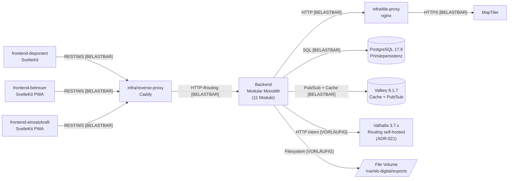
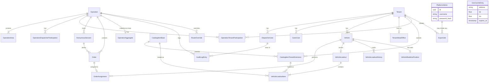

# Architecture

<!-- Systemarchitektur, Modulgrenzen, Schnittstellenverträge.
     Architektur ist ein lebendes Dokument: sie reift während der Umsetzung.
     Jeder Architektur-Bestandteil trägt einen Reifegrad-Marker, der seinen Status anzeigt.
     Änderungen an belastbaren Bestandteilen sind freigabepflichtig (CLAUDE.md Abschnitt 4).
     Änderungen an vorläufigen oder offenen Bestandteilen sind Teil der normalen Erkenntnisarbeit. -->

## 0. Reifegrad-System

Jedes Modul, jede Schnittstelle und jede Architektur-Aussage trägt einen der folgenden Marker:

- `[BELASTBAR]` – Entscheidung getroffen, durch Umsetzung validiert oder durch ADR fixiert. Änderung ist freigabepflichtig (CLAUDE.md Abschnitt 4) und erzeugt einen ADR.
- `[VORLÄUFIG]` – Entwurfshypothese, plausibel aber nicht durch Umsetzung validiert. Darf in der Implementierung verfeinert werden, ohne separate Freigabe – jede Verfeinerung wird aber im Dokument nachgezogen und mit Datum vermerkt. Wird nach Validierung auf `[BELASTBAR]` befördert.
- `[OFFEN]` – bewusst nicht entschieden. Wartet auf Erkenntnis aus einer Erkundungsphase, einen Spike oder eine externe Klärung. Kein Code in Bereichen, die von einer `[OFFEN]`-Architektur abhängen, ohne dass die Lücke vorher geschlossen wurde.

**Beförderungsregel:** Ein Bestandteil wird von `[VORLÄUFIG]` auf `[BELASTBAR]` befördert, wenn:

1. Die Annahme durch funktionierende Implementierung bestätigt wurde, **oder**
2. Ein ADR die Entscheidung explizit fixiert.

Beide Wege sind dokumentationspflichtig: Beförderung mit Datum und kurzer Begründung am betroffenen Eintrag.

**Rückstufungsregel:** Ein `[BELASTBAR]`-Bestandteil kann nur durch ADR auf `[VORLÄUFIG]` oder `[OFFEN]` zurückgestuft werden. Stille Rückstufung ist verboten.

**Code-Bezeichner-Konvention:** Codesprache ist Englisch (`project-context.md` Abschnitt 1). Domänenbegriffe werden 1:1 ins Englische übersetzt:

| Deutsch (Glossar)       | Englisch (Code)                                                                            |
| ----------------------- | ------------------------------------------------------------------------------------------ |
| Einsatz                 | Operation                                                                                  |
| Einsatzraum             | OperationArea                                                                              |
| Mandant                 | Tenant                                                                                     |
| Plattform-Administrator | PlatformAdmin                                                                              |
| Disponent               | Dispatcher                                                                                 |
| Betreuer                | Carer                                                                                      |
| Einsatzkraft            | ResponseUnitMember (Arbeitsname; finale Wahl im Auth-Modul-ADR vor erster UMSETZUNG-Phase) |
| Versorgungs-Transporter | SupplyTransporter                                                                          |
| Geschäftsstelle         | HeadOffice                                                                                 |
| Zugangscode             | AccessCode                                                                                 |
| Bestellung              | Order                                                                                      |
| Fahrauftrag             | OrderAssignment                                                                            |
| Sperrungs-Override      | RouteOverride                                                                              |
| Audit-Log-Eintrag       | AuditLogEntry                                                                              |

Tabellennamen folgen `snake_case`, Klassennamen `PascalCase`, Modulpfade `kebab-case`/`snake_case` gemäß PEP 8 / Svelte-Konvention. Tabellen, die in der Klärungs-Session in `project-context.md` Abschnitt 11 deutsch referenziert wurden (`einsatz_mandant_teilnahme`, `einsatz_audit_log`), werden im Code als `operation_tenant_participation` und `operation_audit_log` umgesetzt. Diese Übersetzung ist Code-Konvention, kein Vision-Pivot.

## 1. Überblick

EB Digital ist ein **Modular Monolith im Backend** mit **drei separaten SvelteKit-Frontends** (Disponent, Betreuer, Einsatzkraft), einem **nginx-Tile-Proxy** vor MapTiler und TomTom sowie einem **Caddy-Reverse-Proxy** mit automatischem TLS. Das Gesamtsystem läuft als einzelne Compose-Deployment-Einheit auf einem Hetzner-VPS in Deutschland.

Prägende Kernentscheidung: ein Backend-Monolith mit klar geschnittenen Modulen statt eines verteilten Service-Schnitts. Begründung: kein verteilter Lebenszyklus erkennbar, Mandanten-Trennung erfolgt domänenintern, Last-Annahme (50 Disponenten + 500 Einsatzkräfte) trägt einen Monolithen problemlos. Drei separate Frontends sind dagegen nötig, weil sich die Service-Worker-Profile, Last-Annahmen und Berechtigungs-Modelle der Rollen klar unterscheiden.

**Architektur-Pattern:** Modular Monolith Backend + drei SvelteKit-Frontends + Tile-/Reverse-Proxy. `[VORLÄUFIG]`, seit 2026-05-07. Validierung steht aus; Beförderung auf `[BELASTBAR]` mit Erreichen erster UMSETZUNG-Phase und bestandenem Last-/Funktionstest.

**Kommunikations-Grundmodus:**

- REST/JSON synchron Frontend ↔ Backend, Pfad-Präfix `/api`. `[BELASTBAR]`, Vision-Stack-fix.
- WebSocket Frontend ↔ Backend für Live-Standorte, Auftragsstatus-Updates, Disponent↔Betreuer-Chat, Hilfe-Knopf, Audit-Log-Stream. `[BELASTBAR]`, Vision-Stack-fix.
- HTTP synchron Backend → externer Karten-/Geocoding-Service (MapTiler) ausschließlich über `infra/tile-proxy` als API-Key-Inject und Rate-Limit-Schutz, **ohne serverseitiges Multi-Client-Cache** (ADR-016). `[BELASTBAR]`, Vision-Constraint API-Budget + Privacy.
- HTTP synchron Backend → **Valhalla-Routing-Container (Compose-intern, self-hosted, ADR-021)** — kein externer Service, kein API-Key, kein Tile-Proxy-Pfad; Override-Routen via `ignore_*`-Flags + 3-Call-Komposition im `backend/geo`-Adapter. `[VORLÄUFIG]` (Spike-G-validiert, produktive Implementierung Phase 6.1).
- Pub/Sub über Valkey für WebSocket-Fan-out (mehrere Backend-Worker können denselben Topic-Stream bedienen). `[BELASTBAR]` (Schritt 4.4): `RealtimePublisher` + Hub-Listener (`PSUBSCRIBE operation.*`) produktiv; Multi-Worker-Lasttest in STABILISIERUNG (Phase 7).
- Asynchrone Hintergrund-Jobs über Procrastinate (PostgreSQL-basiert): Datenexport, 30-Tage-Anonymisierung, Aggregat-Berechnung. `[BELASTBAR]`, Stack-fix.
- **Anbieter-Austauschbarkeit für externe Geo-Services:** Tile-, Geocoding- und Routing-Provider werden ausschließlich über provider-neutrale Adapter-Module angesprochen (`backend/geo` als Adapter-Layer; `infra/tile-proxy` als provider-neutrales Cache-/Proxy-Modul). Provider-Wechsel ist ohne Modul-Refactor außerhalb des Adapters möglich. Frontend-Renderer-Default ist MapLibre GL JS (provider-neutral); Wechsel zu provider-spezifischem SDK (z. B. MapTiler SDK JS) ist ADR-pflichtig. `[BELASTBAR]` (ADR-014, Regel-017).

## 2. Modul-Karte



**Erlaubte Beziehungen sind ausschließlich die im Diagramm gezeigten.** Insbesondere:

- Frontends greifen niemals direkt auf den externen Service MapTiler zu – Tiles und Geocoding laufen Backend-seitig über `infra/tile-proxy`. Begründung: API-Keys bleiben Backend-seitig (`project-context.md` Abschnitt 6 Sicherheit), API-Budget-Disziplin zentral kontrollierbar.
- Frontends greifen niemals direkt auf PostgreSQL, Valkey oder den Valhalla-Container zu.
- Backend-Module greifen niemals direkt auf MapTiler zu – ausschließlich über `infra/tile-proxy`. Der Valhalla-Container (ADR-021) wird ausschließlich vom `backend/geo`-Adapter angesprochen (Compose-internes Netz, kein öffentlicher Port).
- Backend-Module sprechen Frontends nur über REST oder WebSocket an, nicht über andere Kanäle.

Die backend-internen Modul-zu-Modul-Beziehungen sind in Abschnitt 3 pro Modul unter „Abhängigkeiten (andere Module)" dokumentiert. Reifegrade dort.

## 3. Module (detailliert)

### Modul: backend/auth `[BELASTBAR]`

- **Reifegrad:** `[BELASTBAR]`, seit 2026-05-10 (Schritt 2.2). Login-Endpoint, Cookie-Sessions (Starlette `SessionMiddleware` mit `Secure`+`HttpOnly`+`SameSite=Strict`), Argon2id-Hash-Vergleich, Valkey-basierte Rate-Limit-Schicht (ADR-013) sind produktiv. Coverage des Moduls 100 % Lines/Branches; End-to-End-Smoke Login → /me → Logout grün gegen Compose-Stack. Vorbedingung Schritt-1.6-Reifegrad S1 bleibt bestehen.
- **Verantwortung:** Account-Verwaltung und Session-Handling für angemeldete Rollen (Plattform-Administrator, Disponent, Betreuer); Passwort-Hashing per Argon2id; Login mit Rate-Limit; Cookie-basierte Sessions; CLI-Bootstrap zum Anlegen von Plattform-Administrator-Accounts.
- **Nicht-Verantwortung:** Anonyme Einsatzkraft-Sessions (das ist `backend/auth_anonymous`); Mandanten-Antrag und -Freischaltung (das ist `backend/tenants`); Account-Anlage Disponent durch Plattform-Admin und Betreuer durch Disponent (Use-Case-Logik liegt hier, aber Mandanten-Scope-Validierung in `backend/tenants`).
- **Öffentliche Schnittstellen:** S1 (CLI-Entry-Point Admin-Bootstrap), Anteile von S8 (REST `/api/auth/*`, REST `/api/users/*`); siehe Abschnitt 4.
- **Interne Struktur:** ein Use-Case-Layer (Login, Logout, ChangePassword, CreateUser, ListUsers); Repository-Layer auf SQLAlchemy 2.0; Hashing-Helper mit `argon2-cffi`; Session-Handling über Starlette `SessionMiddleware`; CLI-Befehl als eigenständiger Click/Typer-Subcommand unter `eb_digital.cli.admin`. **Cross-Cutting:** definiert die FastAPI-yield-Dependency `get_db_session()` als Modul-übergreifenden Request-Scoped-DB-Session-Vertrag (ADR-015, Regel-018) — `async with factory() as session: try: yield session except: await session.rollback(); raise`. Konsumiert von `backend/auth_anonymous` und `backend/tenants`.
- **Abhängigkeiten (andere Module):** wird verwendet von `backend/tenants` (Disponent-Anlage; konsumiert auch `get_db_session`), `backend/auth_anonymous` (konsumiert `get_db_session`), Frontends (Login-Pfad). Verwendet selbst keine anderen Backend-Module.
- **Abhängigkeiten (extern):** PostgreSQL für `users`-Tabelle (mit Rolle, Mandanten-Referenz), `argon2-cffi`, `itsdangerous`, Starlette-Session-Middleware.
- **Technologie:** wie Haupt-Stack.
- **NFRs (modulspezifisch):** Coverage ≥ 95 % Lines, ≥ 90 % Branches (`project-context.md` Abschnitt 7). Externe Security-Review vor Produktivstart Pflicht (`project-context.md` Abschnitt 3 „Auth-Bausteine"). Bedrohungsmodell siehe Abschnitt 6, Reifegrad `[OFFEN]`.
- **Offene Fragen:** Email-Reset-Flow (Detail-Schema steht aus); MFA für Plattform-Admin (Phase ≥ 2 erwogen, kein Phase-1-Constraint).

### Modul: backend/auth_anonymous `[BELASTBAR]`

- **Reifegrad:** `[BELASTBAR]`, seit 2026-05-11 (Schritt 2.3). URL-Token-Generator (`itsdangerous.URLSafeSerializer` mit Salt `eb-digital.operation-url-token`), Crockford-Base32-AccessCode-Generator, Argon2id-Hash-Verify (Konstantzeit, Regel-006), Rate-Limit auf `POST /session` (IP+URL AND, 5/15 min via Valkey, ADR-013) und Anonymous-Session-Cookie (Starlette `request.session['anon']`-Subkey, 24-h-Hard-Cap-`expires_at`) sind produktiv. Coverage 100 % Lines/Branches. Order-Endpunkte (`POST/GET /api/anon/{url}/order*`) folgen mit `backend/operations` in 4.x.
- **Verantwortung:** Erzeugung und Validierung der einsatzspezifischen URL mit kryptographisch zufälligem Token; AccessCode-Generierung (6 Zeichen Crockford-Base32) und Validierung; Verwaltung anonymer Temporär-Sessions; Bindung der Session an `operation_id`.
- **Nicht-Verantwortung:** Das Anlegen oder Beenden eines Einsatzes (`backend/operations`); persistente Standortdaten der Einsatzkraft (`backend/operations` über das Order-Datenmodell mit Lebensdauer-Limit aus `project-context.md` Abschnitt 6 Datenschutz); jegliche User-Identität (per Definition kein PII).
- **Öffentliche Schnittstellen:** S2 (REST `/api/anon/{operation_url}/*`); siehe Abschnitt 4.
- **Interne Struktur:** URL-Token-Generator (`itsdangerous`); AccessCode-Generator (Crockford-Base32-Encoding mit Verwechslungsfreiheit O/0/I/1/L); AnonymousSessionRepository; Toggle-Logik für AccessCode-Aktivierung mit Zeitstempel; QR-Code-Renderer im Disponenten-Frontend (Backend liefert die kombinierte URL-mit-Code als String, QR-Render erfolgt clientseitig). DB-Zugriff über die Cross-Cutting-Dependency `get_db_session` aus `backend/auth` (Request-Scoped, ADR-015 / Regel-018).
- **Abhängigkeiten (andere Module):** verwendet `backend/operations` (Operation-Lookup zur Validierung, Status `aktiv`); konsumiert `get_db_session` aus `backend/auth` (Cross-Cutting-Dependency, ADR-015). Wird verwendet von `frontend-einsatzkraft` und intern vom Bestellpfad in `backend/operations`.
- **Abhängigkeiten (extern):** PostgreSQL (`anonymous_session`, `operation` mit `access_code_hash` (Argon2id-PHC gemäß ADR-005/Regel-006) und `access_code_active`); Valkey (Rate-Limit-Counter für die `POST /session`-Route via `backend/eb_digital/auth/rate_limit.py`, ADR-013).
- **NFRs (modulspezifisch):** Coverage ≥ 95 % Lines, ≥ 90 % Branches. Rate-Limit auf Code-Validierungs-Endpunkt (analog zu Login: 5 Fehlversuche pro 15 min pro IP).
- **Offene Fragen:** keine offenen Bereiche im Phase-1-Scope; spätere Erweiterung „Code rotieren während Einsatz" ist Stabilisierungs-Erweiterungspfad (`project-context.md` Abschnitt 11 Frage B).

### Modul: backend/tenants `[BELASTBAR]`

- **Reifegrad:** `[BELASTBAR]`, seit 2026-05-12 (Schritt 2.4). Self-Service-Antrag (`POST /api/auth/register-tenant`, public, 3/24 h/IP-Rate-Limit), Plattform-Admin-Approve und Deactivate, Mandanten-CRUD mit Rollen-Filter (Plattform-Admin: alle; Dispatcher: eigener Tenant; Carer: 403), Dispatcher-/Carer-Invite mit signiertem Reset-Token (`itsdangerous.URLSafeTimedSerializer`, Salt `eb-digital.user-password-reset`, 24-h-TTL), Reset-Password-Flow (`POST /api/auth/reset-password`, 5/15 min/IP-Rate-Limit, 410-Response identisch für ungültig/abgelaufen/Replay), Tenant-Status-Check im Login-Pfad (Dispatcher/Carer in nicht-aktivem Tenant → 401, kein Info-Leak). S10 (Tenant Participation Lookup) produktiv. Coverage `backend/tenants` 95–100 %; End-to-End-Smoke 10 Schritte grün gegen Compose-Stack.
- **Verantwortung:** Mandanten-Stammdatenpflege; Self-Service-Antrag (`POST /api/auth/register-tenant`); Plattform-Admin-Freischaltung; mandantenseitige Verwaltung von Disponenten-, Betreuer- und Fahrzeug-Accounts (Anlage, Sperrung, Reset durch Disponent für seine Mandanten-Mitglieder); Mandanten-Deaktivierung mit Lösch-Pfad für Stammdaten (DSGVO-Art. 17).
- **Nicht-Verantwortung:** Verbund-Vertragsabwicklung in Phase 1 (siehe Frage F – kein eigenes Modul, spätere Erweiterung dieses Moduls); Aggregations-Tabelle (`backend/retention`); Datenexport (`backend/export`).
- **Öffentliche Schnittstellen:** Anteile von S8 (REST `/api/tenants/*`, `/api/users/*` mit Mandanten-Scope); S10 (Funktions-Export `tenant_participates_in_operation(tenant_id, operation_id) -> bool` für I2-Berechtigungs-Filter).
- **Interne Struktur:** Use-Cases CreateTenant, ApproveTenant, DeactivateTenant, AddDispatcher/Carer/Vehicle (delegiert an `backend/auth` für Account-Anlage und an `backend/fleet` für Fahrzeug-Anlage); Repository auf `tenant`, `operation_tenant_participation`-Tabelle. DB-Zugriff über die Cross-Cutting-Dependency `get_db_session` aus `backend/auth` (Request-Scoped, ADR-015 / Regel-018).
- **Abhängigkeiten (andere Module):** verwendet `backend/auth` (User-Anlage; konsumiert auch `get_db_session`), `backend/fleet` (Fahrzeug-Anlage). Wird verwendet von `backend/operations` (Mandanten-Scope-Prüfung über S10).
- **Abhängigkeiten (extern):** PostgreSQL (`tenant`, `operation_tenant_participation`).
- **NFRs (modulspezifisch):** Coverage ≥ 80 % Lines (Standard).
- **Offene Fragen:** Verbund-Vertrag-Schema (Phase ≥ 2, in spätere UMSETZUNG-Phase „Verbund-Modus" verschoben, siehe `project-context.md` Abschnitt 11 Frage F).

### Modul: backend/catalog `[BELASTBAR]`

- **Reifegrad:** `[BELASTBAR]`, seit 2026-05-28 (Schritt 4.1). Drei Tabellen (`catalog_category`, `catalog_item_base`, `catalog_item_tenant_extension` mit `mode_constraint`) plus Repository + Use-Cases + Resolver-Drei-Query-Pattern + vier Rollen-API-Endpunkte sind produktiv; 55 grüne Unit-Tests (Repository + Use-Cases + API mit `TestClient`); dev-smoke.sh-Catalog-Stufe (9 Sub-Checks E2E gegen Compose-Stack) komplett grün; Migration `b3a9c7e1f205` Round-Trip-verifiziert mit `alembic check`.
- **Verantwortung:** Zentraler Basis-Artikelkatalog (gepflegt durch Plattform-Admin); mandantenspezifische Erweiterungen als Override eines Base-Items **oder** eigenständiges Tenant-Item (gepflegt durch Disponent); Bereitstellung des effektiven Katalogs für eine gegebene Operation (`base_catalog ∪ tenant_catalog`) bzw. einen Tenant. Override-Felder priorisiert; `is_active` / `is_disabled` als Soft-Delete-Flags.
- **Nicht-Verantwortung:** Bestand und Beladung – das ist `backend/fleet`. Bestellungs-Logik – das ist `backend/operations`.
- **Öffentliche Schnittstellen:** Sub-Surfaces von S8 (`/api/catalog/categories`, `/api/catalog/base`, `/api/catalog/tenant`, `/api/catalog`) und S2 (`/api/anon/{operation_url}/catalog` mit anonymer Session und Rate-Limit IP+URL-AND analog ADR-013, eigener Schlüsselraum `catalog:ratelimit:anon`, großzügigeres Limit 60/15 min weil kein Brute-Force-Pfad).
- **Interne Struktur:**
  - **Datenmodell:** `catalog_category(id, name UNIQUE, audit)`, `catalog_item_base(id, name, unit, default_unit_label, description, category_id FK→catalog_category RESTRICT, is_active, audit)`, `catalog_item_tenant_extension(id, tenant_id FK→tenant CASCADE, base_item_id FK→catalog_item_base CASCADE NULL, name|unit|default_unit_label|category_id für eigenständige Items NULL, override_name|override_unit_label NULL, is_disabled, audit)` mit `mode_constraint` (entweder Override-Modus oder Eigenständig-Modus) und Partial-UNIQUE-Index `WHERE base_item_id IS NOT NULL` gegen Doppel-Override pro Tenant+Base.
  - **Use-Cases:** `CreateCategory` (Plattform-Admin), `CreateBaseItem`/`UpdateBaseItem` (PA, mit Soft-Delete via `is_active`), `CreateTenantOverride`/`CreateTenantOwnItem` (Disponent für eigenen Tenant, mit `_require_tenant_active`-Vorbedingung und `BaseItemNotActiveError`-Mapping), `UpdateTenantExtension` (Mode-Routing über `base_item_id IS NULL`/NOT NULL mit `ExtensionModeError` bei Mode-Mismatch), `ResolveCatalogForTenant` (Drei-Query-Pattern: aktive Base-Items + Category-JOIN → Overrides der Tenants → eigenständige Tenant-Items + Category-JOIN; Override-Felder priorisiert, `is_disabled` filtert), `ResolveCatalogForOperation` (Phase 1: Single-Owner über S10/Regel-014; Phase X additiv erweiterbar auf Verbund).
- **Abhängigkeiten (andere Module):** wird verwendet von `backend/operations` (Bestellungs-Validierung, in 4.3). Konsumiert `backend/tenants` (S10 `owners_of_operation` für Resolver, `find_tenant_by_id` für Vorbedingungs-Checks), `backend/auth` (Session-Validierung), `backend/auth_anonymous` (anonyme Session-Validierung für Anon-Read).
- **Abhängigkeiten (extern):** PostgreSQL 17.9 (Persistenz), Valkey 8.1.7 (Rate-Limit für Anon-Read).
- **NFRs (modulspezifisch):** Standard-Coverage (80 % Lines / 70 % Branches); per-File-Coverage im Modul: models 100 %, schemas 100 %, api 77 %, use_cases 68 %, repositories 39 % — die unter 80 % liegenden Werte sind im Wesentlichen Resolver-/SELECT-Pfade, die im dev-smoke.sh-E2E (gegen echtes Postgres) gedeckt sind; Gesamt-Coverage 88 % liegt über dem CI-Gate.

### Modul: backend/operations `[BELASTBAR]` (mit teil-`[OFFEN]`-Bestandteil Hilfe-Knopf)

> **Schritt 4.3a (2026-06-06) produktiv & verifiziert:** Lebenszyklus (Open/Close/ChangeAreas/ToggleAccessCode), Versorgungs-Transporter-Modus-Umhüllung mit Audit-Log (ADR-008/Regel-011), anonymer Bestellpfad `PlaceOrder` mit Plausibilitäts-Check (ADR-017), `ApproveLowPlausibilityOrder`, `AssignVehicle` (S4/I3), `CancelOrder`, `CompleteOrder`; 7 Datenmodelle; Sub-Surfaces S8e (`/api/operations/*`) + S2c (`/api/anon/{url}/order`).
> **Schritt 4.3b (2026-06-07) produktiv & verifiziert:** Bündelung (ADR-018) — `BundleOrders` (manuell, Versorgungs-Transporter `mode='large_order'`, min. 2 `pending`-Orders), `DissolveBundle`, impliziter `CompleteBundle` (wenn alle Bündel-Orders abgeschlossen), Einzel-Order-Storno-Sperre in aktivem Bündel (`OrderInActiveBundleError`); neue Entity `order_bundle` + nullable `customer_order.bundle_id`/`order_assignment.bundle_id` (Migration `d4f1a9b8c2e6`, Round-Trip-verifiziert); Bündel-Endpunkte `POST /bundles`, `POST /bundles/{id}/dissolve`, `GET /bundles[/{bundle_id}]`; Audit-Action-Types `orders_bundled`/`bundle_dissolved`/`bundle_completed`. **Verbleibend `[OFFEN]`:** Hilfe-Knopf-Semantik (Spike K, Phase 5). Realtime-Event-Publishing läuft über einen No-Op-Stub-Adapter (S3 `[VORLÄUFIG]` bis Schritt 4.4).

- **Reifegrad:** `[BELASTBAR]`, seit 2026-06-07 (Schritt 4.3b — Bündelung produktiv). **Kein `[OFFEN]`-Bereich mehr:** Hilfe-Knopf-Semantik seit 2026-06-11 `[VORLÄUFIG]` durch **ADR-023** (Spike K — `help_alert`-Konzept, Implementierung Phase 6). Geo-Plausibilitäts-Algorithmus (ADR-017) und Bündelungs-Trigger (ADR-018) sind durch 4.3a/4.3b produktiv eingelöst.
- **Verantwortung:** Lebenszyklus von Operations (Eröffnen, Aktiv, Beenden); OperationArea-Verwaltung; Bestellungs-Aufnahme; Auftrags-Erzeugung; Fahrzeug-Zuweisung (automatisch + Disponent-Override); Stornierung; Bündelung (Großbestellungs-Modus); Versorgungs-Transporter-Modus-Steuerung; AuditLogEntry-Schreibung für alle kritischen Aktionen; Audit-Log-Stream-Bereitstellung. Zugangscode-Toggle ist Aktion auf Operation, technische Umsetzung in `backend/auth_anonymous`.
- **Nicht-Verantwortung:** Routing-Berechnung (`backend/geo`); WebSocket-Topic-Verteilung (`backend/realtime` – `backend/operations` publisht Events, `backend/realtime` fan-outet); Aggregat-Schreibung beim Einsatz-Ende (`backend/retention` – wird über S5-Event getriggert).
- **Öffentliche Schnittstellen:** Anteile von S8 (REST `/api/operations/*`, `/api/operations/{id}/orders/*`, `/api/operations/{id}/audit-log`); S3 (Event-Publishing an `backend/realtime`); S4 (Funktions-Export für Fahrzeug-Zuweisung); S5 (Event an `backend/retention` „operation ended"); S10 (Konsument von `tenant_participates_in_operation`).
- **Interne Struktur:** Domain-Layer mit Operation/Order/OrderAssignment-Aggregaten; Use-Case-Layer mit Aktionen (OpenOperation, CloseOperation, ChangeOperationArea, ToggleAccessCode, SwitchSupplyTransporterMode, PlaceOrder, AssignVehicle, CancelOrder, BundleOrders, RaiseHelpAlert, ApproveLowPlausibilityOrder); EventBus-Adapter zu `backend/realtime`; AuditLogger als Cross-Cutting-Concern auf jedem Use-Case.
- **Abhängigkeiten (andere Module):** verwendet `backend/catalog` (Item-Validation), `backend/fleet` (Fahrzeug-Lookup, Beladungs-Prüfung), `backend/geo` (Routing-Anfrage, Plausibilitäts-Check), `backend/realtime` (Event-Publishing), `backend/retention` (Aggregat-Trigger), `backend/auth_anonymous` (für anonyme Bestell-Pfade), `backend/tenants` (S10).
- **Abhängigkeiten (extern):** PostgreSQL (zentrale Operation/Order/Audit-Tabellen).
- **NFRs (modulspezifisch):** Coverage ≥ 90 % Lines (`project-context.md` Abschnitt 7); Audit-Log-Vollständigkeit ist Pflicht-Test.
- **Offene Fragen:** keine `[OFFEN]`-Bereiche mehr. **Geklärt 2026-06-11:** Hilfe-Knopf-Semantik durch ADR-023 (2 Kategorien `eigennot`/`panne`, optionale Beschreibung, Auto-Standort, Rückzieh-Pfad, Acknowledge/Resolve mit Audit, Re-Notification statt Eskalation, `help_alert`-Datenmodell + API-Tripel; UMSETZUNG Phase 6). **Geklärt 2026-05-18:** Geo-Plausibilitäts-Algorithmus durch ADR-017 (Hülle-Distanz + dynamische GPS-Toleranz `2·accuracy_m`, 500-m-Moderationsfilter, Text-Standort als Moderation, dreistufige Konfigurations-Hierarchie). Implementations-Plan in Phase 4 plus additive Schema-Migration (`tenant.plausibility_default_threshold_m`, `operation.plausibility_threshold_m`). **Geklärt 2026-05-28:** Bündelungs-Trigger durch ADR-018 (manuell durch Disponent, eigene `order_bundle`-Entity + nullable `order.bundle_id` + nullable `order_assignment.bundle_id`, Versorgungs-Transporter mit `mode='large_order'` Pflicht, keine räumliche Backend-Validierung in Phase 1, Min-2-Orders-Constraint, `bundling_count` = Aktionsanzahl plus additive ADR-006-Erweiterung um `bundled_order_count`). Implementations-Plan in Phase 4.3 plus Phase-6.5-Aggregat-Schema-Erweiterung.

### Modul: backend/fleet `[BELASTBAR]`

- **Reifegrad:** `[BELASTBAR]`, seit 2026-05-28 (Schritt 4.2). Fünf Tabellen (`vehicle`, `tenant_head_office`, `vehicle_loadout`, `vehicle_loadout_item`, `vehicle_loadout_history`) mit CHECK-Constraints und Partial-UNIQUE-Indizes; Repository + Use-Cases + Sub-Surface S8d (`/api/fleet/*`) sind produktiv; 47 Unit-Tests grün (Repository + Use-Cases + API mit `TestClient`); dev-smoke.sh-Fleet-Stufe (12 Sub-Checks E2E gegen Compose-Stack) komplett grün; Migration `04b8afcf67a7` Round-Trip-verifiziert mit `alembic check`.
- **Verantwortung:** Fahrzeug-Stammdaten mit Mandanten-Bindung; Typ-Trennung über `vehicle.type` (Single Table Inheritance, `regular` vs. `supply_transporter`); Versorgungs-Transporter-Modus über `vehicle.mode` mit DB-CHECK auf Typ-Kombi (nur Supply-Transporter trägt Modus, Default `off`, Werte `off|mobile_supply|large_order`); relationale Beladungs-Snapshot-Tabelle plus Append-Only-History mit Frozen JSONB; HeadOffice (Geschäftsstelle) als 1:1-Tabelle pro Mandant mit Lat/Lng/Label-Range-Checks.
- **Nicht-Verantwortung:** Fahrzeug-Position in Echtzeit (das ist `backend/realtime` – Push aus Betreuer-PWA an WebSocket-Topic, ohne dauerhafte Persistenz roher GPS-Spuren); Fahrzeug-Zuweisung zu Aufträgen — S4 `assign_vehicle` ist Phase 4.3 (braucht `order`/`order_assignment`-Tabellen); automatische Verbrauchsbuchung gegen Bestellungen ist Phase 4.3; Audit-Log-Schreibung bei Mode-Wechsel ist Phase 4.3 (Detail-Plan 3B: `backend/operations.SwitchSupplyTransporterMode` umhüllt den Fleet-Use-Case und schreibt ADR-008/Regel-011-Audit).
- **Öffentliche Schnittstellen:** Sub-Surfaces von S8 (`/api/fleet/vehicles` CRUD, `/api/fleet/vehicles/{id}/mode`, `/api/fleet/vehicles/{id}/loadout` GET/PUT, `/api/fleet/vehicles/{id}/loadout/history`, `/api/fleet/head-office` GET/PUT). Funktions-Exporte für `backend/operations` (Fahrzeug-Lookup, Beladungs-Check, Mode-Validierung) werden in 4.3 ergänzt — Repository-Funktionen `find_vehicle_by_id`, `find_current_loadout`, `list_loadout_items` sind heute bereits konsumier-bereit.
- **Interne Struktur:**
  - **Datenmodell:** `vehicle(id, tenant_id FK→tenant CASCADE, type, mode NULL, name, license_plate NULL, capacity_label NULL, is_active, audit)` mit `type_mode_constraint` und `type_valid` CHECKs plus Partial-Index `WHERE is_active=TRUE`; `tenant_head_office(tenant_id PK, lat, lng, label NULL, audit)` mit Lat/Lng-Range-CHECKs; `vehicle_loadout(id, vehicle_id FK CASCADE UNIQUE, recorded_at, recorded_by_dispatcher_id FK→dispatcher RESTRICT, audit)`; `vehicle_loadout_item(id, loadout_id FK CASCADE, base_item_id NULL, tenant_extension_id NULL, quantity, created_at)` mit `exactly_one_ref`+`quantity_positive`-CHECKs und zwei Partial-UNIQUE-Indizes; `vehicle_loadout_history(id, vehicle_id FK CASCADE, recorded_at, recorded_by_dispatcher_id FK→dispatcher RESTRICT, items JSONB, created_at)` als Frozen Snapshot.
  - **Use-Cases:** `CreateVehicle`, `UpdateVehicle`, `DeactivateVehicle`, `UpdateSupplyTransporterMode` (ohne Audit-Log in 4.2; Audit-Pflicht in 4.3 über `backend/operations`-Umhüllung), `SetLoadout` (atomic Replace mit History-Frozen-JSONB-Kopie via `_freeze_existing_loadout`, Cross-Tenant-Extension-Check auf Use-Case-Ebene), `GetCurrentLoadout`, `GetLoadoutHistory`, `SetHeadOffice` (Upsert), `GetHeadOffice`.
- **Abhängigkeiten (andere Module):** konsumiert `backend/tenants` (Tenant-Aktiv-Check via `find_tenant_by_id`), `backend/catalog` (Base-Item + Tenant-Extension-Validierung bei Loadout, `find_base_item_by_id` + `find_extension_by_id`), `backend/auth` (Session-Validierung). Wird verwendet von `backend/operations` (in 4.3 für `assign_vehicle` und Mode-Wechsel-Umhüllung).
- **Abhängigkeiten (extern):** PostgreSQL 17.9 (Persistenz inkl. JSONB für History).
- **NFRs (modulspezifisch):** Standard-Coverage (80 % Lines / 70 % Branches); per-File-Coverage im Modul: models 100 %, schemas 98 %, api 73 %, use_cases 70 %, repositories 76 % — die unter 80 % liegenden Werte sind primär Read-/Resolver-Pfade, die im dev-smoke.sh-E2E (gegen echtes Postgres) gedeckt sind; Modul-Coverage liegt mit 437 abgedeckten von 526 Lines bei 83 % über dem Gate.
- **Offene Fragen:** Fahrzeugbezeichnungs-Schema (Spike M, kein Architektur-Blocker, vor Roll-out zu klären). Automatische Verbrauchsbuchung pro Mandant aktivierbar (Vision §3) ist 4.3-Aufgabe.

### Modul: backend/geo `[VORLÄUFIG]` (mit teil-`[OFFEN]`-Bestandteilen)

- **Reifegrad:** `[VORLÄUFIG]`, seit 2026-05-07. **Eingebettete `[VORLÄUFIG]`-Bereiche:** Sperrungs-Override-Technik (seit 2026-06-10 durch **ADR-021** spezifiziert — Valhalla `ignore_access`/`ignore_oneways`/`exclude_polygons` + 3-Call-Komposition; Beförderung auf `[BELASTBAR]` mit Phase-6.1-Implementierung); Geo-Plausibilitäts-Algorithmus-Spezifikation (ADR-017) — **Komponente `PlausibilityChecker` seit 2026-06-06 `[BELASTBAR]`** (Schritt 4.3a).
- **Verantwortung:** Routing-Adapter zum **self-hosted Valhalla-Container** (ADR-021; Compose-intern, Versions-/Digest-Pin); Geocoding-Adapter zu MapTiler mit Adress→Koordinate-Cache; **`Cache-Control`-Header-Pass-Through** an `infra/tile-proxy` (ADR-016, kein serverseitiges Caching von Tile-Responses); Geofencing 150 m für Annäherungs-Notification an Einsatzkraft (Vision); Sperrungs-Override-Verwaltung (Datenmodell `route_override` mit `kind` `block`/`allow`, Geometrie + provider-neutral gematchten Kanten-Referenzen, ADR-021; Audit-Pflicht Regel-012); Verbrauchszähler externer Dienste mit Disponenten-Warnung bei Budget-Überschreitung (nur noch MapTiler-Pfade).
- **Nicht-Verantwortung:** Tile-Bereitstellung selbst (das ist `infra/tile-proxy`); Karten-Rendering (Frontend mit MapLibre GL JS); Betrieb des Valhalla-Containers (Compose-Infrastruktur, Daten-Update-Pipeline per Folge-ADR in 6.1).
- **Öffentliche Schnittstellen:** Anteile von S8 (REST `/api/geo/*` für Routing-Anfragen, Plausibilitäts-Check, Override-Pflege); S7 (HTTP-Konsument von `infra/tile-proxy` für MapTiler-Pfade); Funktions-Export für `backend/operations` (`route_for_assignment(start, target, vehicle_id)`).
- **Interne Struktur:** ValhallaRoutingAdapter (`httpx`-Client gegen Compose-internen Valhalla-Endpoint; kapselt die Override-Mechanik: Location-`radius`/`search_filter`-Snapping-Disziplin, `/locate`-Kanten-Matching vor Sperren-Anlage, 3-Call-Komposition für `allow`-Overrides — Spike-G-Lehren); MapTilerGeocodingAdapter (mit Cache `geo_cache` in PostgreSQL); RouteOverrideRepository (ADR-021-Datenmodell); PlausibilityChecker (`[BELASTBAR]` seit 4.3a — Hülle-Distanz via Shapely-Geometrie, dynamische GPS-Toleranz `2·accuracy_m` mit 5-m-Untergrenze, Moderations-Filter auf `accuracy_m > 500`, Text-Standort als `MODERATION_NO_GPS`); GeoUsageCounter mit Persistenz im Tabellen-Format `geo_usage_daily(tenant_id, date, maptiler_geocoding_calls, maptiler_tile_proxy_hits)` (Routing-Spalte entfällt, ADR-021).
- **Abhängigkeiten (andere Module):** verwendet `infra/tile-proxy` (HTTP, MapTiler-Pfade) und den Valhalla-Container (HTTP, Compose-intern). Wird verwendet von `backend/operations` (Routing, Plausibilität).
- **Abhängigkeiten (extern):** MapTiler (Geocoding/Tiles über Tile-Proxy), PostgreSQL (Cache + Override-Tabelle). Valhalla ist seit ADR-021 **keine externe Abhängigkeit** mehr, sondern self-hosted Infrastruktur (OSM-Daten via Geofabrik, ODbL — Lizenz-Behandlung in ADR-021).
- **NFRs (modulspezifisch):** Standard-Coverage. Routing-Aufrufe-Disziplin (`project-context.md` Abschnitt 6 Performance: max 1 Aufruf pro Auftrag, ≥ 30 s Pause für dasselbe Fahrzeug) — seit ADR-021 Last-Schutz statt Budget-Schutz.
- **Offene Fragen:** keine `[OFFEN]`-Bereiche mehr. **Geklärt 2026-05-18:** Geo-Plausibilitäts-Algorithmus durch ADR-017. **Geklärt 2026-06-10:** Sperrungs-Override-Technik durch ADR-021 (Spike G, Empirie in `docs/spikes/spike-g-results.md`). Implementierungs-Detail 6.1: Geofabrik-Update-Pipeline + Extract-Zuschnitt + Container-Sub-Dep-Lizenz-Verifikation (Folge-ADR).

### Modul: backend/realtime `[BELASTBAR]` (mit reserviertem `chat`/`gps_push`/`help_alert`-Anteil)

- **Reifegrad:** `[BELASTBAR]`, seit 2026-06-08 (Schritt 4.4). WebSocket-Hub + Valkey-Pub/Sub-Brücke produktiv: drei rollengebundene Endpunkte (`/ws/dispatcher`, `/ws/carer`, `/ws/anon/{operation_url}`), Cookie-/Anon-Session-Auth (Close 4401/4403), Subscription-Autorisierung über S10 (`tenant_participates_in_operation`, `list_operations_for_tenant`), dedizierter `PSUBSCRIBE operation.*`-Listener pro Worker, In-Memory-Subscription-Registry mit Fan-out, Anon-`session_id`-Filter (nur eigene Bestellung), Heartbeat (30 s Ping / 10 s Pong-Timeout), Tile-Hash-Redaction-Helper für den Log-Pfad. Der No-Op-`RealtimeAdapter`-Stub aus 4.3a ist durch den echten `RealtimePublisher` ersetzt (S3-Signatur unverändert). Coverage `backend/realtime` 93–100 % Lines; 55 Unit-Tests + dev-smoke-Realtime-Stufe (WS-Auth + Subscribe + Valkey-E2E + Anon-Filter) grün. **Reserviert:** `help_alert`-Payload seit 2026-06-11 durch **ADR-023** spezifiziert (`[VORLÄUFIG]` — kein Freitext im Push, Description per REST; Produzent folgt Phase 6); `chat`-/`gps_push`-Client-Aktionen (kein Produzent bis Phase 6, Topic-Namen reserviert, unbekannte Aktion → Fehler-Frame).
- **Verantwortung:** WebSocket-Endpoint pro Rolle (`/ws/dispatcher`, `/ws/carer`, `/ws/anon/{operation_url}`); Topic-Schema mit Tenant-Scoping (siehe S9); Pub/Sub über Valkey für Multi-Worker-Fan-out; Standort-Push der Betreuer mit Tile-Identifier-Hashing für Logging (PII-Redaction); Auftragsstatus-Stream; Disponent↔Betreuer-Chat-Routing; Hilfe-Knopf-Notification-Routing; Audit-Log-Stream zu Disponenten-UI.
- **Nicht-Verantwortung:** Persistenz der Standort-Spur (nur letzter Standort pro Session in `anonymous_session`/`vehicle_realtime_position` mit Lebensdauer-Limit); Notification an externe Push-Stacks – Web-Push ist nicht im Phase-1-Stack.
- **Öffentliche Schnittstellen:** S9 (WebSocket-Topologie und Topic-Schema); S3 (Event-Konsument von `backend/operations`).
- **Interne Struktur:** WebSocket-Hub mit Topic-Routing; Valkey-Pub/Sub-Brücke; Authentifizierungs-Decorator (Cookie für Disponent/Betreuer, anonyme Session-Cookie für Einsatzkraft); Logger-Wrapper mit Standort-Redaction (Tile-Hash statt Roh-Koordinate).
- **Abhängigkeiten (andere Module):** verwendet `backend/auth` (Cookie-Validierung) und `backend/auth_anonymous` (anonyme Session-Validierung). Wird verwendet von `backend/operations` (Event-Publishing) und Frontends.
- **Abhängigkeiten (extern):** Valkey (Pub/Sub), PostgreSQL (Realtime-Position-Snapshot mit Lebensdauer).
- **NFRs (modulspezifisch):** Standard-Coverage. PII-in-Logs-Verbot strikt eingehalten.

### Modul: backend/resilience `[VORLÄUFIG]` (mit teil-`[OFFEN]`-Bestandteilen)

- **Reifegrad:** `[VORLÄUFIG]`, seit 2026-05-07. **Kein `[OFFEN]`-Bereich mehr:** Backup-Granularität, Recovery-Reihenfolge und RTO/RPO-Annahme seit 2026-06-11 `[VORLÄUFIG]` durch **ADR-022** (Spike H, Empirie in `docs/spikes/spike-h-results.md`); Beförderung auf `[BELASTBAR]` durch den 6.4-Backup-Recovery-Test auf VPS-Hardware.
- **Verantwortung:** Backup und Wiederherstellung des persistenten Einsatzzustands aus PostgreSQL (inklusive offener Aufträge und in-flight Procrastinate-Jobs); Recovery-Skript für Bare-Metal-Restore. WebSocket-Verbindungen brechen bei Server-Neustart bewusst ab; Clients reconnecten automatisch und bekommen den persistenten State neu geladen. „Nahtlos" im Vision-Sinn meint State-Erhaltung, nicht Connection-Erhaltung.
- **Nicht-Verantwortung:** WebSocket-Reconnect-Logik im Frontend (das ist Frontend-Aufgabe); Hot-Failover oder Multi-Master-Replikation (Phase ≥ 2).
- **Öffentliche Schnittstellen:** keine modul-übergreifenden Funktions-Exporte; Operative-Schnittstellen in Form von Skripten unter `eb_digital.cli.resilience` (Backup-Trigger, Restore-Dry-Run, Restore).
- **Interne Struktur (ADR-022):** Backup-Strategie C — `pg_basebackup` täglich + kontinuierliches WAL-Archiving (`archive_timeout` 60 s, PITR) + täglicher `pg_dump -Fc` als portables Artefakt; Aufbewahrung **14 Tage** (< 30-Tage-Anonymisierungs-Karenz, ADR-022); Off-VPS-Backup-Ziel (6.4-Detail-Plan); **Stalled-Job-Start-Routine** beim Backend-/Worker-Start (`get_stalled_jobs` → `retry_job`, `prune_stalled_workers` — empirisch verifiziert); Restore-Runbook in `docs/runbooks/restore.md` mit der ADR-022-Recovery-Reihenfolge (PostgreSQL inkl. Job-State → Valkey kein Restore → Backend/Worker → Valhalla rebuildbar → Frontends); Health-Check-Endpoint für Backup-Status.
- **Abhängigkeiten (andere Module):** keine direkten – das Modul liest direkt PostgreSQL und schreibt Backup-Artefakte.
- **Abhängigkeiten (extern):** PostgreSQL (`pg_basebackup` + `pg_dump`, ADR-022), Filesystem auf VPS + Off-VPS-Ziel (Backup-Volume).
- **NFRs (modulspezifisch):** Coverage ≥ 90 % Lines (`project-context.md` Abschnitt 7); RTO/RPO-Werte aus Spike H in Abschnitt 6 als `[VORLÄUFIG]` mit Messwert eingetragen, nach 6.4-Test-Validierung auf VPS-Hardware auf `[BELASTBAR]` befördert.
- **Offene Fragen:** keine `[OFFEN]`-Bereiche mehr. **Geklärt 2026-06-11:** Backup-Strategie, Recovery-Reihenfolge, RTO/RPO durch ADR-022 (Spike H). Implementierungs-Details 6.4: WAL-Archiving-Konfiguration, Off-Site-Ziel, Runbook, VPS-Validierungstest.

### Modul: backend/export `[VORLÄUFIG]`

- **Reifegrad:** `[VORLÄUFIG]`, seit 2026-05-07. Konkretisiert durch Frage D.
- **Verantwortung:** DSGVO-Datenexport pro Mandant; Job-Tripel POST/GET-Status/GET-Download; ZIP-Bundle mit JSON pro Tabelle plus `manifest.json`; Cleanup-Job für 7-Tage-Aufbewahrung.
- **Nicht-Verantwortung:** PDF/CSV-Konvertierung (nicht in Phase 1); Karten-Snapshot-Anhänge (nicht in Phase 1).
- **Öffentliche Schnittstellen:** S6 (REST `/api/tenants/{id}/export*` Tripel + Procrastinate-Job + Filesystem-Volume).
- **Interne Struktur:** ExportJobUseCase erstellt Procrastinate-Job; Worker liest sämtliche Mandanten-Daten read-only aus allen relevanten Backend-Modulen über deren Repositories; ZipBuilder serialisiert pro Tabelle eine JSON-Datei und schreibt `manifest.json`; FileVolumeStore legt unter `/var/eb-digital/exports/{tenant_id}/{job_id}.zip` ab; CleanupJob löscht Files älter als 7 Tage.
- **Abhängigkeiten (andere Module):** liest read-only aus allen Backend-Modulen mit mandantengebundenen Daten (`backend/tenants`, `backend/auth` ohne Passwort-Hashes, `backend/fleet`, `backend/catalog`, `backend/operations`, `backend/retention`-Aggregate). Phase 1 nutzt Filterregel I5: nur Daten mit `operation_tenant_participation.role='owner'`.
- **Abhängigkeiten (extern):** PostgreSQL, Filesystem-Volume.
- **NFRs (modulspezifisch):** Standard-Coverage.

### Modul: backend/retention `[VORLÄUFIG]`

- **Reifegrad:** `[VORLÄUFIG]`, seit 2026-05-07. Konkretisiert durch Frage C.
- **Verantwortung:** Aggregat-Snapshot beim Operation-Ende (Trigger via S5-Event); 30-Tage-Anonymisierungs-Job für individuelle Bestell- und Standortdaten; Mandanten-Deaktivierungs-Lösch-Pfad für Stammdaten (DSGVO-Art. 17).
- **Nicht-Verantwortung:** Datenexport (das ist `backend/export`); Backup-Recovery (das ist `backend/resilience`).
- **Öffentliche Schnittstellen:** S5 (Event-Konsument); kein REST-Pfad.
- **Interne Struktur:** zwei Procrastinate-Jobs (`write_operation_aggregate(operation_id)` synchron beim Operation-End-Event; `anonymize_operation_details(operation_id)` zeitgesteuert mit Verzögerung 30 Tage); Aggregations-Schreiber baut den `operation_aggregate`-Eintrag aus Operation-Daten + Audit-Log; Anonymisierer löscht Detail-Daten der Tabellen `order`, `order_assignment`, `anonymous_session`, `vehicle_realtime_position` für `operation_id`.
- **Abhängigkeiten (andere Module):** liest read-only aus `backend/operations` (Operations, Orders, Assignments) und `backend/auth_anonymous` (anonyme Session-Snapshots, falls für Aggregat relevant). Schreibt in eigene Tabelle `operation_aggregate`.
- **Abhängigkeiten (extern):** PostgreSQL, Procrastinate.
- **NFRs (modulspezifisch):** Coverage ≥ 95 % Lines (`project-context.md` Abschnitt 7); Idempotenz beider Jobs Pflicht-Test.
- **Offene Fragen:** Schema-Migration auf „verarbeitende Mandanten" bei Verbund-Phase (I4-Vermerk, kein Phase-1-Aufwand).

### Modul: frontend-disponent `[VORLÄUFIG]`

- **Reifegrad:** `[VORLÄUFIG]`, seit 2026-05-07. Schritt 2.5 (Login-Flow + Dashboard-Skelett) hat den Funktionspfad gegen die belastbaren Schnittstellen S8a/S8b validiert; eine Beförderung des Architektur-Patterns auf `[BELASTBAR]` ist mit dem Last-Test in Phase 6 vorgesehen (Detail-Frage 5-A aus 2.5).
- **Verantwortung:** Disponenten-Web-UI für Desktop/Tablet; Login-Pfad; Operation-Übersicht; Auftrags-Disposition; Karte mit MapLibre GL JS; Audit-Log-Sicht; AccessCode-Verwaltung mit Anzeige + Copy + QR-Render; Bestätigungs-Dialog vor destruktiven Aktionen (`project-context.md` Abschnitt 11 Frage E).
- **Nicht-Verantwortung:** Service-Worker-Offline-Caching im Sinne der Betreuer-PWA – Disponent arbeitet stationär mit stabiler Verbindung.
- **Öffentliche Schnittstellen:** REST/WS-Konsument der Backend-API.
- **Interne Struktur:** SvelteKit-App mit Routing als Route-Gruppen `(public)/` und `(authed)/`; In-Memory-Session-Cache (`src/lib/stores/session.ts`, kein localStorage — Detail-Frage 3-A aus 2.5); zentraler API-Client-Wrapper (`src/lib/api/client.ts`) mit einheitlichem Error-Mapping; WebSocket-Client für Live-Updates (Phase 4); QR-Code-Rendering clientseitig (Phase 6).
- **Abhängigkeiten (andere Module):** REST/WS zu Backend.
- **Abhängigkeiten (extern):** MapLibre GL JS, ein QR-Code-Renderer (z. B. `qrcode-svelte` mit MIT-Lizenz – Auswahl per OPERATIVER ADR vor erster UMSETZUNG-Phase Frontend).
- **NFRs (modulspezifisch):** Standard-Coverage; Schritt 2.5 erreicht ≥ 96 % auf den Auth-/API-Modulen.
- **Phase-2-Lieferumfang (Schritt 2.5):** Login + Dashboard mit Mandanten-Übersicht (über `/api/tenants`) + Reset-Password-UI (Token aus URL-Query) + Logout. Operations-Sektion ist Platzhalter „Keine aktiven Einsätze" (Detail-Frage 2-A — kein Backend-Operations-Endpoint vor Phase 4). Self-Service-Antragsformular und Admin-Approve-/Invite-UI sind bewusst draußen (Detail-Frage 1-B), gehören in Phase 7 (Roadmap-Meilenstein P) oder zur 2.6+/Backoffice-Iteration.

### Modul: frontend-betreuer `[VORLÄUFIG]` (mit teil-`[OFFEN]`-Bestandteil)

- **Reifegrad:** `[VORLÄUFIG]`, seit 2026-05-07. **Eingebetteter `[OFFEN]`-Bereich:** Tile-Caching-Strategie / Service-Worker (Spike L).
- **Verantwortung:** Mobile-PWA für Betreuer; Login-Pfad; Auftrags-Anzeige; Turn-by-Turn-Navigation auf Straßenwegen; Karten-Anzeige mit MapLibre GL JS; Service-Worker mit Tile-Caching und Auftrags-Pufferung; GPS-Push an WebSocket; Hilfe-Knopf (UI-Teil; Semantik durch ADR-023 fixiert: 2-Tap-Auslösung, Rückzieh-Pfad, Quittungs-Status, Kein-Notruf-Hinweis 110/112).
- **Nicht-Verantwortung:** Disposition (das ist Disponenten-Sache); Stornierung und Umverteilung.
- **Öffentliche Schnittstellen:** REST/WS-Konsument der Backend-API; Service-Worker als interner Browser-Layer.
- **Interne Struktur:** SvelteKit-App; vite-plugin-pwa + Workbox; Tile-Cache-Strategy TBD nach Spike L; Routenführungs-Renderer; Geolocation-API-Wrapper.
- **Abhängigkeiten (andere Module):** REST/WS zu Backend.
- **Abhängigkeiten (extern):** MapLibre GL JS, Workbox 7.4.x, vite-plugin-pwa 1.3.x.
- **NFRs (modulspezifisch):** Offline-Pufferung Pflicht (Vision); PWA-Coverage durch Playwright-Smoke-Test pro Service-Worker-Strategie.
- **Offene Fragen:** Tile-Caching-Strategie Phase 1 (Spike L: StaleWhileRevalidate vs. CacheFirst mit Expiration; Pre-Cache des Einsatzraums beim Schichtbeginn).

### Modul: frontend-einsatzkraft `[VORLÄUFIG]`

- **Reifegrad:** `[VORLÄUFIG]`, seit 2026-05-07. **Bestellpfad seit 2026-06-09 (Schritt 4.5) funktional validiert:** Dashboard lädt den effektiven Katalog (S2b), gruppiert nach Kategorie mit Mengen-Steppern; Standorterfassung per Geolocation (explizite Nutzeraktion) oder Text-Fallback; Bestellung via S2c mit genau-eine-Referenz-Mapping; Live-Status der eigenen Bestellung über WS-Client (S9, `/api/ws/anon/{token}`) mit Pong/Auto-Reconnect. 80 Vitest-Tests grün, Coverage `src/lib/` 95 % Lines / 82 % Branches, Build (adapter-static) grün. Reifegrad bleibt `[VORLÄUFIG]` bis Phase-6-Last-Test (Architektur-Pattern-Beförderung, Präzedenz 2.5/2.6).
- **Verantwortung:** Schlanke anonyme Bestell-PWA; URL-Validation; optionale AccessCode-Eingabe; Standortfreigabe (GPS oder Text-Beschreibung); Katalog-Anzeige; Bestellungs-Erfassung; Auftragsstatus-Anzeige; 150-m-Annäherungs-Anzeige.
- **Nicht-Verantwortung:** Anzeige fremder Bestellungen (Vision-Constraint); Chat-Funktion; Hilfe-Funktion (Vision-Constraint); Stornierung/Umverteilung.
- **Öffentliche Schnittstellen:** REST/WS unter `/api/anon/{operation_url}/*`; Service-Worker für minimale Tile-Cache-Pufferung (umfänglich kleiner als Betreuer-PWA, weil seltene Aufrufe).
- **Interne Struktur:** SvelteKit-App, klein gehalten; minimaler Service-Worker; kein Login, kein Profil. Lib-Bausteine (4.5): `api/catalog`+`api/operations` (S2b/S2c-Bindings), `realtime/ws` (gekapselter WS-Client — erster WS-Konsument im Projekt, Muster für Phase-6-Frontends), `stores/cart` (Warenkorb-Logik), `location` (Geolocation-Wrapper), `order-display` (Status-/Outcome-Texte).
- **Abhängigkeiten (andere Module):** REST/WS zu Backend.
- **Abhängigkeiten (extern):** MapLibre GL JS (Phase 6, Karten-Anzeige — in 4.5 bewusst nicht aktiviert, weil `infra/tile-proxy` [VORLÄUFIG] + Spike L noch keine Tiles liefern), Workbox 7.4.x (transitiv via vite-plugin-pwa).
- **NFRs (modulspezifisch):** niederschwellige Bedienbarkeit (Vision); Erstaufruf-Größe minimal (mobile, oft schlechtes Netz).
- **Offene Bereiche (Phase 6):** Karten-Anzeige + 150-m-Annäherungs-Event (`proximity`); hängen an Tile-Proxy + Spike L.

### Modul: infra/tile-proxy `[VORLÄUFIG]`

- **Reifegrad:** `[VORLÄUFIG]`, seit 2026-05-07. Verantwortung gemäß ADR-016 (2026-05-17) auf API-Key-Inject + Rate-Limit + Reverse-Proxy ohne Cache reduziert; Beförderung auf `[BELASTBAR]` mit erster produktiver Phase-6-Implementierung.
- **Verantwortung:** ausgehender API-Key-Inject (Backend-Geheimhaltung des MapTiler-Keys); Rate-Limit-Schutz gegen versehentlichen Budget-Verbrauch durch Programmfehler; HTTP-Reverse-Proxy-Routing für Pfade `/tiles/maptiler/*`, `/geocoding/maptiler/*` (der frühere `/routing/tomtom/*`-Pfad entfällt — Routing läuft seit ADR-021 Compose-intern gegen Valhalla, ohne Key, ohne Proxy); **Cache-Control-Header-Pass-Through** vom Upstream-Provider 1:1 an den Client.
- **Nicht-Verantwortung:** **kein serverseitiges Caching** (ADR-016, AGB-Konflikt mit MapTiler Terms); kein Routing-Pfad (ADR-021); Routing-Logik (`backend/geo`); Geocoding-Cache als Backend-Repository.
- **Öffentliche Schnittstellen:** S7 (HTTP-Konsument für `backend/geo`).
- **Interne Struktur:** nginx-Konfiguration mit Reverse-Proxy-Blöcken pro MapTiler-Pfad; **kein `proxy_cache_path`-Block**, **kein Cache-Volume**; ausgehende Header tragen den MapTiler-API-Key (aus ENV-Variable); eingehende Antworten passieren `Cache-Control`-Header unverändert an den Client. Rate-Limit über `limit_req_zone` als Schutz gegen versehentliche Endlos-Schleifen.
- **Abhängigkeiten (andere Module):** keine; wird verwendet von `backend/geo`.
- **Abhängigkeiten (extern):** MapTiler.
- **NFRs (modulspezifisch):** nicht durch Coverage messbar; Smoke-Test über curl + Snapshot-Diff (`project-context.md` Abschnitt 7 Ausnahmen). Tile-Last-Glättung erfolgt ausschließlich client-seitig: Browser-Cache gemäß Provider-`Cache-Control` (MapTiler 4 h dokumentiert) plus PWA-Service-Worker-Pre-Cache des Operations-Raums (Spike L, Phase 5).

### Modul: infra/reverse-proxy `[VORLÄUFIG]`

- **Reifegrad:** `[VORLÄUFIG]`, seit 2026-05-07.
- **Verantwortung:** Caddy mit automatischem TLS (Let's Encrypt); Routing zum Backend-Container und zu den drei Frontend-Buckets; Access-Logging; einheitliche Security-Header (HSTS, CSP-Skelett, X-Content-Type-Options).
- **Nicht-Verantwortung:** Tile-Caching (`infra/tile-proxy`); jegliche App-Logik.
- **Öffentliche Schnittstellen:** öffentlicher HTTPS-Endpoint; intern HTTP zu Backend und Frontend-Buckets.
- **Interne Struktur:** Caddyfile mit Site-Blöcken pro Frontend (Disponent unter `app.eb-digital.example`, Betreuer unter `betreuer.eb-digital.example`, Einsatzkraft unter `einsatz.eb-digital.example` – konkrete Domains in `project-context.md` Abschnitt 8 zu finalisieren).
- **Abhängigkeiten (andere Module):** keine; vor allen anderen.
- **NFRs (modulspezifisch):** nicht durch Coverage messbar; Smoke-Test über curl + Snapshot-Diff.

## 4. Schnittstellenverträge

Alle modulübergreifenden Aufrufe sind hier dokumentiert. Änderungen an `[BELASTBAR]`-Schnittstellen sind freigabepflichtig (CLAUDE.md 4.5). `[VORLÄUFIG]`-Schnittstellen dürfen während der Umsetzung verfeinert werden, mit Update hier.

### Schnittstelle: S1 – Admin-Bootstrap-CLI `[BELASTBAR]`

- **Reifegrad:** `[BELASTBAR]`, seit 2026-05-09 (Schritt 1.6 produktiv).
- **Typ:** CLI.
- **Anbieter:** `backend/auth`.
- **Konsument:** Operator (Patrick) per `docker compose exec backend python -m eb_digital admin create`.
- **Spezifikation:**
  - **Eingabe:** `--username <string>` (Pflicht, mindestens 3 Zeichen nach Strip, kein Whitespace im Namen), interaktive Passwort-Eingabe via `getpass.getpass()` (Mindestlänge 12 wie `project-context.md` Abschnitt 6 Sicherheit, Library-Default-Argon2id-Parameter, kein Maximum). **Keine** Passwort-Bestätigung in Phase 1 (folgt Fahrplan-Schritt 1.6 wörtlich; UX-Erweiterung optional in Phase 2, ADR-pflichtig).
  - **Ausgabe (Erfolg):** stdout `created admin user: <username>`, plus strukturierte JSON-Log-Zeile `{"message": "platform_admin_created", "username": ..., "created_via": "bootstrap_cli", "at": <ISO8601>}` auf demselben Stream wie der Worker (project-context.md Abschnitt 6 Datenschutz: kein Passwort, kein Hash, kein Salt). Exit-Code 0.
  - **Ausgabe (Fehler):** Exit-Code 1; eine gemeinsame `AdminCreationError`-Klasse mit konkreten Messages: `username darf nicht leer sein`, `username darf keine Leerzeichen enthalten`, `username muss mindestens 3 Zeichen lang sein`, `Username '<name>' existiert bereits`, `Passwort muss mindestens 12 Zeichen lang sein`. Datenbank-Fehler (Connection-/Server-Fehler) propagieren als ungefangene Exception (Exit-Code 1 via Python-Default), Stacktrace im stderr — kein Maskieren echter Infrastruktur-Fehler. Keine Passwort-Echos in Logs oder Fehlermeldungen.
  - **Idempotenz:** nicht idempotent. Wiederholtes Anlegen mit demselben Username scheitert mit `Username '<name>' existiert bereits`.
  - **Timeouts:** keiner (interaktive Eingabe).
- **Versionierung:** keine semantische Versionierung; CLI-Subcommand-Schema wird mit Major-Version-Bump des Backend-Pakets versioniert.
- **Sicherheit:** kein Klartext-Passwort in argv; kein Klartext-Passwort/Hash/Salt in Logs; CLI nur erreichbar mit SSH-Zugang zum Host. ENV-getriebener `DATABASE_URL` (kein Hard-Coding).
- **Beispiel:**
  ```
  $ docker compose exec backend python -m eb_digital admin create --username patrick
  Passwort:
  created admin user: patrick
  ```
- **Offene Fragen:** keine.

### Schnittstelle: S2 – Anonymous Session API `[VORLÄUFIG]`

- **Reifegrad:** `[VORLÄUFIG]`, seit 2026-05-07.
- **Typ:** HTTP-REST.
- **Anbieter:** `backend/auth_anonymous`.
- **Konsument:** `frontend-einsatzkraft`.
- **Spezifikation:**
  - **Endpoints:**
    - `GET /api/anon/{operation_url}/info` – Metadaten zur Operation (Stadt-Label, AccessCode-Pflicht ja/nein, Status). Antwort 200 oder 404. Keine Authentifizierung nötig.
    - `POST /api/anon/{operation_url}/session` – Body: `{ "access_code": "X7K3PQ" | null }`. Validiert Token + ggf. Code; legt anonyme Session an; setzt Session-Cookie. Antwort 201 mit `{ "session_id": "..." }` oder 401 (Code falsch) oder 410 (Operation beendet). Rate-Limit: 5 Fehlversuche/15 min/IP plus separat pro Operation-URL.
    - `POST /api/anon/{operation_url}/order` – Body: `{ "items": [...], "location": { "lat": ..., "lon": ... } | { "text": "..." } }`. Antwort 201 mit `order_id` oder 422 (Plausibilitäts-Moderation, Order in Disponenten-Queue) oder 401 (Session abgelaufen).
    - `GET /api/anon/{operation_url}/order/{order_id}` – Statusabfrage. Antwort 200 oder 404.
    - `GET /api/anon/{operation_url}/catalog` – effektiver Mandanten-Katalog. Antwort 200.
  - **Eingabe-Validierung:** Pydantic v2 Schemas; AccessCode-Format `^[0-9A-HJ-KM-NP-TV-Z]{6}$` (Crockford-Base32 ohne O/I/L/U).
  - **Ausgabe (Erfolg):** JSON-Schema in OpenAPI-Spec.
  - **Ausgabe (Fehler):** einheitliches Fehler-Schema `{ "error_code": "...", "message": "..." }`. Keine PII in Fehlermeldungen.
  - **Idempotenz:** `POST /session` nicht idempotent (jeder Aufruf eine neue Session); `POST /order` nicht idempotent. Wenn Idempotenz später nötig wird, optional `Idempotency-Key`-Header (`[OFFEN]`, Phase ≥ 2).
  - **Timeouts/Retries:** Frontend-seitig 10 s Timeout, ein Retry; Backend kein automatischer Retry.
- **Versionierung:** API-Pfad-Präfix `/api`; Schema-Breaking-Changes bekommen einen neuen Pfad-Block (z. B. `/api/v2/anon/...`). Phase 1: keine Versionierung im Pfad.
- **Sicherheit:** Cookie-Sessions `Secure` + `HttpOnly` + `SameSite=Strict`, signiert; Lifetime einsatzgebunden (verfällt mit Operation-Status `closed`).
- **Beispiel:**
  ```
  POST /api/anon/abc123def456/session
  Content-Type: application/json
  { "access_code": "X7K3PQ" }
  ```
- **Offene Fragen:** keine.

### Schnittstelle: S3 – Operations Event Bus → Realtime `[BELASTBAR]`

- **Reifegrad:** `[BELASTBAR]`, seit 2026-06-08 (Schritt 4.4). `backend/operations` publisht über die `RealtimePublisher`-Protocol (`publish(topic, payload, tenant_scope)`); der echte Publisher in `backend/realtime` schreibt auf den gleichnamigen Valkey-Channel, der Hub-Listener (`PSUBSCRIBE operation.*`) fan-outet an die WebSockets. `order_status`-Payload additiv um `anonymous_session_id` erweitert (Anon-Filter, Detail-Plan 4.4-4A). `help_alert`-Payload-Schema seit 2026-06-11 durch **ADR-023** spezifiziert (`[VORLÄUFIG]`, Produzent Phase 6) — S3 hat keinen offenen Anteil mehr.
- **Typ:** Intern Event (Funktions-Aufruf mit asynchronem Fan-out).
- **Anbieter:** `backend/realtime` (Konsument-Hub).
- **Konsument-API:** `backend/operations` published via `realtime.publish(topic: str, payload: dict, tenant_scope: TenantId | None)`.
- **Spezifikation:**
  - **Topic-Schema:**
    - `operation.{operation_id}.order_status` – jeder Auftragsstatus-Wechsel.
    - `operation.{operation_id}.assignment` – Fahrzeug-Zuweisungen.
    - `operation.{operation_id}.audit_log` – jede AuditLogEntry-Schreibung (für Disponenten-Audit-Stream).
    - `operation.{operation_id}.help_alert` – Hilfe-Knopf-Notification.
    - `operation.{operation_id}.chat` – Chat-Nachrichten.
  - **Payload:** strukturiertes JSON mit `event_type`, `timestamp`, `actor` (DispatcherId | CarerId | AnonymousSessionId | "system"), `data`. Kein PII-Roh-GPS, sondern gehashter Tile-Identifier in Payload-`location`-Feldern.
  - **Idempotenz:** Konsument muss Doppel-Empfang tolerieren (Valkey-Pub/Sub liefert mindestens-einmal).
- **Versionierung:** Topic-Schema-Versionierung über `event_type`-Sub-Suffixe (z. B. `order_status_v2`).
- **Sicherheit:** Tenant-Scoping über Topic-Namen: WebSocket-Subscriptions werden pro Verbindung gegen `tenant_participates_in_operation` geprüft; Cross-Mandanten-Subscription scheitert mit 403.
- **Offene Fragen:** keine — Hilfe-Knopf-Payload-Schema durch ADR-023 spezifiziert (2026-06-11).

### Schnittstelle: S4 – Operations → Fleet Vehicle Assignment `[VORLÄUFIG]`

- **Reifegrad:** `[VORLÄUFIG]`, seit 2026-05-07. Implementiert Invariante I3 aus Frage F.
- **Typ:** Funktions-Export.
- **Anbieter:** `backend/fleet`.
- **Konsument:** `backend/operations`.
- **Spezifikation:**
  - **Funktion:** `fleet.assign_vehicle(order_id: OrderId, vehicle_id: VehicleId, dispatcher_id: DispatcherId) -> OrderAssignment`.
  - **Vor-Bedingung:** Berechtigungs-Prüfung über `tenant_participates_in_operation(vehicle.tenant_id, order.operation_id)` – nicht über Mandanten-ID-Match.
  - **Eingabe:** `OrderId`, `VehicleId`, `DispatcherId` (Akteur, für Audit-Log).
  - **Ausgabe (Erfolg):** `OrderAssignment` mit `assigned_at`, `vehicle_state_snapshot`.
  - **Ausgabe (Fehler):** `VehicleNotEligible` (Tenant nicht teilnehmend), `VehicleNotLoaded` (fehlende Items), `OrderAlreadyAssigned`, `VehicleUnavailable`.
  - **Idempotenz:** nicht idempotent; mehrfache Zuweisung erzeugt zusätzliche Assignments oder Fehler je nach Order-Status.
- **Sicherheit:** Funktions-Aufruf intern, Berechtigungs-Prüfung Pflicht.
- **Bündel-Mapping (geklärt durch ADR-018, 2026-05-28):** Beim Bündel-Assignment werden **N OrderAssignment-Einträge** erzeugt (eines pro gebündelter Order) mit identischer `bundle_id` (FK auf `order_bundle`) und identischem `vehicle_id` (= Versorgungs-Transporter im Großbestellungs-Modus). Kein NULL-Constraint auf `order_id`; Aggregations-Joins bleiben einheitlich. `order_assignment.bundle_id` ist nullable: bei nicht-gebündelten Assignments NULL.

### Schnittstelle: S5 – Operations → Retention Aggregat-Trigger `[VORLÄUFIG]`

- **Reifegrad:** `[VORLÄUFIG]`, seit 2026-05-07. Implementiert Frage C, Reihenfolge 5.A.
- **Typ:** Event (Procrastinate-Job-Enqueue).
- **Anbieter:** `backend/retention`.
- **Konsument-API:** `backend/operations` ruft `retention.schedule_operation_aggregate(operation_id)` synchron beim Aktion `CloseOperation`. Dieser Aufruf reiht den Procrastinate-Job ein.
- **Spezifikation:**
  - **Eingabe:** `OperationId`.
  - **Ausgabe (Erfolg):** Job ID; Aggregat-Snapshot wird zeitnah (Sekunden) geschrieben.
  - **Ausgabe (Fehler):** Job-Enqueue-Fehler propagiert (DB nicht erreichbar).
  - **Idempotenz:** Pflicht – Doppel-Enqueue darf nur einen Aggregat-Eintrag erzeugen (UNIQUE auf `operation_aggregate.operation_id`). Konsument-Test.
  - **Reihenfolge:** Aggregat-Schreibung ist getrennter Job vor 30-Tage-Anonymisierung. 30-Tage-Job wird beim Operation-End ebenfalls eingereiht, mit `schedule_at = ended_at + 30 days`.
- **Sicherheit:** intern.

### Schnittstelle: S6 – Tenant Data Export `[VORLÄUFIG]`

- **Reifegrad:** `[VORLÄUFIG]`, seit 2026-05-07. Implementiert Frage D.
- **Typ:** HTTP-REST + Procrastinate-Job + Filesystem-Volume.
- **Anbieter:** `backend/export`.
- **Konsument:** `frontend-disponent` (Self-Service); CLI für Plattform-Admin-Override (`python -m eb_digital export start --tenant <id>`).
- **Spezifikation:**
  - **Endpoints:**
    - `POST /api/tenants/{tenant_id}/export` – startet Job, Antwort 202 mit `{ "job_id": "..." }`. Auth: Cookie als Disponent dieses Tenants oder Plattform-Admin.
    - `GET /api/tenants/{tenant_id}/export/{job_id}` – Status. Antwort 200 mit `{ "state": "queued|running|done|failed", "started_at": "...", "completed_at": "..." | null, "size_bytes": ... | null }`.
    - `GET /api/tenants/{tenant_id}/export/{job_id}/download` – ZIP-Download. Antwort 200 mit `Content-Type: application/zip`, `Content-Disposition: attachment; filename="eb-digital-export-{tenant_id}-{job_id}.zip"`. 410 wenn älter als 7 Tage oder bereits gelöscht.
  - **Eingabe:** keine.
  - **Ausgabe-Bundle:** ZIP mit `manifest.json` + JSON-Datei pro Tabelle. `manifest.json` Schema:
    ```json
    {
      "schema_version": "1.0.0",
      "exported_at": "2026-05-07T10:00:00Z",
      "tenant_id": "uuid...",
      "tables": [
        { "name": "tenant", "rows": 1, "filename": "tenant.json" },
        { "name": "dispatcher_user", "rows": 12, "filename": "dispatcher_user.json" },
        ...
      ]
    }
    ```
  - **Inhalt:** Mandanten-Stammdaten, Disponenten- und Betreuer-Accounts ohne `password_hash`, Fahrzeug-Stammdaten und Beladungs-Historie, mandantenspezifischer Catalog, Operations + Orders + Assignments der letzten 30 Tage detailliert (anonymisiert danach), `operation_aggregate`-Einträge. Phase 1 nutzt Filterregel I5: nur Operations mit `operation_tenant_participation.role='owner'`.
  - **Idempotenz:** mehrfacher Aufruf von POST erzeugt mehrere Jobs (kein Lock); GET-Download mehrfach abrufbar bis Cleanup.
  - **Lebensdauer:** ZIP unter `/var/eb-digital/exports/{tenant_id}/{job_id}.zip`, 7 Tage. Cleanup-Job (zweiter Procrastinate-Job, scheduled 1×/Tag) löscht ältere Files.
- **Versionierung:** `manifest.schema_version` als SemVer; Migration zwischen Versionen wird im Migrations-Hinweis dokumentiert.
- **Sicherheit:** Auth-Cookie Pflicht; Tenant-Scope über DispatcherUser-Mandant geprüft; Plattform-Admin kann jeden Mandanten exportieren.
- **Offene Fragen:** keine in Phase 1.

### Schnittstelle: S7 – Geo → Tile-Proxy `[VORLÄUFIG]` (mit `[OFFEN]`-Anteil)

- **Reifegrad:** `[VORLÄUFIG]`, seit 2026-05-07. **`[OFFEN]`-Anteil:** konkrete Routing-Anfrage-Struktur mit Sperrungs-Override (Spike G).
- **Typ:** HTTP.
- **Anbieter:** `infra/tile-proxy`.
- **Konsument:** `backend/geo`.
- **Spezifikation:**
  - **Tile-Endpunkte:** `GET /tiles/{provider}/{z}/{x}/{y}.{ext}` – nginx proxied an MapTiler. **Kein serverseitiger Cache** (ADR-016); `Cache-Control`-Header des Upstreams (MapTiler default 4 h) wird 1:1 an den Client gereicht. Last-Glättung über Browser-Cache + PWA-Service-Worker (Spike L).
  - **Geocoding-Endpunkt:** `GET /geocoding/{provider}/forward?q=...` – proxied an MapTiler. `backend/geo` cached zusätzlich strukturiert in `geo_cache` (geocoded Adresse → Koordinate; das ist Adressdaten-Cache, kein Tile-/Result-Cache im AGB-Sinn).
  - **Routing-Endpunkt:** `GET /routing/tomtom/{path}` – proxied an TomTom mit aktiver Routing-API-Version explizit gepinnt (kein implizites `latest`). **Kein serverseitiger Cache** (ADR-016, TomTom ToS Clause 11.4); Wiederholungs-Schutz ausschließlich über das 30-s-Fahrzeug-Throttle im `backend/geo`-Adapter. Detail-Format der Sperrungs-Override-Übergabe TBD nach Spike G.
  - **API-Key-Inject:** nginx fügt API-Key serverseitig hinzu; Client-Side-Pfad enthält keinen Key.
- **Versionierung:** Routing-API-Version explizit im Pfad (z. B. `/routing/tomtom/calculateRoute/v1`).
- **Sicherheit:** Tile-Proxy ist intern erreichbar (Compose-Netzwerk); Caddy reicht keine Tile-Proxy-Pfade nach außen.
- **Offene Fragen:** Sperrungs-Override-Aufrufschema (Spike G).

### Schnittstelle: S8 – Authentifizierte REST-API `[VORLÄUFIG]`

- **Reifegrad:** `[VORLÄUFIG]`, seit 2026-05-07.
- **Typ:** HTTP-REST.
- **Anbieter:** Backend (verteilt auf `backend/auth`, `backend/tenants`, `backend/operations`, `backend/fleet`, `backend/catalog`, `backend/geo`, `backend/export`).
- **Konsument:** `frontend-disponent`, `frontend-betreuer` (Untermenge der Endpunkte je Rolle).
- **Spezifikation:**
  - **Pfad-Präfix:** `/api`.
  - **Auth:** Cookie-Session (Disponent/Betreuer/PlatformAdmin); Pflicht für alle Endpoints außer `/api/health`, `/api/auth/login`, `/api/auth/register-tenant`, `/api/anon/...`.
  - **Endpunkt-Bereiche:**
    - `/api/auth/*` – Login, Logout, ChangePassword, Registriere-Tenant-Antrag.
    - `/api/users/*` – User-Verwaltung im eigenen Mandanten.
    - `/api/tenants/*` – Mandanten-Sicht (Plattform-Admin: alle; Disponent: eigener Mandant).
    - `/api/fleet/*` – Fahrzeug-Verwaltung im eigenen Mandanten.
    - `/api/catalog/*` – Basis-Katalog (Plattform-Admin schreibend) + Mandanten-Erweiterungen (Disponent schreibend).
    - `/api/operations/*` – Operations-Sicht und -Aktionen (Disponent schreibend, Betreuer lesend mit Auftragsbezug).
    - `/api/operations/{id}/orders/*` – Auftragsverwaltung.
    - `/api/operations/{id}/audit-log` – Audit-Log-Stream pro Operation.
    - `/api/geo/*` – Routing-Anfragen, Override-Pflege.
    - `/api/health` – Liveness-Check, ohne Auth.
  - **Schema:** OpenAPI-3.1-Dokument generiert aus FastAPI; verfügbar unter `/api/openapi.json`. Pydantic v2 als Schema-Quelle.
  - **Idempotenz-Header:** `Idempotency-Key` für `POST`-Endpunkte mit Nebenwirkungen (Auftragserzeugung, Statuswechsel) – `[VORLÄUFIG]`, Implementierung erst bei Bedarf in der UMSETZUNG-Phase.
  - **Pagination:** Cursor-basierte Pagination (`?cursor=...&limit=50`) für Listen-Endpunkte mit potentiell vielen Einträgen.
  - **Fehler-Format:** `{ "error_code": "...", "message": "...", "details": {...} | null }`.
- **Versionierung:** Pfad-Präfix-Versionierung bei Breaking Changes (`/api/v2/...`); Phase 1 keine `v1`-Suffix.
- **Sicherheit:** CSRF-Schutz über `SameSite=Strict`-Cookie; Login-Rate-Limit 5/15 min/IP plus pro User; API-Keys (MapTiler/TomTom) niemals im Client-Bundle (Backend-injection in Tile-Proxy).
- **Offene Fragen:** Idempotency-Key-Implementierung Phase 2; OpenAPI-Server-Side-Validation-Strenge (zusätzlich zu Pydantic).

### Schnittstelle: S9 – WebSocket-Topologie `[BELASTBAR]`

- **Reifegrad:** `[BELASTBAR]`, seit 2026-06-08 (Schritt 4.4). Drei Endpunkte produktiv (`/ws/dispatcher` mit `subscribe`/`unsubscribe`-Aktion + S10-Check; `/ws/carer` mit Auto-Subscribe auf `assignment`+`chat` via S10; `/ws/anon/{operation_url}` mit `order_status` + `session_id`-Filter). Server→Client-Frame `{topic, event_type, payload, ts}`, Fehler als `event_type="error"` (kein Drop). Heartbeat 30 s Ping / 10 s Pong-Timeout. Reconnect = Client-Aufgabe, State-Reload via REST-Refetch (kein WS-Replay). **Reserviert:** `chat`/`gps_push`-Client-Aktionen (Phase 6) → aktuell `unsupported_action`-Fehler-Frame. GPS-Push-Frequenz-Frage bleibt für `frontend-betreuer` (Phase 6) offen.
- **Typ:** WebSocket.
- **Anbieter:** `backend/realtime`.
- **Konsument:** `frontend-disponent`, `frontend-betreuer`, `frontend-einsatzkraft`.
- **Spezifikation:**
  - **Endpoints:**
    - `/ws/dispatcher` – Auth via Cookie. Beim Connect sendet Client eine `subscribe`-Nachricht mit `{ "operations": ["op_id_1", "op_id_2"] }`. Server prüft `tenant_participates_in_operation` für jedes Topic.
    - `/ws/carer` – Auth via Cookie. Subscribt automatisch auf `operation.{op_id}.assignment` (eigene Aufträge), `operation.{op_id}.chat` (Mandanten-Chat-Channel).
    - `/ws/anon/{operation_url}` – Auth via anonyme Session-Cookie. Subscribt auf `operation.{op_id}.order_status` für eigene Bestellung – Filtern nach `session_id` serverseitig (Client darf keine fremden Bestellungen sehen, Vision-Constraint).
  - **Message-Schema:** alle Server→Client-Messages: `{ "topic": "...", "event_type": "...", "payload": {...}, "ts": "..." }`. Client→Server: `{ "action": "subscribe|unsubscribe|chat|gps_push|...", "data": {...} }`.
  - **Reconnect-Verhalten:** Frontend reconnected automatisch bei Verbindungsabbruch; Server liefert beim Reconnect den aktuellen State neu (kein WS-internes Replay; State-Reload erfolgt über REST-Refetch nach Verbindungs-Restore).
  - **Heartbeat:** alle 30 s Server-Ping; Client-Pong erwartet binnen 10 s, sonst Connection-Drop.
- **Versionierung:** Topic-Schema-Versionierung über `event_type`-Sub-Suffixe.
- **Sicherheit:** Tenant-Scoping pro Subscription geprüft; PII-Redaction in Logging-Pfad (kein Roh-GPS in Logs).
- **Offene Fragen:** GPS-Push-Frequenz vom Carer (Vorschlag: alle 10 s im aktiven Auftrag, alle 60 s sonst – TBD in UMSETZUNG-Phase `frontend-betreuer`).

### Schnittstelle: S10 – Tenant Participation Lookup `[VORLÄUFIG]`

- **Reifegrad:** `[VORLÄUFIG]`, seit 2026-05-07. Implementiert Invarianten I1 und I2 aus Frage F.
- **Typ:** Funktions-Export.
- **Anbieter:** `backend/tenants`.
- **Konsument:** `backend/operations`, `backend/realtime`, `backend/export`.
- **Spezifikation:**
  - **Funktionen:**
    - `tenants.list_operations_for_tenant(tenant_id: TenantId) -> list[OperationId]` – liefert alle Operations, an denen der Mandant teilnimmt (Phase 1: alle als `role='owner'`).
    - `tenants.tenant_participates_in_operation(tenant_id: TenantId, operation_id: OperationId) -> bool`.
    - `tenants.owners_of_operation(operation_id: OperationId) -> list[TenantId]` – Phase 1 immer Liste mit einem Eintrag.
  - **Implementierung:** SQL-Join über `operation_tenant_participation`.
  - **Performance:** Index auf `(tenant_id, operation_id)` und `(operation_id, role)`.
- **Versionierung:** intern, keine SemVer.
- **Sicherheit:** intern; Funktions-Aufruf nur innerhalb Backend.
- **Offene Fragen:** keine in Phase 1; Verbund-Phase erweitert um `role='participant'`-Pfade.

## 5. Datenfluss

### Flow: F1 – Mandanten-Self-Service-Onboarding `[VORLÄUFIG]`

1. Mandanten-Antragsteller (Berufsverband-Vertretung) ruft `POST /api/auth/register-tenant` (öffentlich) mit Stammdaten und schriftlichem Vertrags-Verweis (extern hochgeladen, in Phase 1 als Hinweis-Text). `backend/tenants` legt Tenant mit `status='pending'` an.
2. Plattform-Admin sieht Antrag in `frontend-disponent` (Plattform-Admin-Sicht) und ruft `POST /api/tenants/{id}/approve` nach Vorliegen der schriftlichen Unterlagen. `backend/tenants` setzt `status='active'`.
3. Plattform-Admin legt initialen Disponenten-Account an (`POST /api/users` mit Mandanten-Scope und Rolle `dispatcher`). Zugangsdaten werden out-of-band an Mandanten übergeben.
4. Disponent meldet sich erstmals an, ändert Passwort.

**Fehlerpfade:**

- Antragsdaten unvollständig → 422 mit Feld-Validation.
- Plattform-Admin nicht erreichbar → Antrag bleibt im `pending`-Status (kein automatisches Aging).
- Disponenten-Anlage scheitert (Username schon belegt) → Plattform-Admin korrigiert.

### Flow: F2 – Einsatzkraft-Bestellung Hard-Path `[VORLÄUFIG]` (mit `[OFFEN]`-Bestandteilen)

> **Stand 2026-06-09 (Schritt 4.5):** Die Einsatzkraft-Seite der Schritte 3–8 ist im `frontend-einsatzkraft` produktiv (Katalog-Anzeige, Bestellung, Standorterfassung, Live-Status via WS). Backend-Seite (S2b/S2c/S9, Plausibilität, Assignment, Audit-Log) seit 4.1/4.3a/4.4 belastbar. Offen bleiben Schritt 9 (`proximity`-Event/Karte, Phase 6) und Carer-PWA-Schritte 9–10 (`frontend-betreuer`, Phase 6).

1. Disponent eröffnet Operation (`POST /api/operations`) mit Stadt-Label, OperationArea-Geometrie, optionalem AccessCode-Aktivierungs-Flag. `backend/operations` erzeugt Operation, `backend/auth_anonymous` generiert URL-Token und (falls aktiviert) AccessCode.
2. Disponent verteilt URL (und Code) per Disponenten-UI (Anzeige, Copy, QR-Code).
3. Einsatzkraft öffnet `https://einsatz.eb-digital.example/{operation_url}` in Browser. `frontend-einsatzkraft` lädt App-Shell (PWA); ruft `GET /api/anon/{operation_url}/info`. Bei `access_code_active=true` zeigt UI Code-Eingabe.
4. Einsatzkraft gibt Code ein, Frontend ruft `POST /api/anon/{operation_url}/session` mit Code. `backend/auth_anonymous` validiert; bei Erfolg Session-Cookie; bei Misserfolg Rate-Limit-Counter +1.
5. Einsatzkraft sieht Catalog (`GET /api/anon/{operation_url}/catalog`), erfasst Bestellung, gibt Standort frei (GPS oder Text). `POST /api/anon/{operation_url}/order` mit Items + Location.
6. `backend/operations` ruft `backend/geo.check_plausibility(location, operation_id)` (Algorithmus `[VORLÄUFIG]` durch ADR-017: Hülle-Distanz + dynamische GPS-Toleranz `2·accuracy_m`). Ergebnis: `ACCEPTED` oder `MODERATION_*` (NO_GPS / ACCURACY_UNKNOWN / ACCURACY_TOO_LOW / OUT_OF_RANGE).
7. Bei `plausible`: `backend/operations` erzeugt Order, ruft `backend/geo.route_for_assignment(...)` für jedes Kandidaten-Fahrzeug, ruft `backend/fleet.assign_vehicle(...)` mit dem nach Nähe + Beladung passenden Fahrzeug. Disponent kann automatische Wahl überschreiben.
8. `backend/operations` published `operation.{op}.assignment`-Event; `backend/realtime` fan-outet an Disponenten-WS, betreffenden Carer-WS und Einsatzkraft-WS (eigene Order).
9. Carer empfängt Auftrag in PWA, navigiert zur Position. Bei < 150 m Annäherung published `backend/realtime` ein `proximity`-Event an Einsatzkraft-WS.
10. Carer drückt „Übergabe abgeschlossen". `POST /api/operations/{id}/orders/{order_id}/complete`. Order-Status wechselt auf `completed`, AuditLog-Eintrag.

**Fehlerpfade:**

- AccessCode falsch → 401, Rate-Limit-Counter +1; nach 5 Versuchen Block.
- Plausibilitäts-Check schlägt fehl → Order in Status `needs_moderation`, Disponent entscheidet.
- TomTom-Routing nicht erreichbar → Fallback ohne Verkehrslage (Static-Routing aus letzter Antwort); bei vollständigem Ausfall Disponent koordiniert per Chat (Vision/`project-context.md` Abschnitt 5).
- Kein passendes Fahrzeug → Auftrag bleibt in Disponenten-Queue, Disponent disponiert manuell.
- Carer offline (Funkloch) → Auftrag wird gepuffert, sobald Verbindung wiederhergestellt, lädt PWA Status nach (REST-Refetch).

### Flow: F3 – Disponenten-Aktion mit Audit-Log `[VORLÄUFIG]`

1. Disponent (Akteur D) löst Aktion aus (z. B. „Auftrag stornieren"). UI zeigt Bestätigungs-Dialog für destruktive Aktionen.
2. Frontend ruft REST-Endpoint (z. B. `POST /api/operations/{id}/orders/{order_id}/cancel`).
3. `backend/operations` führt Use-Case aus, schreibt im selben Transaktions-Scope einen `operation_audit_log`-Eintrag mit `{ actor_id: D, action_type: 'order_cancelled', target_object: order_id, ts, payload: {...} }`.
4. `backend/operations` published `operation.{op}.audit_log`-Event; alle anderen Disponenten am Einsatz sehen den Eintrag im UI in Echtzeit.
5. AuditLog-Daten werden beim Operation-Ende in das Aggregat (Frage C) eingerechnet (`anzahl_stornierungen` etc.).

**Fehlerpfade:**

- Use-Case scheitert (z. B. Auftrag bereits abgeschlossen) → 422, kein AuditLog-Eintrag.
- Audit-Log-Schreibung scheitert → gesamte Transaktion zurückgerollt; UI zeigt Fehler.

### Flow: F4 – Operation-Ende → Aggregat → 30-Tage-Anonymisierung `[VORLÄUFIG]`

1. Disponent löst `POST /api/operations/{id}/close` aus (mit Bestätigungs-Dialog wegen Destruktivität – Frage E).
2. `backend/operations` setzt Operation-Status auf `closed`, schreibt AuditLog-Eintrag, ruft `retention.schedule_operation_aggregate(operation_id)` (S5).
3. `backend/retention`-Procrastinate-Job „write_operation_aggregate" liest Operation-Daten + AuditLog + Detail-Tabellen, baut den `operation_aggregate`-Eintrag (Felder aus Frage C 2.A), schreibt mit UNIQUE-Schutz auf `operation_id`.
4. `backend/retention` reiht parallel den 30-Tage-Anonymisierungs-Job ein mit `schedule_at = ended_at + 30 days`.
5. Nach 30 Tagen läuft „anonymize_operation_details": löscht Detail-Daten in `order`, `order_assignment`, `anonymous_session`, `vehicle_realtime_position` für `operation_id`. Aggregat bleibt.

**Fehlerpfade:**

- Aggregat-Schreibung scheitert → Procrastinate-Retry mit Backoff (Standard-Konfiguration); bei dauerhaftem Scheitern Plattform-Admin-Alert.
- 30-Tage-Job läuft nicht (Scheduler offline) → Job bleibt in Queue, läuft beim nächsten Start; Aggregat unbeeinflusst, weil bereits geschrieben.

### Flow: F5 – Mandanten-Datenexport asynchron `[VORLÄUFIG]`

1. Disponent klickt „Export" in `frontend-disponent`. Frontend ruft `POST /api/tenants/{tenant_id}/export`. `backend/export` erstellt Procrastinate-Job, antwortet 202 mit `job_id`.
2. Frontend pollt alle 3 s `GET /api/tenants/{tenant_id}/export/{job_id}` für Status (oder per WS-Topic `tenant.{id}.export_status`, Phase 2).
3. Worker führt Export-Job aus: liest read-only aus allen relevanten Modul-Repositories (Filter I5: nur `operation_tenant_participation.role='owner'`); serialisiert pro Tabelle eine JSON-Datei; schreibt `manifest.json`; verpackt zu ZIP unter `/var/eb-digital/exports/{tenant_id}/{job_id}.zip`.
4. Status auf `done`. Frontend zeigt Download-Link, der `GET /api/tenants/{tenant_id}/export/{job_id}/download` aufruft.
5. Download streamt das ZIP. Datei bleibt 7 Tage abrufbar.
6. Cleanup-Job (täglich) löscht Files älter als 7 Tage.

**Fehlerpfade:**

- Export-Job scheitert (DB-Lese-Fehler) → Status `failed`; Frontend zeigt Fehler; Disponent kann erneut starten.
- Download-Abbruch → mehrfacher Download im Fenster möglich, kein Job-Restart nötig.
- Volume voll → Job scheitert mit `disk_full`-Error; Plattform-Admin-Alert.

## 6. Nicht-funktionale Anforderungen

### Performance

- **Backend-API p95 < 300 ms** bei 50 concurrent Disponenten + 500 concurrent Einsatzkräfte (`project-context.md` Abschnitt 2 Annahme). `[VORLÄUFIG]`, in STABILISIERUNG-Phase mit Lasttest zu validieren.
- **WebSocket-Latenz Server→Client p95 < 200 ms** (Annahme, `[VORLÄUFIG]`).
- **Tile-Cache-Strategie:** **kein serverseitiges Caching** vor MapTiler (ADR-016, 2026-05-17 — AGB-Konflikt; ursprünglich auch TomTom-bezogen, TomTom seit ADR-021 entfallen). Alleinige Cache-Schichten sind Browser-Cache (gemäß Provider-`Cache-Control`-Header, MapTiler default 4 h) plus PWA-Service-Worker-Pre-Cache des Operations-Raums vor Schichtbeginn (Spike L, Phase 5). `[BELASTBAR]` (ADR-016).
- **Routing-Aufruf-Disziplin (Valhalla self-hosted, ADR-021):** max 1 pro Auftrag, ≥ 30 s Pause für dasselbe Fahrzeug — seit ADR-021 Last-Schutz statt Budget-Schutz. `[BELASTBAR]` (`project-context.md` Abschnitt 6 + ADR-016/ADR-021).
- **Datenbank-Abfragen:** keine N+1-Muster, kein `SELECT *`. `[BELASTBAR]` (Linter/Review-Regel).

### Skalierung

- **Backend horizontal skalierbar:** mehrere FastAPI-Worker hinter Caddy, gemeinsamer Valkey-Pub/Sub für WebSocket-Fan-out, gemeinsamer PostgreSQL. `[VORLÄUFIG]` – Phase 1 läuft mit einem Backend-Worker; horizontale Skalierung Phase ≥ STABILISIERUNG.
- **Stateful-Komponenten:**
  - PostgreSQL 17.9 – `[BELASTBAR]`.
  - Valkey 8.1.7 – `[BELASTBAR]` (Cache + Pub/Sub).
  - File-Volume `/var/eb-digital/exports` – `[BELASTBAR]`.
- **Procrastinate-Worker:** kann separat skaliert werden (mehrere Worker auf demselben PostgreSQL-Job-State). `[VORLÄUFIG]`.

### Security

- **Bedrohungsmodell:** `[OFFEN]` – wird in einem späteren Auth-Threat-Model-ADR (vor erster UMSETZUNG-Phase `backend/auth`) erstellt; vor Produktivstart per externer Security-Review validiert (`project-context.md` Abschnitt 3 „Auth-Bausteine" Pflicht).
- **Schutzmaßnahmen:**
  - Argon2id-Hashing per `argon2-cffi`. `[BELASTBAR]`.
  - Cookie-Sessions `Secure` + `HttpOnly` + `SameSite=Strict`, signiert. `[BELASTBAR]`.
  - Login-Rate-Limit 5/15 min/IP+User, Code-Rate-Limit analog. `[BELASTBAR]`.
  - API-Key (MapTiler) ausschließlich Backend; Tile-Proxy injectet (TomTom seit ADR-021 entfallen; Valhalla Compose-intern ohne Key). `[BELASTBAR]`.
  - CSRF-Schutz über `SameSite=Strict`. `[VORLÄUFIG]` (Validierung mit Penetrations-Test).
  - HSTS + Security-Header in Caddy. `[VORLÄUFIG]`.
- **Sensitive Datenflüsse:**
  - Passwort-Hashes ausschließlich in `users.password_hash`, niemals in Logs/Exports.
  - GPS-Standorte: nur als gehashter Tile-Identifier in Logs (`backend/realtime`-Logger-Wrapper). Roh-Koordinaten ausschließlich in Live-Tabellen mit Lebensdauer-Limit.
  - AccessCodes: in DB ausschließlich als **Argon2id-PHC-Hash** in `operation.access_code_hash` (nullable, gefüllt sobald `access_code_active=true`); Vergleich per Konstantzeit-Verify gemäß ADR-005 + Regel-006. Klartext lebt nur im Erzeugungs-Flow (Anzeige im Disponenten-UI direkt nach Erzeugung) und wird nicht rekonstruierbar gespeichert. Suchfeld ist nicht nötig, weil `operation` immer über `url_token` aufgelöst wird — der Code ist Zweitfaktor, kein Lookup-Schlüssel. `[BELASTBAR]` (durch Schritt 2.3 produktiv umgesetzt).

### Observability

- **Logging:** strukturiertes JSON via stdlib `logging` + JSON-Formatter; zentraler Logger-Wrapper mit Redaction-Liste (`project-context.md` Abschnitt 3 „Backend Logging"). Caddy-Access-Logs separat, kein PII. Prod-Default `INFO`, lokal `DEBUG`. `[BELASTBAR]`.
- **Metriken:** Phase 1 keine Prometheus-Integration; einfacher Healthcheck-Endpoint `/api/health` plus `geo_usage_daily`-Tabelle für API-Budget-Monitoring. `[VORLÄUFIG]` – Erweiterung um Healthcheck-Dashboard und Verbrauchszähler in STABILISIERUNG-Phase (`project-context.md` Abschnitt 8).
- **Tracing:** `[OFFEN]`, kein Phase-1-Constraint; Re-Evaluation, sobald Performance-Validierung (Lasttest) sichtbare Latenz-Hotspots zeigt.

### Datenschutz

- **Datenkategorien:**
  - Identitäts-PII (Disponent/Betreuer): Username, optional Email für Reset.
  - Anonyme Einsatzkraft-Sessions: Session-ID, Operation-ID, optional letzter Standort mit Lebensdauer-Limit. **Keine Identitäts-PII**.
  - Aggregations-Daten: dauerhaft, ohne Personen-Buckets.
- **Speicherort:** PostgreSQL auf Hetzner-VPS in Deutschland.
- **Retention:**
  - Detail-Daten Operations 30 Tage nach Operation-Ende.
  - Aggregations-Daten dauerhaft.
  - Stammdaten Mandant solange aktiv; bei Mandanten-Deaktivierung Lösch-Pfad.
- **Löschung:** Procrastinate-Jobs in `backend/retention`; Mandanten-Deaktivierung in `backend/tenants`. DSGVO-Art. 17 implizit über 30-Tage-Auto-Anonymisierung; Mandanten-Deaktivierung als zusätzlicher Pfad.
- `[BELASTBAR]` (Vision-Constraint und `project-context.md` Abschnitt 6).

### Resilienz (ADR-022, Spike H)

- **Backup-Strategie C:** `pg_basebackup` täglich + kontinuierliches WAL-Archiving (`archive_timeout` 60 s, PITR) + täglicher `pg_dump -Fc`; Aufbewahrung 14 Tage (< 30-Tage-Anonymisierungs-Karenz); Off-VPS-Ziel. `[VORLÄUFIG]` (empirisch fundiert, VPS-Validierung in 6.4).
- **RTO Prozess-/Container-Crash:** < 30 s — gemessen 0,7 s DB-Recovery (kill -9 mitten in 20k-Transaktion), 15,1 s Full-Stack-Neustart bis `/api/health`. RPO 0 (WAL). `[VORLÄUFIG]` mit Messwert (lokale NVMe; VPS-Validierung 6.4).
- **RTO Disaster (VPS-Verlust):** Minuten-Bereich (Restore 4,6 s bei 90 MB; Host-Provisioning dominiert). **RPO ≤ 1 min** (WAL-Archiving). `[VORLÄUFIG]` (6.4-Test).
- **Recovery-Reihenfolge:** PostgreSQL (inkl. Procrastinate-Job-State) → Valkey (kein Restore) → Backend/Worker (Stalled-Job-Start-Routine) → Valhalla (rebuildbar) → Frontends. `[VORLÄUFIG]` (ADR-022; Runbook in 6.4).
- **Akzeptierte Lücke:** Crash zwischen DB-Commit und Valkey-`PUBLISH` verliert genau ein WS-Event; Heilung per REST-Refetch beim Client-Reconnect (4.4/4.5-Design). `[BELASTBAR]` (empirisch konsistent, dev-smoke nach Neustart grün).

### Wartbarkeit / Portabilität

- **Anbieter-Austauschbarkeit für externe Geo-Services** (Tile-, Geocoding-, Routing-Provider): jede externe Service-Integration läuft ausschließlich über provider-neutrale Adapter (`backend/geo`-Adapter-Klassen, `infra/tile-proxy`-Modul). Provider-spezifische Aufrufe, Datenstrukturen oder Endpunkte leben ausschließlich im Adapter; aufrufende Module dürfen Provider-Identität nicht kennen. Frontend-Renderer-Default: MapLibre GL JS (provider-neutral). Wechsel zu provider-spezifischem SDK (MapTiler SDK JS, Mapbox GL JS, etc.) erfordert eigenen ADR mit expliziter Begründung des akzeptierten Frontend-Lock-ins. `[BELASTBAR]` (ADR-014, Regel-017).
- **Pflichten beim Hinzufügen eines neuen externen Service:** Adapter-Schnittstellen-Definition vor erster produktiver Nutzung (Methoden-Signaturen, Datentypen, Fehler-Verhalten); mindestens ein Alternativanbieter im aufnehmenden ADR oder im `project-context.md` dokumentiert; Wechselpfad als Adapter-Austausch beschrieben. Detail siehe Regel-017.

## 7. Datenmodell

Grobübersicht der wichtigsten Entitäten und ihrer Beziehungen. Spalten/Indizes/Migrations-Details gehören in Alembic-Migrations-Dateien (`backend/migrations/versions/`), nicht hier. Reifegrad pro Entität: alle `[VORLÄUFIG]` außer wo markiert.

**Plumbing-Schicht (Stand 2026-05-09 nach Schritt 1.4):** SQLAlchemy 2.0 Async-Engine + asyncpg-Driver, gemeinsamer `DeclarativeBase` mit deterministischer `MetaData`-Naming-Convention für PK/FK/UQ/CK/IX (Voraussetzung für stabile Alembic-Autogenerate-Diffs). `TimestampMixin` liefert `created_at`/`updated_at` als timezone-aware UTC. ID-Schema: UUID v4 als Default für PKs (außer wenn ein Aggregat fachlich Integer-Auto-Increment verlangt — dann ADR). Migrations-Verzeichnis `backend/migrations/`; `alembic.ini` im Repo-Root liest die DB-URL zur Laufzeit aus `Settings`, kein Hard-Coding.



**Zentrale Invariante I1 (Frage F):** `OperationTenantParticipation(operation_id, tenant_id, role)` ist die einzige Verknüpfung zwischen Operation und Tenant. Phase 1: genau ein Eintrag mit `role='owner'` pro Operation. Späterer Verbund-Modus fügt `role='participant'` additiv hinzu.

**Lebensdauer-Felder:**

- `AnonymousSession.last_location` mit `last_seen_at` – wird durch Heartbeat aktualisiert; nach Operation-Ende über `backend/retention` gelöscht.
- `VehicleRealtimePosition` – aktualisiert per WebSocket-GPS-Push; nach 30 Tagen gelöscht.

**Fleet-Datenmodell-Spezifika (Schritt 4.2):** `Vehicle.type` mit CHECK auf `regular|supply_transporter`; `Vehicle.mode` mit CHECK auf Typ-Kombi (`(type='supply_transporter' AND mode IN ('off','mobile_supply','large_order')) OR (type='regular' AND mode IS NULL)`); `VehicleLoadoutItem` referenziert Catalog exklusiv über `base_item_id` ODER `tenant_extension_id` (CHECK `exactly_one_ref`); zwei Partial-UNIQUE-Indizes verhindern Doppel-Item pro Loadout je Ref-Typ; `VehicleLoadoutHistory.items` als Frozen JSONB-Snapshot, weil Catalog-Items deaktiviert/umbenannt werden können — History bleibt unabhängig interpretierbar.

**Schema-Migrations-Hinweis (I4 aus Frage F):** `OperationAggregate.tenant_id` ist Phase 1 ein einzelner Foreign-Key. Bei späterer Verbund-Phase Schema-Migration auf „verarbeitende Mandanten" – z. B. Aufspaltung in `originating_tenant_id` und `executing_tenant_id` oder zusätzliche Tabelle `operation_aggregate_tenant_share`. Migration ist eine bekannte spätere Aufgabe, keine versteckte technische Schuld.

## 8. Verworfene Alternativen

Architekturoptionen, die bewusst nicht gewählt wurden, mit Begründung. ADR-Referenzen vergeben in Modus-2-Schritt 5 (2026-05-07).

- **Lead-Disponent-Modell mit exklusiven kritischen Aktionen** – verworfen zugunsten des flachen Modells „alle Disponenten gleichberechtigt" mit Audit-Log und UX-Bestätigungs-Dialog. Begründung: Plattform-Admin als Eskalations-Pfad nicht zuverlässig erreichbar; Disponenten haben den operativen Überblick. Siehe `project-context.md` Abschnitt 11 Frage E. **Siehe ADR-008.**
- **Synchron-Einzelendpunkt für Datenexport** (`GET /api/tenants/{id}/export` als Single-Request) – verworfen wegen Worker-Block-Risiko bei großen Mandanten und Kollision mit p95 < 300 ms-Ziel. Stattdessen asynchron via Procrastinate-Job-Tripel. Siehe `project-context.md` Abschnitt 11 Frage D. **Siehe ADR-007.**
- **ENV-Variable-Bootstrap für Plattform-Admin** – verworfen wegen Klartext-Passwort-Risiko in `.env`/Compose-File/Logs/Backups. Siehe `project-context.md` Abschnitt 11 Frage A. **Siehe ADR-004.**
- **Web-Setup-Wizard für Plattform-Admin** – verworfen wegen Race-Condition-Risiko und früher Web-Code-Last. Siehe `project-context.md` Abschnitt 11 Frage A. **Siehe ADR-004.**
- **Hybrid-Setup-Link via Server-Log** – verworfen wegen Konflikt mit Datenschutz-Constraint „keine sensiblen Daten in Logs". Siehe `project-context.md` Abschnitt 11 Frage A. **Siehe ADR-004.**
- **Verbund-Modus in Phase 1** – verworfen wegen Phase-1-Komplexität; stattdessen architektonische Verbund-Tauglichkeit über fünf Invarianten I1–I5 vorbereitet, eigentliche Implementierung in späterer UMSETZUNG-Phase. Siehe `project-context.md` Abschnitt 11 Frage F. **Siehe ADR-009.**
- **Cross-Anzeige bei Geo-Überschneidung paralleler Mandanten in Phase 1** – verworfen, weil DPolG-Bremen Solo-Mandant und Geo-Überschneidungs-Logik in Phase 1 ohne Validierungsmöglichkeit. Erweiterungspfad in spätere Phase verschoben. **Siehe ADR-009** (im Kontext der Verbund-Vorbereitung).
- **Pseudonyme Personen-Hashes im Aggregat** – verworfen wegen Re-Identifikations-Risiko bei kleinen Mandanten. Aggregat hat keine Personen-Buckets. Siehe `project-context.md` Abschnitt 11 Frage C. **Siehe ADR-006.**
- **Karten-Snapshots im Datenexport** – verworfen wegen MapTiler-Lizenz-Klärungsbedarf und Phase-1-Komplexität. Siehe `project-context.md` Abschnitt 11 Frage D. **Siehe ADR-007.**
- **Single-Use-Codes pro Einsatzkraft** – verworfen, weil Verteilung „außerhalb des Systems" ohne zentrale Verteilliste pro Einsatzkraft nicht realisierbar. Stattdessen ein Code pro Operation, wiederverwendbar. Siehe `project-context.md` Abschnitt 11 Frage B. **Siehe ADR-005.**
- **4-stellige PIN als AccessCode** – verworfen wegen zu geringer Brute-Force-Reserve (10⁴ vs. 32⁶). Siehe `project-context.md` Abschnitt 11 Frage B. **Siehe ADR-005.**
- **Provider-Lock-in pragmatisch akzeptieren** (z. B. MapTiler SDK JS für Sessions-Cost-Vorteil ohne Architektur-Kapselung) – verworfen, weil strategische Flexibilität wichtiger als Cost-Optimierung in Phase 1 und MapTiler-AGB-Risiken (Cache-Klausel, Free-Tier-Restriktion, Multi-Tenant-Restriktion bei Server Standard) zeigen, wie schnell sich Provider-Bedingungen ändern können. Patrick-Direktive 2026-05-10 fordert explizit Wechselbarkeit. **Siehe ADR-014.**
- **Multi-Provider-Aktivbetrieb von Tag 1** (zwei aktive Provider-Adapter mit Failover) – verworfen wegen Over-Engineering ohne demonstrierten Phase-1-Bedarf; doppelter Implementations-/Verifikations-/Test-Aufwand. **Siehe ADR-014.**
- **MapTiler-Sales-Approval für serverseitigen Tile-Cache** – verworfen, weil Patrick-Direktive 2026-05-17 architektur-saubere Lösung der Vertragslösung vorzieht; Sales-Zusatz-Fee unbekannt; Phase-6-Eingangsblockade durch externe Antwortzeiten unerwünscht. **Siehe ADR-016.**
- **Self-Hosting tileserver-gl in Phase 1** (Pfad-C aus ADR-014-Kontext) – verworfen wegen Operations-Aufwand (10–30 GB Storage, monatliche Update-Pipeline, Style-Pflege) und Daten-Qualitäts-Verlust gegenüber MapTiler Cloud. Bleibt als Eskalations-Pfad offen, falls Phase-7-Lasttest zeigt, dass Budget nicht tragbar ist. **Siehe ADR-016.**
- **60-s-Backend-Routing-Cache für identische Start/Ziel-Paare** – verworfen wegen TomTom ToS Clause 11.4 (Multi-Client-Caching untersagt). Wiederholungs-Schutz ausschließlich über das 30-s-Fahrzeug-Throttle im `backend/geo`-Adapter. **Siehe ADR-016.** _(ToS-Begründung seit ADR-021 gegenstandslos; das Throttle bleibt als Last-Schutz.)_
- **TomTom als Routing-Provider** – verworfen nach Spike-G-Empirie 2026-06-10: `supportingPoints` kann permanente Sperrungen (Fußgängerzone T2, Einbahn-Gegenrichtung T3) auch mit dichter Punktfolge nicht erzwingen; kein öffentlicher Parameter zum Aufheben von Zufahrtsbeschränkungen — Kern-Anforderung Reverse-Override (Patrick-Direktive 2026-05-17) unerfüllbar. **Siehe ADR-021.**
- **Hybrid-Routing (TomTom-ETA + Valhalla für Overrides)** – verworfen wegen Koordinations-Komplexität (Engine-Wahl-Heuristik, doppelte Sperren-Übersetzung, doppelte Test-/Fallback-/Audit-Last) bei schwachem Mehrwert (Live-ETA entfällt genau dann, wenn Overrides aktiv sind); bleibt dank ADR-014-Adapter **additiv nachrüstbar**, falls der Phase-7-Lasttest ETA-Qualität ohne Verkehrslage als Problem ausweist. **Siehe ADR-021.**

Stack-seitige Verwerfungen sind in `project-context.md` Abschnitt 3 „Explizit nicht erlaubt" geführt – hier nicht dupliziert. Begründung der Stack-Wahl in **ADR-002**.

## 9. Reifegrad-Übersicht (Stand 2026-06-11, Schritt 5.3 / ADR-023 — Spike-K-Beförderungen)

| Bestandteil                                                                                                                                                                                                                                        | Reifegrad | Seit       | Validiert durch / wartet auf                                                                                                                                                                                                                                                                                                                                                                                                                                                                                                                                                                                                                                                                                                                                                                  |
| -------------------------------------------------------------------------------------------------------------------------------------------------------------------------------------------------------------------------------------------------- | --------- | ---------- | --------------------------------------------------------------------------------------------------------------------------------------------------------------------------------------------------------------------------------------------------------------------------------------------------------------------------------------------------------------------------------------------------------------------------------------------------------------------------------------------------------------------------------------------------------------------------------------------------------------------------------------------------------------------------------------------------------------------------------------------------------------------------------------------- | ---------------------------------------------------------------------------------------------------------------------------------------------------------------------------------------------------------------------------------------- |
| Architektur-Pattern (Modular Monolith + 3 SvelteKit-Frontends + 2 Proxies)                                                                                                                                                                         | VORLÄUFIG | 2026-05-07 | erste UMSETZUNG-Phase mit bestandenem Funktions-/Last-Test                                                                                                                                                                                                                                                                                                                                                                                                                                                                                                                                                                                                                                                                                                                                    |
| Kommunikations-Grundmodus REST/WS/HTTP-Tile-Proxy                                                                                                                                                                                                  | BELASTBAR | 2026-05-07 | Vision-Stack-fix                                                                                                                                                                                                                                                                                                                                                                                                                                                                                                                                                                                                                                                                                                                                                                              |
| Pub/Sub via Valkey                                                                                                                                                                                                                                 | BELASTBAR | 2026-06-08 | Schritt 4.4: `RealtimePublisher` (Valkey `PUBLISH`) + Hub-Listener (`PSUBSCRIBE operation.*`) produktiv; E2E Publish→Listener→Fan-out unit-getestet (fakeredis) + dev-smoke gegen echten Valkey grün. Multi-Worker-Lasttest Phase 7.                                                                                                                                                                                                                                                                                                                                                                                                                                                                                                                                                          |
| Procrastinate-Job-Engine                                                                                                                                                                                                                           | BELASTBAR | 2026-05-07 | Stack-fix (ADR-002)                                                                                                                                                                                                                                                                                                                                                                                                                                                                                                                                                                                                                                                                                                                                                                           |
| backend/auth                                                                                                                                                                                                                                       | BELASTBAR | 2026-05-10 | Schritt 2.2 produktiv: Login (`POST /api/auth/login`), Cookie-Sessions (Starlette `SessionMiddleware`, `Secure`+`HttpOnly`+`SameSite=Strict`, Timeouts 8 h Admin / 24 h Disp+Carer), Argon2id-Verify mit Timing-Attack-Schutz (`verify_dummy()`), Rate-Limit IP+User AND (ADR-013, eigener Valkey-Counter, 5/15 min); Coverage 100 %; End-to-End-Smoke grün. Externe Security-Review steht für Phase 7 aus.                                                                                                                                                                                                                                                                                                                                                                                   |
| backend/auth_anonymous                                                                                                                                                                                                                             | BELASTBAR | 2026-05-11 | Schritt 2.3 produktiv: URL-Token (`itsdangerous.URLSafeSerializer`), Crockford-Base32-AccessCode-Generator, Argon2id-Verify (Regel-006, Konstantzeit), Rate-Limit IP+URL AND (ADR-013, 5/15 min via Valkey, separater Schlüsselraum `auth_anonymous:ratelimit:session:*` mit SHA-256-Hash auf URL-Token-Klartext), 24-h-Hard-Cap-`expires_at`. Coverage `backend/auth_anonymous` 100 % Lines/Branches; End-to-End-Smoke (Operation → /info → /session → 401/410-Pfade) im Compose-Stack. Order-Endpunkte folgen in Phase 4.x.                                                                                                                                                                                                                                                                 |
| backend/tenants                                                                                                                                                                                                                                    | BELASTBAR | 2026-05-12 | Schritt 2.4 produktiv: Self-Service-Antrag (3/24 h/IP-Rate-Limit), Plattform-Admin-Approve/Deactivate (idempotent), Tenant-CRUD mit Rollen-Filter, Dispatcher-/Carer-Invite mit signiertem Reset-Token (24-h-TTL, Salt `eb-digital.user-password-reset`), Reset-Password-Flow (Replay-Schutz via atomaren `set_password_and_activate`), Tenant-Status-Check im Login-Pfad. S10 produktiv. Coverage `backend/tenants` 95–100 %; End-to-End-Smoke (10 Schritte: register → approve → invite → reset → login → replay → deactivate → blocked-login) grün gegen Compose-Stack.                                                                                                                                                                                                                    |
| backend/catalog                                                                                                                                                                                                                                    | BELASTBAR | 2026-05-28 | Schritt 4.1 produktiv: drei Tabellen (`catalog_category`, `catalog_item_base`, `catalog_item_tenant_extension`) mit `mode_constraint` + Partial-UNIQUE-Index, Repository + Use-Cases + Resolver-Drei-Query-Pattern, vier Rollen-API-Endpunkte (Plattform-Admin Categories+Base, Disponent Tenant-Extensions eigener Tenant, Carer Read effektiv, Anon Read mit Session + Rate-Limit), Migration `b3a9c7e1f205` Round-Trip gegen Postgres 17.9 verifiziert; 55 Unit-Tests grün, dev-smoke.sh-Catalog-Stufe (9 Sub-Checks E2E) komplett grün; Coverage Gesamt 88 %.                                                                                                                                                                                                                             |
| backend/operations                                                                                                                                                                                                                                 | BELASTBAR | 2026-06-07 | Schritt 4.3a + 4.3b produktiv & verifiziert (Lebenszyklus + Orders + Plausibility + Assignment + Audit-Log + Bündelung; Migrationen `c5e8d2f4a173` + `d4f1a9b8c2e6` Round-Trip; Modul-Coverage ≥ 90 % Lines / ≥ 80 % Branches; dev-smoke-F2-Hard-Path + Bündel-Stufe grün). **Kein `[OFFEN]`-Bereich mehr:** Hilfe-Knopf seit 2026-06-11 `[VORLÄUFIG]` (ADR-023). S3 seit 4.4 `[BELASTBAR]`.                                                                                                                                                                                                                                                                                                                                                                                                  |
| Datenmodelle `operation_area`, `operation_dispatcher_participation`, `customer_order`, `customer_order_item`, `order_assignment` + additive Spalten `tenant.plausibility_default_threshold_m`, `operation.plausibility_threshold_m` (Schritt 4.3a) | BELASTBAR | 2026-06-06 | Migration `c5e8d2f4a173` Round-Trip gegen Postgres 17.9 (`alembic check` deckungsgleich). `customer_order` (Tabellenname statt SQL-reserved `order`) mit Status-/Plausibility-/Location-CHECKs; `customer_order_item` mit `exactly_one_ref`; `order_assignment` mit Partial-UNIQUE auf aktivem Order.                                                                                                                                                                                                                                                                                                                                                                                                                                                                                         |
| Datenmodell `order_bundle` + nullable FK-Spalten `customer_order.bundle_id`, `order_assignment.bundle_id` (Schritt 4.3b)                                                                                                                           | BELASTBAR | 2026-06-07 | Migration `d4f1a9b8c2e6` Round-Trip gegen Postgres 17.9 (`alembic check` deckungsgleich vor + nach). `order_bundle` mit Status-CHECK `('active','completed','dissolved')`, FK `created_by_dispatcher_id → dispatcher.id` (ADR-018-SQL-Korrektur von `dispatcher_user`), `vehicle.id` RESTRICT, `operation.id` CASCADE; `bundle_id`-FKs ohne ondelete (NO ACTION, cascade-sicher) + Indizes. ADR-018.                                                                                                                                                                                                                                                                                                                                                                                          |
| Schnittstelle S8e (Sub-Surface `/api/operations/*`)                                                                                                                                                                                                | BELASTBAR | 2026-06-07 | Schritt 4.3a: 13 Endpunkte + 4.3b: 4 Bündel-Endpunkte (`POST /bundles`, `POST /bundles/{id}/dissolve`, `GET /bundles[/{id}]`). Rollen-Matrix Disp R/W teilnehmend via S10, PA R-only (`?tenant_id=`), Carer R+Complete, Anon kein Zugriff. Exception→HTTP-Mapping (401/403/404/409/422). dev-smoke + API-Tests grün.                                                                                                                                                                                                                                                                                                                                                                                                                                                                          |
| Schnittstelle S2c (Sub-Surface `/api/anon/{url_token}/order`)                                                                                                                                                                                      | BELASTBAR | 2026-06-06 | Schritt 4.3a: anonyme Bestellung mit Anon-Cookie + Rate-Limit (IP+URL-AND, 5/15 min, eigener Schlüsselraum). Plausibilitäts-Check inline (ADR-017). dev-smoke F2-Hard-Path grün.                                                                                                                                                                                                                                                                                                                                                                                                                                                                                                                                                                                                              |
| backend/fleet                                                                                                                                                                                                                                      | BELASTBAR | 2026-05-28 | Schritt 4.2 produktiv: fünf Tabellen (`vehicle`, `tenant_head_office`, `vehicle_loadout`, `vehicle_loadout_item`, `vehicle_loadout_history`) mit CHECK-Constraints und Partial-UNIQUE-Indizes, Repository + Use-Cases + Sub-Surface S8d (`/api/fleet/*`) mit Rollen-Matrix (Disponent R/W eigener Tenant, PA R-only via `?tenant_id=`, Carer R-only eigener Tenant, Anon 403); Mode-Wechsel-Use-Case in 4.2 ohne Audit-Log (3B); Audit-Pflicht 4.3 via `backend/operations`-Umhüllung. Migration `04b8afcf67a7` Round-Trip-verifiziert (`alembic check` deckungsgleich zum ORM); 47 Unit-Tests + dev-smoke.sh Fleet-Stufe (12 Sub-Checks E2E) komplett grün; Coverage Fleet-Modul 83 %.                                                                                                       |
| backend/geo                                                                                                                                                                                                                                        | VORLÄUFIG | 2026-05-07 | UMSETZUNG-Phase 6.1. **Kein `[OFFEN]`-Bereich mehr:** Sperrungs-Override-Technik seit 2026-06-10 `[VORLÄUFIG]` durch **ADR-021** (Valhalla self-hosted, `ignore_*`-Flags + 3-Call-Komposition, Spike-G-Empirie). **`PlausibilityChecker`-Komponente seit 2026-06-06 `[BELASTBAR]`** (Schritt 4.3a, Shapely 2.x/ADR-020, 18 Tests 100 % Coverage, ADR-017 1:1 umgesetzt). Routing-(Valhalla)/Geocoding-Adapter bleiben `[VORLÄUFIG]` (Phase 6.1).                                                                                                                                                                                                                                                                                                                                              |
| backend/realtime                                                                                                                                                                                                                                   | BELASTBAR | 2026-06-08 | Schritt 4.4 produktiv: WS-Hub (3 Endpunkte) + Valkey-Pub/Sub-Brücke + S10-Subscription-Autorisierung + Anon-`session_id`-Filter + Heartbeat + Tile-Hash-Redaction; No-Op-Stub durch echten `RealtimePublisher` ersetzt. Coverage 93–100 % Lines; 55 Unit-Tests + dev-smoke-Realtime-Stufe grün. Reserviert: `help_alert` durch ADR-023 spezifiziert (`[VORLÄUFIG]`, Produzent Phase 6), `chat`/`gps_push` (Phase 6).                                                                                                                                                                                                                                                                                                                                                                          |
| backend/resilience                                                                                                                                                                                                                                 | VORLÄUFIG | 2026-05-07 | UMSETZUNG-Phase 6.4. **Kein `[OFFEN]`-Bereich mehr:** Backup-Strategie/Recovery-Reihenfolge/RTO-RPO seit 2026-06-11 `[VORLÄUFIG]` durch **ADR-022** (Spike H, empirisch)                                                                                                                                                                                                                                                                                                                                                                                                                                                                                                                                                                                                                      |
| backend/export                                                                                                                                                                                                                                     | VORLÄUFIG | 2026-05-07 | erste UMSETZUNG-Phase                                                                                                                                                                                                                                                                                                                                                                                                                                                                                                                                                                                                                                                                                                                                                                         |
| backend/retention                                                                                                                                                                                                                                  | VORLÄUFIG | 2026-05-07 | erste UMSETZUNG-Phase                                                                                                                                                                                                                                                                                                                                                                                                                                                                                                                                                                                                                                                                                                                                                                         |
| frontend-disponent                                                                                                                                                                                                                                 | VORLÄUFIG | 2026-05-15 | Schritt 2.5 funktional validiert: Login + Dashboard mit Mandanten-Übersicht + Reset-Password-UI + Logout produktiv gegen S8a/S8b. Route-Gruppen `(public)/`/`(authed)/`, In-Memory-Session-Cache, API-Client-Wrapper mit Error-Mapping; Coverage ≥ 96 % auf den getesteten Auth-/API-Modulen. Beförderung des **Architektur-Patterns** (Modular Monolith + 3 SvelteKit-Frontends) auf `[BELASTBAR]` ist nach Phase-6-Last-Test vorgesehen (Detail-Frage 5-A aus 2.5).                                                                                                                                                                                                                                                                                                                         |
| frontend-betreuer                                                                                                                                                                                                                                  | VORLÄUFIG | 2026-05-07 | UMSETZUNG-Phase, mit `[OFFEN]`-Bereich Spike L                                                                                                                                                                                                                                                                                                                                                                                                                                                                                                                                                                                                                                                                                                                                                |
| frontend-einsatzkraft                                                                                                                                                                                                                              | VORLÄUFIG | 2026-06-09 | Schritt 4.5 funktional validiert (Bestellpfad F2): Dashboard lädt effektiven Katalog (S2b), Mengen-Stepper nach Kategorie gruppiert, Standorterfassung (Geolocation auf Nutzeraktion + Text-Fallback), Bestellung via S2c (genau-eine-Referenz-Mapping), Live-Status der eigenen Bestellung über WS-Client (S9, `/api/ws/anon/{token}`, Pong + Auto-Reconnect — erster WS-Konsument im Projekt). Plus 2.6-Basis (Landing, `/[token]`+`/info`+AccessCode gegen S2a, Dashboard-Guard, SPA-Mode). 80 Vitest-Tests grün, Coverage `src/lib/` 95.21 % Lines / 82.53 % Branches; Build (adapter-static) grün. Karten-Anzeige + 150-m-Annäherung bleiben Phase 6 (Tile-Proxy/Spike L). Beförderung des **Architektur-Patterns** auf `[BELASTBAR]` nach Phase-6-Last-Test (Detail-Frage 5-A aus 2.5). |
| infra/tile-proxy                                                                                                                                                                                                                                   | VORLÄUFIG | 2026-05-17 | ADR-016 hat Verantwortung auf API-Key-Inject + Rate-Limit + Reverse-Proxy ohne Cache reduziert (Cache-Verzicht wegen MapTiler/TomTom-ToS). Beförderung auf `[BELASTBAR]` mit Phase-6-Implementierung + Smoke-Test.                                                                                                                                                                                                                                                                                                                                                                                                                                                                                                                                                                            |
| infra/reverse-proxy                                                                                                                                                                                                                                | VORLÄUFIG | 2026-05-07 | erste UMSETZUNG-Phase + Smoke-Test                                                                                                                                                                                                                                                                                                                                                                                                                                                                                                                                                                                                                                                                                                                                                            |
| Schnittstelle S1 (Admin-Bootstrap-CLI)                                                                                                                                                                                                             | BELASTBAR | 2026-05-09 | Schritt 1.6 produktiv: `python -m eb_digital admin create` legt PlatformAdmin an, Idempotenz, Argon2id-Hash; Coverage `backend/auth` 100 %                                                                                                                                                                                                                                                                                                                                                                                                                                                                                                                                                                                                                                                    |
| Schnittstelle S2 (Anonymous Session API)                                                                                                                                                                                                           | VORLÄUFIG | 2026-05-07 | UMSETZUNG-Phase, Sub-Surface `/info` + `/session` ist bereits BELASTBAR (siehe S2a). Order-Endpunkte folgen in Phase 4.x.                                                                                                                                                                                                                                                                                                                                                                                                                                                                                                                                                                                                                                                                     |
| Schnittstelle S2a (Sub-Surface `/api/anon/{url}/info`, `/api/anon/{url}/session`)                                                                                                                                                                  | BELASTBAR | 2026-05-11 | Schritt 2.3 produktiv: `/info` 200/404 (404 bei `planned`/`closed`/forged-Token), `/session` 201/401/410/422/429 inklusive Rate-Limit IP+URL AND und URL-Counter-Reset-Disziplin (analog 2.2). End-to-End-Smoke gegen Compose-Stack grün. Order-Sub-Surface folgt in 4.x.                                                                                                                                                                                                                                                                                                                                                                                                                                                                                                                     |
| Schnittstelle S3 (Operations Event Bus → Realtime)                                                                                                                                                                                                 | BELASTBAR | 2026-06-08 | Schritt 4.4: `RealtimePublisher`-Protocol produktiv; `operations`→Valkey-Channel→Hub-Fan-out. `order_status`-Payload um `anonymous_session_id` erweitert. `help_alert`-Payload durch ADR-023 spezifiziert (2026-06-11, `[VORLÄUFIG]` bis Phase-6-Produzent).                                                                                                                                                                                                                                                                                                                                                                                                                                                                                                                                  |
| Schnittstelle S4 (Operations → Fleet Vehicle Assignment)                                                                                                                                                                                           | BELASTBAR | 2026-06-06 | Schritt 4.3a: `assign_vehicle` als Operations-Use-Case produktiv; Vehicle-Eligibility über `backend/fleet` gelesen, `order_assignment` von `backend/operations` geschrieben. Manuelle Disponenten-Zuweisung (Auto-Routing Phase 6).                                                                                                                                                                                                                                                                                                                                                                                                                                                                                                                                                           |
| Schnittstelle S5 (Operations → Retention Aggregat-Trigger)                                                                                                                                                                                         | VORLÄUFIG | 2026-05-07 | UMSETZUNG `backend/retention`                                                                                                                                                                                                                                                                                                                                                                                                                                                                                                                                                                                                                                                                                                                                                                 |
| Schnittstelle S6 (Tenant Data Export)                                                                                                                                                                                                              | VORLÄUFIG | 2026-05-07 | UMSETZUNG `backend/export`                                                                                                                                                                                                                                                                                                                                                                                                                                                                                                                                                                                                                                                                                                                                                                    |
| Schnittstelle S7 (Geo → Tile-Proxy)                                                                                                                                                                                                                | VORLÄUFIG | 2026-05-07 | UMSETZUNG `backend/geo` (6.1). `[OFFEN]`-Anteil „Sperrungs-Override-Aufrufschema" seit 2026-06-10 `[VORLÄUFIG]` durch ADR-021 — Routing-Pfad verlässt S7 (Valhalla Compose-intern), S7 reduziert auf MapTiler-Tiles/Geocoding.                                                                                                                                                                                                                                                                                                                                                                                                                                                                                                                                                                |
| Schnittstelle S8 (Authentifizierte REST-API)                                                                                                                                                                                                       | VORLÄUFIG | 2026-05-07 | UMSETZUNG erste produktive Endpunkte                                                                                                                                                                                                                                                                                                                                                                                                                                                                                                                                                                                                                                                                                                                                                          |
| Schnittstelle S8a (Sub-Surface `/api/auth/login`, `/api/auth/logout`, `/api/auth/me`)                                                                                                                                                              | BELASTBAR | 2026-05-10 | Schritt 2.2 produktiv: Login-Flow gegen PlatformAdmin/Dispatcher/Carer; Cookie-Round-Trip mit Starlette `SessionMiddleware`; End-to-End-Smoke grün. In 2.4 erweitert um Tenant-Status-Check für Dispatcher/Carer (Login in nicht-aktivem Tenant → 401, kein Info-Leak). Tenants- und Users-CRUD-Sub-Surfaces siehe S8b.                                                                                                                                                                                                                                                                                                                                                                                                                                                                       |
| Schnittstelle S8b (Sub-Surface `/api/auth/register-tenant`, `/api/auth/reset-password`, `/api/tenants/*`)                                                                                                                                          | BELASTBAR | 2026-05-12 | Schritt 2.4 produktiv: Self-Service-Antrag (3/24 h/IP-Rate-Limit), Reset-Password-Flow (5/15 min/IP, 410-Response identisch für ungültig/abgelaufen/Replay), Tenant-CRUD mit Rollen-Filter (Plattform-Admin: alles, Dispatcher: eigener Tenant, Carer: 403), Approve/Deactivate (Plattform-Admin), Dispatcher-/Carer-Invite mit Reset-Token (Plattform-Admin oder Dispatcher des Mandanten). End-to-End-Smoke (10 Schritte) grün. Tenants-/Users-CRUD-Erweiterungen (CHANGE-Endpunkte für bestehende User) folgen in 2.5+ und Phase 7.                                                                                                                                                                                                                                                        |
| Schnittstelle S8c (Sub-Surface `/api/catalog/categories`, `/api/catalog/base`, `/api/catalog/tenant`, `/api/catalog`)                                                                                                                              | BELASTBAR | 2026-05-28 | Schritt 4.1 produktiv: Plattform-Admin Categories+Base-CRUD, Disponent Tenant-Extensions-CRUD nur für eigenen Tenant (Regel-014), Carer/Dispatcher Read effektiver Catalog. CHECK-Constraint `mode_constraint` und Partial-UNIQUE-Index auf DB-Ebene; `BaseItemNotActiveError`, `ExtensionModeError`, `DuplicateOverrideError` auf 409 gemappt; Soft-Delete via `is_active`/`is_disabled`. dev-smoke.sh-Stufe mit 9 Sub-Checks E2E gegen Compose-Stack komplett grün.                                                                                                                                                                                                                                                                                                                         |
| Schnittstelle S2b (Sub-Surface `/api/anon/{operation_url}/catalog`)                                                                                                                                                                                | BELASTBAR | 2026-05-28 | Schritt 4.1 produktiv: Anon-Read des effektiven Catalogs der Operation, die zur aktiven anonymen Session gehört. URL-Token + Anon-Cookie + Operation-Match-Check; Operation-Status-Filter `active`; Rate-Limit IP+URL-AND analog ADR-013, eigener Schlüsselraum `catalog:ratelimit:anon`, großzügigeres Limit 60/15 min (Catalog-Read ist kein Brute-Force-Pfad). Resolver-Output kanonisch ResolvedCatalogItem mit Override-Feldern eingekomponiert.                                                                                                                                                                                                                                                                                                                                         |
| Schnittstelle S8d (Sub-Surface `/api/fleet/vehicles*`, `/api/fleet/head-office`)                                                                                                                                                                   | BELASTBAR | 2026-05-28 | Schritt 4.2 produktiv: Vehicle-CRUD + `/mode` (Disponent eigener Tenant), `/loadout` GET/PUT mit Catalog-Item-Validation + Cross-Tenant-Extension-Check, `/loadout/history` (Disponent + PA, Carer 403), `/head-office` GET/PUT (Upsert). Rollen-Matrix: Disponent R/W eigener Tenant, PA R-only via `?tenant_id=` (Listen-Endpunkte) bzw. direkt via Vehicle-ID (Detail-Endpunkte), Carer R-only eigener Tenant, Anon 403. Domain-Exceptions `VehicleNotSupplyTransporterError`, `CatalogItemNotAvailableError`, `CrossTenantExtensionError`, `HeadOfficeNotFoundError` auf 422/404 gemappt. dev-smoke.sh-Stufe mit 12 Sub-Checks E2E gegen Compose-Stack komplett grün.                                                                                                                     |
| Datenmodell `vehicle` (Schritt 4.2)                                                                                                                                                                                                                | BELASTBAR | 2026-05-28 | Tabelle produktiv: PK UUID, FK `tenant_id` CASCADE, CHECK `type_valid` (`regular                                                                                                                                                                                                                                                                                                                                                                                                                                                                                                                                                                                                                                                                                                              | supply_transporter`), CHECK `type_mode_constraint`(Supply-Transporter trägt Modus, regulär hat`mode IS NULL`), Index auf `tenant_id`+ Partial-Index`WHERE is_active=TRUE`. Migration `04b8afcf67a7` Round-Trip gegen Postgres 17.9 grün. |
| Datenmodell `tenant_head_office` (Schritt 4.2)                                                                                                                                                                                                     | BELASTBAR | 2026-05-28 | 1:1-Tabelle pro Tenant; PK `tenant_id`, FK→tenant CASCADE, CHECK `lat_range` ±90, CHECK `lng_range` ±180.                                                                                                                                                                                                                                                                                                                                                                                                                                                                                                                                                                                                                                                                                     |
| Datenmodell `vehicle_loadout` + `vehicle_loadout_item` (Schritt 4.2)                                                                                                                                                                               | BELASTBAR | 2026-05-28 | Aktueller Beladungs-Snapshot pro Vehicle (UNIQUE auf `vehicle_id`); Items mit CHECK `exactly_one_ref` (Base ODER Tenant-Extension) + `quantity_positive` (>0); zwei Partial-UNIQUE-Indizes gegen Doppel-Item pro Loadout je Ref-Typ; FK auf Catalog-Items mit `ondelete='RESTRICT'`.                                                                                                                                                                                                                                                                                                                                                                                                                                                                                                          |
| Datenmodell `vehicle_loadout_history` (Schritt 4.2)                                                                                                                                                                                                | BELASTBAR | 2026-05-28 | Append-only Frozen-Snapshot-Tabelle; `items` als JSONB (Catalog-unabhängig, weil History auch nach Catalog-Deactivate/Rename interpretierbar bleiben muss); Index auf `(vehicle_id, recorded_at)` für „letzte N Snapshots"-Queries.                                                                                                                                                                                                                                                                                                                                                                                                                                                                                                                                                           |
| Valkey-Connection-Pool für Backend                                                                                                                                                                                                                 | BELASTBAR | 2026-05-10 | Schritt 2.2 produktiv: `redis-py 7.4.0`-Async-Client gegen Valkey 8.1.7-alpine im Compose-Stack; Lifespan-Wiring in `app.py`; ADR-013 Rate-Limit-Counter ist die erste Nutzung. Pub/Sub-Pfad bleibt `[VORLÄUFIG]` bis Phase 4.                                                                                                                                                                                                                                                                                                                                                                                                                                                                                                                                                                |
| Request-Scoped DB-Session-Dependency (`get_db_session`)                                                                                                                                                                                            | BELASTBAR | 2026-05-15 | Schritt 2.5b produktiv (ADR-015 / Regel-018): FastAPI-yield-Dependency in [backend/eb_digital/auth/api.py](../backend/eb_digital/auth/api.py) mit `async with factory() as session: try: yield session except: await session.rollback(); raise`. Konsumiert von `backend/auth`, `backend/auth_anonymous`, `backend/tenants`. Lifecycle-Tests (Enter-vor-Yield, Exit-nach-Konsum, Rollback-im-Exception-Pfad) plus dev-smoke.sh-Probe (Slug-Kollision → 409 → Folge-`/api/health` < 1 s) gegen echtes PostgreSQL grün.                                                                                                                                                                                                                                                                         |
| Schnittstelle S9 (WebSocket-Topologie)                                                                                                                                                                                                             | BELASTBAR | 2026-06-08 | Schritt 4.4: 3 Endpunkte produktiv (Dispatcher subscribe+S10, Carer Auto-Subscribe, Anon `session_id`-Filter), Frame-Schema `{topic,event_type,payload,ts}`, Heartbeat 30 s/10 s, Reconnect via REST-Refetch. `chat`/`gps_push` reserviert (Phase 6).                                                                                                                                                                                                                                                                                                                                                                                                                                                                                                                                         |
| Schnittstelle S10 (Tenant Participation Lookup)                                                                                                                                                                                                    | BELASTBAR | 2026-05-12 | Schritt 2.4 produktiv: drei Funktions-Exporte (`list_operations_for_tenant`, `tenant_participates_in_operation`, `owners_of_operation`) gemäß Regel-013/014 (JOIN über `operation_tenant_participation`, kein Direkt-FK). Phase-1-Verhalten: alle Einträge `role='owner'`. Lookup-Indizes `(tenant_id, operation_id)` und `(operation_id, role)` in Migration `a7c3b2d8e9f1` ergänzt (2.1-Migration hatte sie versehentlich ausgelassen). Konsumenten in 2.4: `tenants.api`. Spätere Konsumenten: `backend/operations`, `backend/realtime`, `backend/export`.                                                                                                                                                                                                                                 |
| NFR Performance p95 < 300 ms                                                                                                                                                                                                                       | VORLÄUFIG | 2026-05-07 | Lasttest STABILISIERUNG                                                                                                                                                                                                                                                                                                                                                                                                                                                                                                                                                                                                                                                                                                                                                                       |
| NFR Skalierungs-Annahme 50/500                                                                                                                                                                                                                     | VORLÄUFIG | 2026-05-07 | Lasttest STABILISIERUNG                                                                                                                                                                                                                                                                                                                                                                                                                                                                                                                                                                                                                                                                                                                                                                       |
| NFR Cache-Strategie für externe Geo-Services                                                                                                                                                                                                       | BELASTBAR | 2026-05-17 | ADR-016 — kein serverseitiges Caching (AGB-Konflikt MapTiler Terms + TomTom Clause 11.4); Browser-Cache (Provider-`Cache-Control`) + PWA-Service-Worker-Pre-Cache (Spike L) als alleinige Cache-Schichten.                                                                                                                                                                                                                                                                                                                                                                                                                                                                                                                                                                                    |
| NFR Routing-Aufrufe-Disziplin (max 1/Auftrag, ≥ 30 s Pause/Fahrzeug)                                                                                                                                                                               | BELASTBAR | 2026-05-17 | Vision-Constraint + ADR-016; seit ADR-021 (Valhalla self-hosted) Last-Schutz statt Budget-Schutz.                                                                                                                                                                                                                                                                                                                                                                                                                                                                                                                                                                                                                                                                                             |
| NFR Backend ARM/x86                                                                                                                                                                                                                                | BELASTBAR | 2026-05-07 | Vision-Constraint                                                                                                                                                                                                                                                                                                                                                                                                                                                                                                                                                                                                                                                                                                                                                                             |
| NFR PWA-Service-Worker offline-fähig                                                                                                                                                                                                               | BELASTBAR | 2026-05-07 | Vision-Constraint                                                                                                                                                                                                                                                                                                                                                                                                                                                                                                                                                                                                                                                                                                                                                                             |
| NFR Coverage-Mindestwerte                                                                                                                                                                                                                          | BELASTBAR | 2026-05-07 | `project-context.md` Abschnitt 7                                                                                                                                                                                                                                                                                                                                                                                                                                                                                                                                                                                                                                                                                                                                                              |
| NFR Anbieter-Austauschbarkeit für externe Geo-Services                                                                                                                                                                                             | BELASTBAR | 2026-05-10 | ADR-014 + Regel-017 (provider-neutrale Adapter-Pflicht; Frontend-Renderer-Default MapLibre GL JS, SDK-Wechsel ADR-pflichtig)                                                                                                                                                                                                                                                                                                                                                                                                                                                                                                                                                                                                                                                                  |
| NFR Bedrohungsmodell                                                                                                                                                                                                                               | OFFEN     | 2026-05-07 | Auth-Threat-Model-ADR + externe Security-Review vor Produktivstart                                                                                                                                                                                                                                                                                                                                                                                                                                                                                                                                                                                                                                                                                                                            |
| NFR Tracing                                                                                                                                                                                                                                        | OFFEN     | 2026-05-07 | Re-Evaluation nach Lasttest, falls Latenz-Hotspots sichtbar                                                                                                                                                                                                                                                                                                                                                                                                                                                                                                                                                                                                                                                                                                                                   |
| Datenschutz-Constraints (PII, Retention, Export)                                                                                                                                                                                                   | BELASTBAR | 2026-05-07 | Vision-Constraint                                                                                                                                                                                                                                                                                                                                                                                                                                                                                                                                                                                                                                                                                                                                                                             |
| Datenmodell-Grobschnitt (alle Entitäten in Abschnitt 7)                                                                                                                                                                                            | VORLÄUFIG | 2026-05-07 | Alembic-Migrations in UMSETZUNG-Phasen                                                                                                                                                                                                                                                                                                                                                                                                                                                                                                                                                                                                                                                                                                                                                        |
| Datenmodell `anonymous_session` (Schritt 2.3)                                                                                                                                                                                                      | BELASTBAR | 2026-05-11 | Tabelle produktiv: PK UUID, FK auf `operation.id` `ON DELETE CASCADE`, kein Tenant-FK (mandantenneutrale Bezieher-Seite), `expires_at` 24-h-Hard-Cap (Frage 3-B), kein `client_ip_hash` (Frage 2-B, Vision-PII-Constraint), `ix_anonymous_session_operation_id` für Cleanup-Job in 4.x. Migration `f14e7ecace66` Round-Trip steht im Compose-Smoke aus (Sandbox kein Docker).                                                                                                                                                                                                                                                                                                                                                                                                                 |
| Datenmodell `operation.url_token` Spalten-Widening 64 → 255 (Schritt 2.3)                                                                                                                                                                          | BELASTBAR | 2026-05-11 | Additive Spalten-Verbreiterung in Migration `f14e7ecace66`, weil itsdangerous-signierte Tokens 80-100 Zeichen lang sind. Kein Datenverlust beim Upgrade; Downgrade kürzt potenziell (in der Migration dokumentiert).                                                                                                                                                                                                                                                                                                                                                                                                                                                                                                                                                                          |
| Invariante I1 (`operation_tenant_participation` als einzige Mandanten-Verknüpfung)                                                                                                                                                                 | BELASTBAR | 2026-05-12 | Schritt 2.4 produktiv: S10-Funktionen lesen Operation↔Tenant ausschließlich über `operation_tenant_participation`. Datenmodell aus 2.1, S10-Indizes in Migration `a7c3b2d8e9f1` aus 2.4. Spätere Konsumenten in 4.x bauen auf der gleichen Schnittstelle auf, kein Direkt-FK-Pfad nötig.                                                                                                                                                                                                                                                                                                                                                                                                                                                                                                      |
| Invariante I2 (abstrakter Berechtigungs-Filter)                                                                                                                                                                                                    | BELASTBAR | 2026-05-12 | Schritt 2.4 produktiv: S10-Funktion `tenant_participates_in_operation` als Teilnahme-Filter (Regel-014). Erste Konsumenten in `tenants.api` (Tenant-Sichtbarkeit für Dispatcher). Operations- und Realtime-Konsumenten folgen in 4.x.                                                                                                                                                                                                                                                                                                                                                                                                                                                                                                                                                         |
| Invariante I3 (Fahrzeug-Zuweisung über Einsatz-Kontext)                                                                                                                                                                                            | BELASTBAR | 2026-06-06 | Schritt 4.3a: `assign_vehicle` prüft Teilnahme des **Vehicle-Tenants** an der Operation (`tenant_participates_in_operation`), nicht Mandanten-ID-Match — verbund-tauglich (ADR-009).                                                                                                                                                                                                                                                                                                                                                                                                                                                                                                                                                                                                          |
| Invariante I4 (`operation_aggregate.tenant_id` einfach in Phase 1, Migration spätere Verbund-Phase)                                                                                                                                                | VORLÄUFIG | 2026-05-07 | UMSETZUNG `backend/retention`                                                                                                                                                                                                                                                                                                                                                                                                                                                                                                                                                                                                                                                                                                                                                                 |
| Invariante I5 (Datenexport nur `role='owner'` in Phase 1)                                                                                                                                                                                          | VORLÄUFIG | 2026-05-07 | UMSETZUNG `backend/export`                                                                                                                                                                                                                                                                                                                                                                                                                                                                                                                                                                                                                                                                                                                                                                    |
| VORLÄUFIG-Bereich Spike G (Sperrungs-Override-Technik)                                                                                                                                                                                             | VORLÄUFIG | 2026-06-10 | Spike G (Schritt 5.1) ERLEDIGT durch **ADR-021**: Routing-Wechsel auf self-hosted Valhalla; Override via `exclude_polygons`/`exclude_locations`, Reverse-Override via `ignore_access`/`ignore_oneways` + 3-Call-Komposition; Datenmodell `route_override`. Empirie in `docs/spikes/spike-g-results.md`. Beförderung auf `[BELASTBAR]` mit Phase-6.1-Implementierung.                                                                                                                                                                                                                                                                                                                                                                                                                          |
| VORLÄUFIG-Bereich Spike H (Resilience-Granularität, RTO/RPO)                                                                                                                                                                                       | VORLÄUFIG | 2026-06-11 | Spike H (Schritt 5.2) ERLEDIGT durch **ADR-022**: Backup-Strategie C (basebackup + WAL-Archiving 60 s + täglicher Dump, 14 Tage), Recovery-Reihenfolge, RTO/RPO mit Messwerten (Crash-Recovery 0,7 s, Full-Stack 15,1 s, RPO ≤ 1 min). Empirie in `docs/spikes/spike-h-results.md`. Beförderung auf `[BELASTBAR]` mit 6.4-Backup-Recovery-Test auf VPS.                                                                                                                                                                                                                                                                                                                                                                                                                                       |
| VORLÄUFIG-Bereich Spike I (Geo-Plausibilitäts-Algorithmus)                                                                                                                                                                                         | VORLÄUFIG | 2026-05-18 | Spike I (Schritt 3.1) ERLEDIGT durch ADR-017: Hülle-Distanz + dynamische GPS-Toleranz `2·accuracy_m` + 500-m-Moderationsfilter + Text-Standort als Moderation + dreistufige Konfigurations-Hierarchie. Spezifikation in `docs/spikes/spike-i-results.md`. Produktive Beförderung auf `[BELASTBAR]` mit Phase-4-Implementation (`backend/operations` + `backend/geo`).                                                                                                                                                                                                                                                                                                                                                                                                                         |
| Spike-J-Bereich (Bündelungs-Trigger)                                                                                                                                                                                                               | BELASTBAR | 2026-06-07 | Schritt 4.3b produktiv eingelöst (ADR-018): `BundleOrders`/`DissolveBundle`/impliziter `CompleteBundle`, `order_bundle`-Entity + FK-Spalten, `mode='large_order'`-Pflicht, Min-2-Orders, Einzel-Storno-Sperre. Zähllogik `count_for_operation` (`bundling_count`/`bundled_order_count`) vorab via B10/B11 verifiziert; produktive `operation_aggregate`-Schema-Erweiterung folgt Phase 6.5.                                                                                                                                                                                                                                                                                                                                                                                                   |
| VORLÄUFIG-Bereich Spike K (Hilfe-Knopf-Semantik)                                                                                                                                                                                                   | VORLÄUFIG | 2026-06-11 | Spike K (Schritt 5.3) ERLEDIGT durch **ADR-023**: 2 Kategorien, optionale Beschreibung, Auto-Standort, Acknowledge/Resolve + Audit, Re-Notification statt Eskalation, `help_alert`-Datenmodell + WS-Payload (schließt offene 4.4-Frage). Konzept in `docs/spikes/spike-k-results.md`. Beförderung auf `[BELASTBAR]` mit Phase-6-Implementierung                                                                                                                                                                                                                                                                                                                                                                                                                                               |
| OFFEN-Bereich Spike L (Tile-Caching-Strategie Frontend)                                                                                                                                                                                            | OFFEN     | 2026-05-07 | Spike L im Fahrplan, vor UMSETZUNG `frontend-betreuer`-Karten-Anzeige produktiv                                                                                                                                                                                                                                                                                                                                                                                                                                                                                                                                                                                                                                                                                                               |
| OFFEN-Bereich Spike M (Fahrzeugbezeichnungs-Schema)                                                                                                                                                                                                | OFFEN     | 2026-05-07 | Spike M im Fahrplan, vor erstem Roll-out                                                                                                                                                                                                                                                                                                                                                                                                                                                                                                                                                                                                                                                                                                                                                      |

## 10. Stufe-2-Klassifikations-Bestätigung

Vision-Hypothese aus Modus-2-Schritt 1: Klasse G (Groß).

Architektur-Indikatoren am Ende des Architektur-Grobschnitts:

- **Anzahl Module:** 14 (11 Backend + 3 Frontend) plus 2 Infra-Module = 16 Komponenten. Liegt deutlich über dem 6+-Schwellenwert für Klasse G.
- **Anzahl externe Abhängigkeiten:** 5 zentrale (PostgreSQL, Valkey, MapTiler, TomTom, Hetzner-Hosting) + Service-/Bibliotheks-Dependencies. Liegt im Bereich G (5+).
- **Anzahl Sprachen:** 2 (Python + TypeScript).
- **Persistenzschichten:** 2 heterogen (PostgreSQL primär, Valkey als Cache/Pub-Sub) + Filesystem-Volume.
- **Deployment:** eine Compose-Einheit mit allen Containern. **Nicht** verteilt-groß: kein Service mit eigenem Lebenszyklus, keine asynchrone Inter-Service-Kommunikation, keine Multi-Repo-Struktur. Damit Klasse G und nicht V.
- **Nutzergruppen:** 4 (Plattform-Admin, Disponent, Betreuer, anonyme Einsatzkraft) mit unterschiedlichen Rollen-/Berechtigungs-Modellen plus Mandanten-Trennung auf Anbieterseite.
- **NFR-Komplexität:** DSGVO + API-Budget + Offline-PWA + Resilience-Anforderung – mehrere parallele NFR-Cluster, typisch G.

**Ergebnis:** Klasse G **bestätigt**. Keine Anpassung der Hypothese aus Modus-2-Schritt 1 nötig. Klassifikation in **ADR-001** fixiert.

**Reaktiv-Schwellenwert:** 20 % `[REAKTIV]`-Anteil über letzte 10 ADRs (`project-context.md` Abschnitt 6 Methodik-Schwellenwerte) gilt unverändert.
